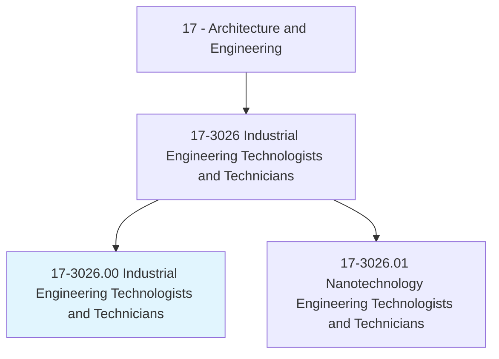
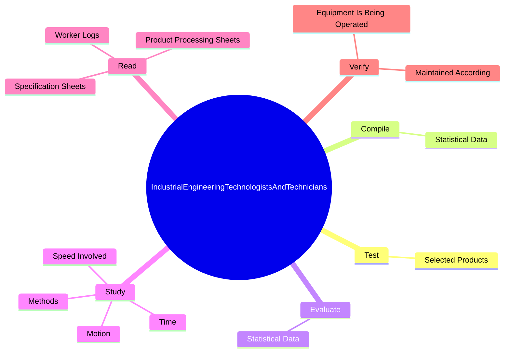
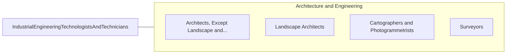

# Industrial Engineering Technologists and Technicians

> Apply engineering theory and principles to problems of industrial layout or manufacturing production, usually under the direction of engineering staff. May perform time and motion studies on worker operations in a variety of industries for purposes such as establishing standard production rates or improving efficiency.

## Overview

Industrial Engineering Technologists and Technicians is an occupation within the Architecture and Engineering category. Apply engineering theory and principles to problems of industrial layout or manufacturing production, usually under the direction of engineering staff. 

## Classification Hierarchy

## Key Statistics

| Metric | Value |
|--------|-------|
| SOC Code | 17-3026.00 |
| Category | [Architecture and Engineering](/occupations/Architecture) |
| Task Count | 154 |
| Source | O*NET |

## Core Tasks

### test.SelectedProducts

Industrial Engineering Technologists and Technicians test selected products as part of their core responsibilities.

**Actions:**
- `test.SelectedProducts.at.SpecifiedStages.in.ProductionProcessForPerformanceCharacteristicsToSpecifications`
- `test.SelectedProducts.at.Adherence.to.Specifications`

### compile.StatisticalData

Industrial Engineering Technologists and Technicians compile statistical data as part of their core responsibilities.

**Actions:**
- `compile.StatisticalData.to.determine.QualityReliabilityOfProducts`
- `compile.StatisticalData.to.maintain.QualityReliabilityOfProducts`

### evaluate.StatisticalData

Industrial Engineering Technologists and Technicians evaluate statistical data as part of their core responsibilities.

**Actions:**
- `evaluate.StatisticalData.to.determine.QualityReliabilityOfProducts`
- `evaluate.StatisticalData.to.maintain.QualityReliabilityOfProducts`

## Skills & Competencies

### Technical Skills
- **Engineering Design** - Advanced
- **CAD/CAM** - Advanced
- **Technical Analysis** - Advanced

### Soft Skills
- **Communication** - Essential
- **Problem Solving** - Essential
- **Critical Thinking** - Important
- **Teamwork** - Important
- **Adaptability** - Important

## Related Occupations

## Industries

This occupation is found across multiple industries. See [Industries](/industries) for sector-specific employment data.

## Career Progression

---

*Source: O*NET 17-3026.00 - ONETOccupation*
