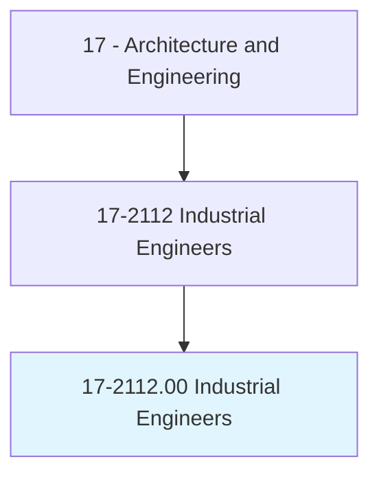
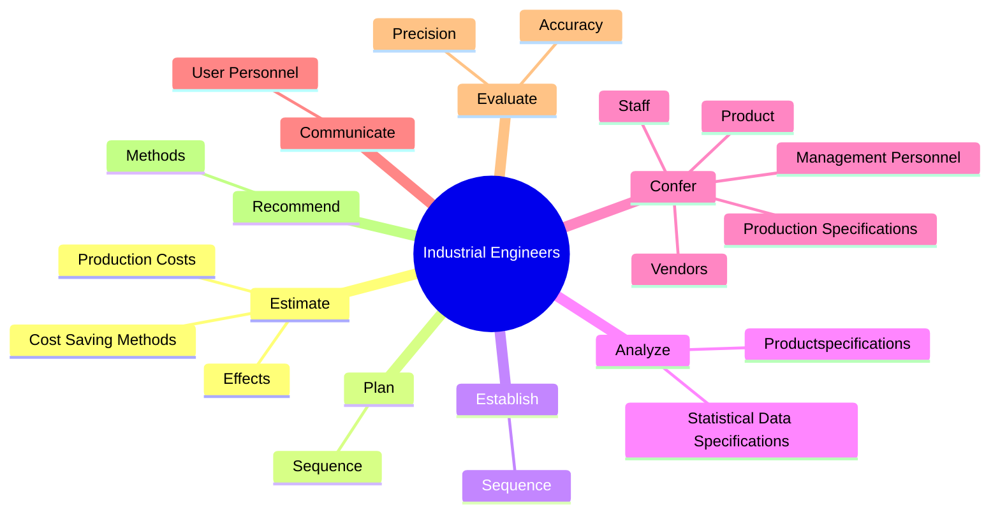
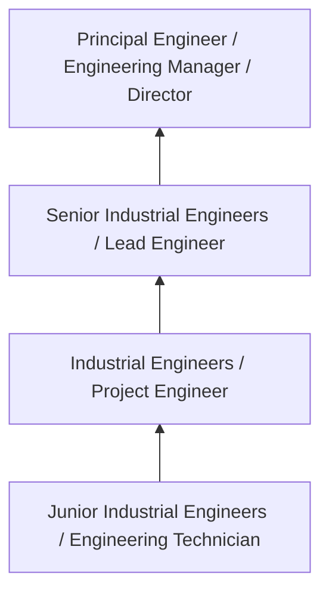
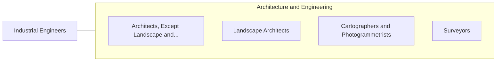

# Industrial Engineers

> Design, develop, test, and evaluate integrated systems for managing industrial production processes, including human work factors, quality control, inventory control, logistics and material flow, cost analysis, and production coordination.

## Overview

Industrial Engineers professionals design, develop, test, and evaluate integrated systems for managing industrial production processes, including human work factors, quality control, inventory control, logistics and material flow, cost analysis, and production coordination.. This occupation falls within the Architecture and Engineering category and requires a combination of specialized knowledge, technical skills, and practical experience.

These professionals work across diverse settings and organizational contexts, applying their expertise to meet the demands of their field. They must stay current with industry standards, emerging practices, and regulatory requirements that affect their work. The role demands both independent judgment and collaborative skills, as practitioners regularly interact with colleagues, stakeholders, and the public.

As the field continues to evolve, Industrial Engineers professionals increasingly leverage technology and data-driven approaches to enhance their effectiveness. Career opportunities span the public and private sectors, with demand influenced by economic conditions, demographic shifts, and technological advancement.

## Classification Hierarchy



## Key Statistics

| Metric | Value |
|--------|-------|
| SOC Code | 17-2112.00 |
| Job Zone | N/A |
| Category | [Architecture and Engineering](/occupations/Architecture/index) |
| Core Tasks | 140+ |
| Salary Range | $55,000 - $140,000 |
| Median Salary | $85,000 |
| Growth Outlook | 4% (As fast as average) |
| Source | O*NET |

## Core Tasks



### implement.QualitycontrolObjectives

Industrial Engineers implement qualitycontrol objectives as part of their core responsibilities.

**Actions:**
- `implement.QualitycontrolObjectives.to.resolve.ProductionProblems` - Coordinate and implement quality control objectives, activities, or procedure...
- `implement.QualitycontrolObjectives.to.maximize.ProductReliability` - Coordinate and implement quality control objectives, activities, or procedure...
- `implement.QualitycontrolObjectives.to.minimize.Costs` - Coordinate and implement quality control objectives, activities, or procedure...
- `implement.Activities.to.resolve.ProductionProblems` - Coordinate and implement quality control objectives, activities, or procedure...
- `implement.Activities.to.maximize.ProductReliability` - Coordinate and implement quality control objectives, activities, or procedure...

### review.ProductionSchedules

Industrial Engineers review production schedules as part of their core responsibilities.

**Actions:**
- `review.ProductionSchedules.to.obtain.KnowledgeOfManufacturingMethods` - Review production schedules, engineering specifications, orders, and related ...
- `review.ProductionSchedules.to.Procedures` - Review production schedules, engineering specifications, orders, and related ...
- `review.ProductionSchedules.to.Activities` - Review production schedules, engineering specifications, orders, and related ...
- `review.EngineeringSpecifications.to.obtain.KnowledgeOfManufacturingMethods` - Review production schedules, engineering specifications, orders, and related ...
- `review.EngineeringSpecifications.to.Procedures` - Review production schedules, engineering specifications, orders, and related ...

### formulate.SamplingProcedures

Industrial Engineers formulate sampling procedures as part of their core responsibilities.

**Actions:**
- `formulate.SamplingProcedures.for.Recording` - Formulate sampling procedures and designs and develop forms and instructions ...
- `formulate.SamplingProcedures.for.Evaluating` - Formulate sampling procedures and designs and develop forms and instructions ...
- `formulate.SamplingProcedures.for.ReportingQualityData` - Formulate sampling procedures and designs and develop forms and instructions ...
- `formulate.SamplingProcedures.for.ReliabilityData` - Formulate sampling procedures and designs and develop forms and instructions ...
- `formulate.DesignsFormsInstructions.for.Recording` - Formulate sampling procedures and designs and develop forms and instructions ...

### study.OperationsSequence

Industrial Engineers study operations sequence as part of their core responsibilities.

**Actions:**
- `study.OperationsSequence.to.determine.WorkerFunctions` - Study operations sequence, material flow, functional statements, organization...
- `study.OperationsSequence.to.Responsibilities` - Study operations sequence, material flow, functional statements, organization...
- `study.MaterialFlow.to.determine.WorkerFunctions` - Study operations sequence, material flow, functional statements, organization...
- `study.MaterialFlow.to.Responsibilities` - Study operations sequence, material flow, functional statements, organization...
- `study.FunctionalStatements.to.determine.WorkerFunctions` - Study operations sequence, material flow, functional statements, organization...


## Skills & Competencies

### Technical Skills
- **Technical Design** - Expert
- **Engineering Analysis** - Advanced
- **CAD/BIM Software** - Advanced
- **Project Management** - Advanced
- **Code Compliance** - Advanced
- **Quality Assurance** - Proficient

### Soft Skills
- **Analytical Thinking** - Critical
- **Problem Solving** - Critical
- **Attention to Detail** - Essential
- **Teamwork** - Essential
- **Communication** - Essential

## Education & Certifications

| Requirement | Details |
|-------------|---------|
| Typical Education | Bachelor's degree in engineering, architecture, or related field |
| Work Experience | 2-4 years professional experience |
| On-the-Job Training | Moderate - technical specialization required |
| Certifications | Professional Engineer (PE), Architect License, or field-specific certifications |

## Career Progression



## Industry Variations

### Private Sector Engineering
Design and development work for commercial clients. Industrial Engineers professionals focus on product development, system design, and project delivery.

### Government and Infrastructure
Public works and infrastructure projects with emphasis on regulatory compliance and long-term sustainability.

### Construction and Field Engineering
On-site implementation and oversight of engineering designs. Strong focus on quality control and safety compliance.

### Consulting
Advisory services for diverse clients. Requires strong project management skills and ability to work across multiple simultaneous projects.

## Technology & Tools

- **Computer-Aided Design (CAD) software**
- **Building Information Modeling (BIM)**
- **Geographic Information Systems (GIS)**
- **Structural analysis software**
- **Project management tools**

## Related Occupations



## Industries

- [Engineering Services](/industries/Engineering) - High Employment
- [Construction](/industries/Construction) - High Employment
- [Manufacturing](/industries/Manufacturing) - Moderate Employment
- [Government](/industries/PublicAdministration) - Moderate Employment

## Departments

This occupation typically works in:
- [Engineering](/departments/Engineering/index)
- Design
- Project Management

## GraphDL Semantic Structure

```graphdl
Industrial Engineers perform:
- estimate.ProductionCosts.of.ProductDesignChanges.on.ExpendituresForManagementReview
- estimate.ProductionCosts.of.Action
- estimate.ProductionCosts.of.Control
- estimate.CostSavingMethods.of.ProductDesignChanges.on.ExpendituresForManagementReview
- estimate.CostSavingMethods.of.Action
- estimate.CostSavingMethods.of.Control
```

---

*Source: O*NET 17-2112.00 - ONETOccupation*
