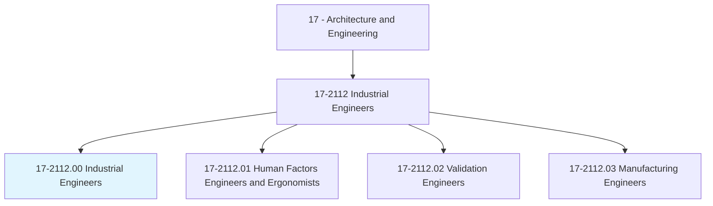
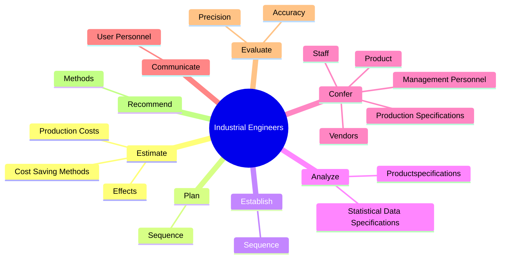
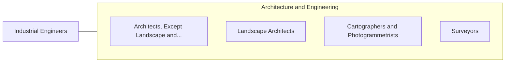

# Industrial Engineers

> Design, develop, test, and evaluate integrated systems for managing industrial production processes, including human work factors, quality control, inventory control, logistics and material flow, cost analysis, and production coordination.

## Overview

Industrial Engineers is classified under Architecture and Engineering (SOC 17). Design, develop, test, and evaluate integrated systems for managing industrial production processes, including human work factors, quality control, inventory control, logistics and material flow, cost analysis, and production coordination.

## Classification Hierarchy

## Key Statistics

| Metric | Value |
|--------|-------|
| SOC Code | 17-2112.00 |
| Category | [Architecture and Engineering](/occupations/Architecture/index) |
| Task Count | 140 |
| Source | O*NET |

## Core Tasks

### estimate.ProductionCosts

Industrial Engineers estimate production costs as part of their core responsibilities.

**Actions:**
- `estimate.ProductionCosts.of.ProductDesignChanges.on.ExpendituresForManagementReview`
- `estimate.ProductionCosts.of.Action`
- `estimate.ProductionCosts.of.Control`
- `estimate.CostSavingMethods.of.ProductDesignChanges.on.ExpendituresForManagementReview`

### plan.Sequence

Industrial Engineers plan sequence as part of their core responsibilities.

**Actions:**
- `plan.Sequence.of.Operations.to.Fabricate`
- `plan.Sequence.of.AssembleParts.to.promote.EfficientUtilization`
- `plan.Sequence.of.Products.to.promote.EfficientUtilization`

### establish.Sequence

Industrial Engineers establish sequence as part of their core responsibilities.

**Actions:**
- `establish.Sequence.of.Operations.to.Fabricate`
- `establish.Sequence.of.AssembleParts.to.promote.EfficientUtilization`
- `establish.Sequence.of.Products.to.promote.EfficientUtilization`

## Skills & Competencies

### Technical Skills
- **Engineering Design** - Advanced
- **CAD/CAM** - Advanced
- **Technical Analysis** - Advanced

### Soft Skills
- **Communication** - Essential
- **Problem Solving** - Essential
- **Critical Thinking** - Important
- **Teamwork** - Important
- **Adaptability** - Important

## Related Occupations

## Industries

This occupation is found across multiple industries. See [Industries](/industries) for sector-specific employment data.

## Career Progression

---

*Source: O*NET 17-2112.00 - ONETOccupation*
