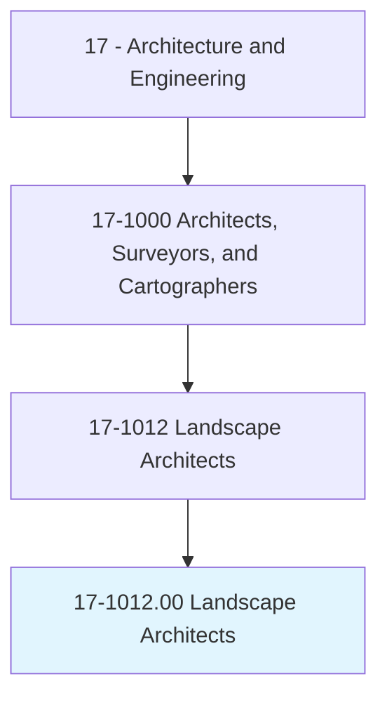
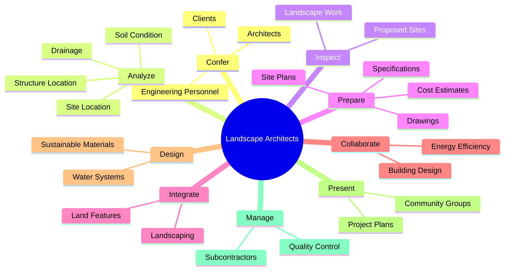
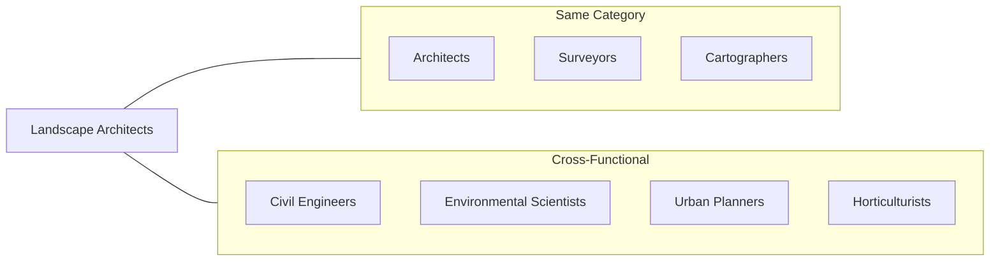
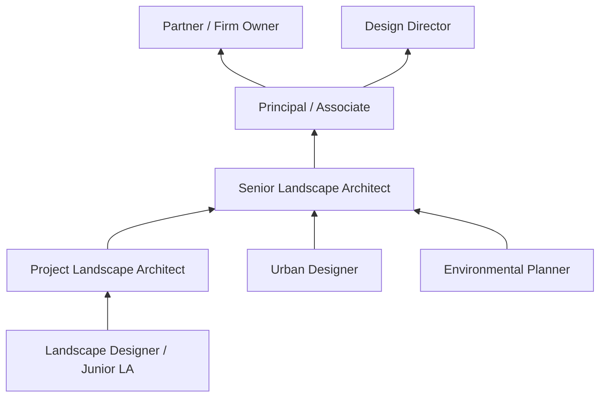

# Landscape Architects

> Plan and design land areas for projects such as parks and other recreational facilities, airports, highways, hospitals, schools, land subdivisions, and commercial, industrial, and residential sites.

## Overview

Landscape Architects are professionals who design outdoor spaces that harmonize human activity with the natural environment. They plan and design parks, gardens, campuses, residential developments, and public spaces, considering factors such as site topography, drainage, vegetation, and environmental sustainability. These professionals balance aesthetic appeal with functional requirements, creating spaces that are beautiful, accessible, and environmentally responsible. Modern landscape architects increasingly focus on sustainable design practices, incorporating rainwater harvesting, native plantings, and green infrastructure into their projects.

## Classification Hierarchy

## Key Statistics

| Metric | Value |
|--------|-------|
| SOC Code | 17-1012.00 |
| Job Zone | 5 (Extensive Preparation) |
| Category | [Architecture and Engineering](/occupations/Architecture/index) |
| Core Tasks | 18+ |
| Source | O*NET |

## Core Tasks

### confer.Clients

Landscape Architects communicate with clients and project stakeholders to understand requirements and present design solutions.

**Actions:**
- `confer.EngineeringPersonnel.on.LandscapeProjects` - Coordinate with engineers on technical aspects
- `confer.Architects.on.LandscapeProjects` - Collaborate with building architects on integrated designs

### analyze.Data

Landscape Architects analyze site data to inform design decisions and ensure project success.

**Actions:**
- `analyze.Data.on.Conditions` - Evaluate overall site conditions
- `analyze.Data.on.SiteLocation` - Assess geographic and contextual factors
- `analyze.Data.on.Drainage` - Study water flow and drainage patterns
- `analyze.Data.on.StructureLocation.for.EnvironmentalReports` - Document environmental considerations
- `analyze.Data.on.LandscapingPlans` - Develop planting and design strategies

### inspect.LandscapeWork

Landscape Architects oversee implementation to ensure quality and compliance with design specifications.

**Actions:**
- `inspect.LandscapeWork.to.ensure.ComplianceWithSpecifications` - Verify work matches design intent
- `inspect.LandscapeWork.to.evaluate.QualityOfMaterials` - Assess material quality and appropriateness
- `inspect.LandscapeWork.to.AdviseClients` - Provide guidance during construction
- `inspect.ProposedSites.to.identify.StructuralElementsOfLandAreasImportantSiteInformation` - Evaluate site features

### prepare.SitePlans

Landscape Architects create comprehensive documentation for land development projects.

**Actions:**
- `prepare.SitePlans.for.LandDevelopment` - Create detailed site layout plans
- `prepare.Specifications.for.LandDevelopment` - Document materials and methods
- `prepare.CostEstimates.for.LandDevelopment` - Develop project budgets
- `prepare.GraphicRepresentations.of.ProposedPlans` - Create visual presentations
- `prepare.Drawings.of.Designs` - Produce technical drawings

### integrate.LandFeatures

Landscape Architects incorporate existing site features and sustainable elements into designs.

**Actions:**
- `integrate.ExistingLandFeatures.into.Designs` - Work with natural topography
- `integrate.Landscaping.into.Designs` - Incorporate vegetation and plantings

### collaborate.RelatedProfessionals

Landscape Architects work with other design professionals on comprehensive projects.

**Actions:**
- `collaborate.RelatedProfessionals.on.WholeBuildingDesign.to.maximize.AestheticFeaturesOfStructuresLandToImproveEnergyEfficiency` - Integrate landscape with building design
- `collaborate.RelatedProfessionals.on.SurroundingLand.to.improve.EnergyEfficiency` - Optimize energy performance through landscape design

### design.WaterSystems

Landscape Architects design sustainable water management systems.

**Actions:**
- `design.RainwaterHarvestingReclaimedWaterSystems.to.conserve.WaterIntoBuildingDesigns` - Create water conservation systems
- `design.GrayReclaimedWaterSystems.to.LandDesigns` - Integrate water reuse into landscapes
- `create.LandscapesMinimizeWaterConsumptionSuchAs.by.IncorporatingDroughtResistantGrassesPlants` - Design drought-tolerant landscapes

### present.ProjectPlans

Landscape Architects communicate designs to stakeholders and the public.

**Actions:**
- `present.ProjectPlans.to.PublicStakeholders` - Share designs with community members
- `present.ProjectPlans.to.GovernmentAgencies` - Seek regulatory approvals
- `present.Designs.to.CommunityGroups` - Engage community in design process

## Skills & Competencies

### Technical Skills
- **Site Analysis** - Expert
- **Computer-Aided Design (CAD)** - Expert
- **Geographic Information Systems (GIS)** - Advanced
- **Sustainable Design** - Expert
- **Horticulture and Plant Science** - Advanced
- **Grading and Drainage** - Expert
- **Construction Documentation** - Advanced

### Soft Skills
- **Creativity** - Critical
- **Spatial Visualization** - Critical
- **Communication** - Essential
- **Project Management** - Essential
- **Client Relations** - Essential
- **Environmental Awareness** - Critical
- **Collaboration** - Essential

## Related Occupations

## Industries

- [Architectural and Landscape Services](/industries/ArchitecturalServices) - High Employment
- [Government](/industries/Government) - High Employment
- [Construction](/industries/Construction/index) - Moderate Employment
- [Real Estate Development](/industries/RealEstate/index) - Moderate Employment
- [Educational Services](/industries/Education) - Moderate Employment

## Industry Variations

### Residential Landscape Architecture
Designs gardens, yards, and outdoor living spaces for homes. Focuses on client relationships and personalized design solutions.

### Urban Design and Planning
Works on public spaces, streetscapes, and city planning projects. Emphasizes community engagement and large-scale planning.

### Parks and Recreation
Designs parks, playgrounds, and recreational facilities. Requires understanding of public use patterns and safety requirements.

### Sustainable Design / Green Infrastructure
Specializes in stormwater management, green roofs, and ecological restoration. Growing field with increasing environmental regulations.

### Commercial and Corporate
Designs corporate campuses, retail centers, and commercial developments. Focuses on branding and creating inviting public spaces.

## Career Progression

## Education & Training

| Requirement | Details |
|-------------|---------|
| Typical Education | Bachelor's or Master's degree in Landscape Architecture (BLA or MLA from LAAB-accredited program) |
| Work Experience | 1-4 years supervised experience (varies by state) |
| On-the-Job Training | Apprenticeship under licensed landscape architect |
| Licensure | Required in most states - pass LARE (Landscape Architect Registration Examination) |
| Common Certifications | ASLA membership, LEED AP, SITES AP |

## Departments

This occupation typically works in:
- [Landscape Architecture](/departments/LandscapeArchitecture)
- [Design](/departments/Design)
- [Planning](/departments/Planning)
- [Environmental Services](/departments/Environmental)

## Tools & Technologies

### Design Software
- AutoCAD
- SketchUp
- Vectorworks Landmark
- Lumion
- Adobe Creative Suite

### Analysis Tools
- ArcGIS
- Civil 3D
- Land F/X
- Rhino

### Visualization
- Lumion
- Enscape
- Photoshop
- 3ds Max

---

*Source: O*NET 17-1012.00 - ONETOccupation*
