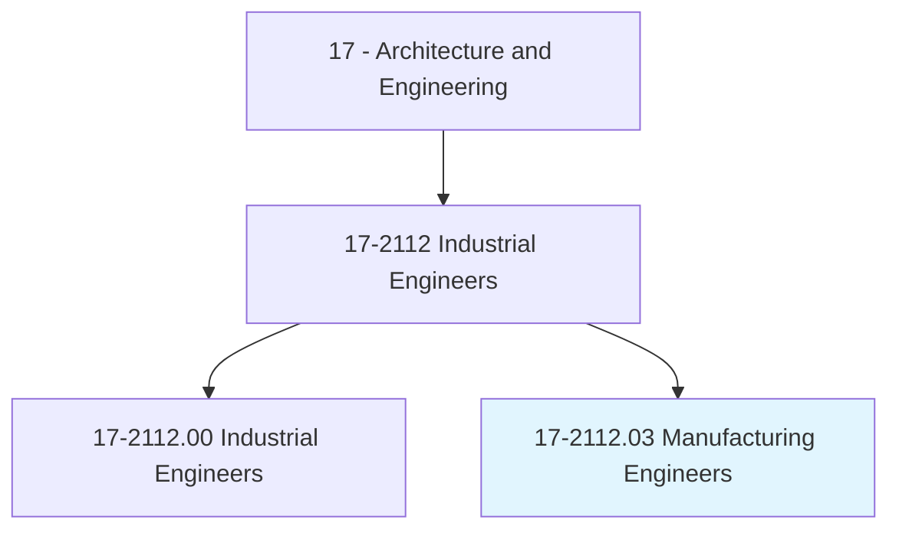
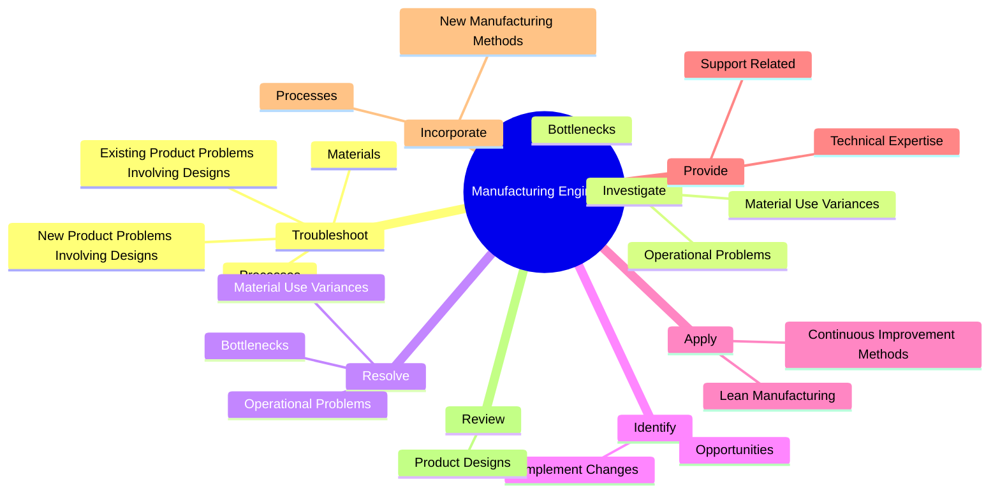
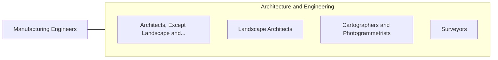

# Manufacturing Engineers

> Design, integrate, or improve manufacturing systems or related processes. May work with commercial or industrial designers to refine product designs to increase producibility and decrease costs.

## Overview

Manufacturing Engineers is a specialized variant within the Architecture and Engineering category. Design, integrate, or improve manufacturing systems or related processes. 

## Classification Hierarchy

## Key Statistics

| Metric | Value |
|--------|-------|
| SOC Code | 17-2112.03 |
| Category | [Architecture and Engineering](/occupations/Architecture/index) |
| Task Count | 111 |
| Source | O*NET |

## Core Tasks

### troubleshoot.NewProductProblemsInvolvingDesigns

Manufacturing Engineers troubleshoot new product problems involving designs as part of their core responsibilities.

**Actions:**
- `troubleshoot.NewProductProblemsInvolvingDesigns`
- `troubleshoot.ExistingProductProblemsInvolvingDesigns`
- `troubleshoot.Materials`
- `troubleshoot.Processes`

### investigate.OperationalProblems

Manufacturing Engineers investigate operational problems as part of their core responsibilities.

**Actions:**
- `investigate.OperationalProblems`
- `investigate.MaterialUseVariances`
- `investigate.Bottlenecks`

### resolve.OperationalProblems

Manufacturing Engineers resolve operational problems as part of their core responsibilities.

**Actions:**
- `resolve.OperationalProblems`
- `resolve.MaterialUseVariances`
- `resolve.Bottlenecks`

## Skills & Competencies

### Technical Skills
- **Engineering Design** - Advanced
- **CAD/CAM** - Advanced
- **Technical Analysis** - Advanced

### Soft Skills
- **Communication** - Essential
- **Problem Solving** - Essential
- **Critical Thinking** - Important
- **Teamwork** - Important
- **Adaptability** - Important

## Related Occupations

## Industries

This occupation is found across multiple industries. See [Industries](/industries) for sector-specific employment data.

## Career Progression

---

*Source: O*NET 17-2112.03 - ONETOccupation*
