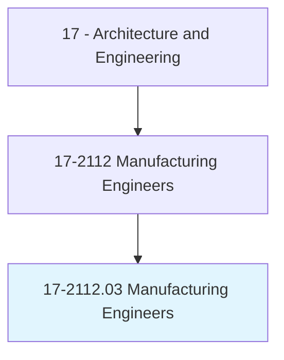
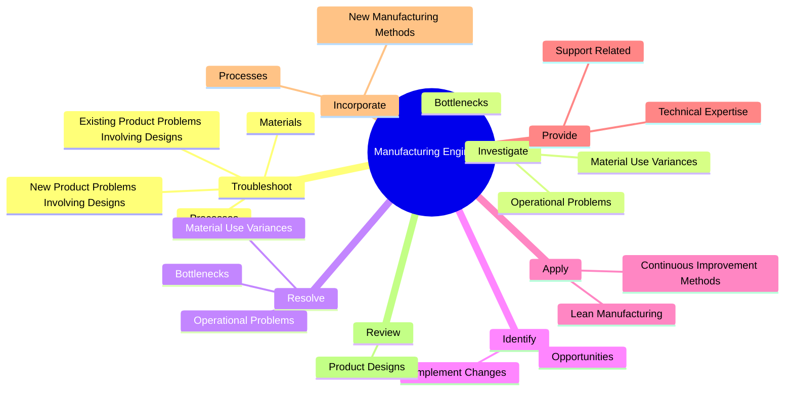
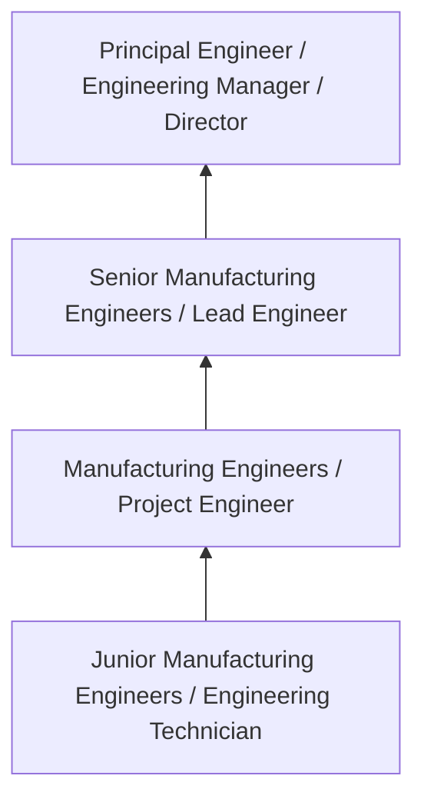
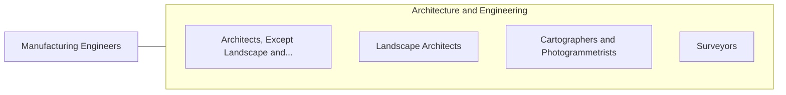

# Manufacturing Engineers

> Design, integrate, or improve manufacturing systems or related processes. May work with commercial or industrial designers to refine product designs to increase producibility and decrease costs.

## Overview

Manufacturing Engineers professionals design, integrate, or improve manufacturing systems or related processes. This occupation falls within the Architecture and Engineering category and requires a combination of specialized knowledge, technical skills, and practical experience.

These professionals work across diverse settings and organizational contexts, applying their expertise to meet the demands of their field. They must stay current with industry standards, emerging practices, and regulatory requirements that affect their work. The role demands both independent judgment and collaborative skills, as practitioners regularly interact with colleagues, stakeholders, and the public.

As the field continues to evolve, Manufacturing Engineers professionals increasingly leverage technology and data-driven approaches to enhance their effectiveness. Career opportunities span the public and private sectors, with demand influenced by economic conditions, demographic shifts, and technological advancement.

## Classification Hierarchy



## Key Statistics

| Metric | Value |
|--------|-------|
| SOC Code | 17-2112.03 |
| Job Zone | N/A |
| Category | [Architecture and Engineering](/occupations/Architecture/index) |
| Core Tasks | 111+ |
| Salary Range | $55,000 - $140,000 |
| Median Salary | $85,000 |
| Growth Outlook | 4% (As fast as average) |
| Source | O*NET |

## Core Tasks



### evaluate.ManufacturedProductsAccording

Manufacturing Engineers evaluate manufactured products according as part of their core responsibilities.

**Actions:**
- `evaluate.ManufacturedProductsAccording.to.SpecificationsStandards` - Evaluate manufactured products according to specifications and quality standa...
- `evaluate.ManufacturedProductsAccording.to.QualityStandards` - Evaluate manufactured products according to specifications and quality standa...
- `evaluate.Current.for.EnvironmentalSustainability` - Evaluate current or proposed manufacturing processes or practices for environ...
- `evaluate.Current.for.ConsideringFactors` - Evaluate current or proposed manufacturing processes or practices for environ...
- `evaluate.Current.for.GreenhouseGasEmissions` - Evaluate current or proposed manufacturing processes or practices for environ...

### identify.Opportunities

Manufacturing Engineers identify opportunities as part of their core responsibilities.

**Actions:**
- `identify.Opportunities.to.improve.ManufacturingProcessesToReduceCosts` - Identify opportunities or implement changes to improve manufacturing processe...
- `identify.Opportunities.to.ProductsToReduceCosts` - Identify opportunities or implement changes to improve manufacturing processe...
- `identify.Opportunities.to.UsingKnowledgeOfFabricationProcesses` - Identify opportunities or implement changes to improve manufacturing processe...
- `identify.Opportunities.to.Tooling` - Identify opportunities or implement changes to improve manufacturing processe...
- `identify.Opportunities.to.production.Equipment` - Identify opportunities or implement changes to improve manufacturing processe...

### read.CurrentLiterature

Manufacturing Engineers read current literature as part of their core responsibilities.

**Actions:**
- `read.CurrentLiterature.with.Participate.in.Educationalprograms` - Read current literature, talk with colleagues, participate in educational pro...
- `read.CurrentLiterature.with.AttendMeetings` - Read current literature, talk with colleagues, participate in educational pro...
- `read.CurrentLiterature.with.Workshops` - Read current literature, talk with colleagues, participate in educational pro...
- `read.CurrentLiterature.with.Conferences.to.keep.AbreastOfDevelopmentsInManufacturingField` - Read current literature, talk with colleagues, participate in educational pro...
- `read.Talk.with.Participate.in.Educationalprograms` - Read current literature, talk with colleagues, participate in educational pro...

### apply.ContinuousImprovementMethods

Manufacturing Engineers apply continuous improvement methods as part of their core responsibilities.

**Actions:**
- `apply.ContinuousImprovementMethods.to.enhance.ManufacturingQuality` - Apply continuous improvement methods, such as lean manufacturing, to enhance ...
- `apply.ContinuousImprovementMethods.to.Reliability` - Apply continuous improvement methods, such as lean manufacturing, to enhance ...
- `apply.ContinuousImprovementMethods.to.CostEffectiveness` - Apply continuous improvement methods, such as lean manufacturing, to enhance ...
- `apply.LeanManufacturing.to.enhance.ManufacturingQuality` - Apply continuous improvement methods, such as lean manufacturing, to enhance ...
- `apply.LeanManufacturing.to.Reliability` - Apply continuous improvement methods, such as lean manufacturing, to enhance ...


## Skills & Competencies

### Technical Skills
- **Technical Design** - Expert
- **Engineering Analysis** - Advanced
- **CAD/BIM Software** - Advanced
- **Project Management** - Advanced
- **Code Compliance** - Advanced
- **Quality Assurance** - Proficient

### Soft Skills
- **Analytical Thinking** - Critical
- **Problem Solving** - Critical
- **Attention to Detail** - Essential
- **Teamwork** - Essential
- **Communication** - Essential

## Education & Certifications

| Requirement | Details |
|-------------|---------|
| Typical Education | Bachelor's degree in engineering, architecture, or related field |
| Work Experience | 2-4 years professional experience |
| On-the-Job Training | Moderate - technical specialization required |
| Certifications | Professional Engineer (PE), Architect License, or field-specific certifications |

## Career Progression



## Industry Variations

### Private Sector Engineering
Design and development work for commercial clients. Manufacturing Engineers professionals focus on product development, system design, and project delivery.

### Government and Infrastructure
Public works and infrastructure projects with emphasis on regulatory compliance and long-term sustainability.

### Construction and Field Engineering
On-site implementation and oversight of engineering designs. Strong focus on quality control and safety compliance.

### Consulting
Advisory services for diverse clients. Requires strong project management skills and ability to work across multiple simultaneous projects.

## Technology & Tools

- **Computer-Aided Design (CAD) software**
- **Building Information Modeling (BIM)**
- **Geographic Information Systems (GIS)**
- **Structural analysis software**
- **Project management tools**

## Related Occupations



## Industries

- [Engineering Services](/industries/Engineering) - High Employment
- [Construction](/industries/Construction) - High Employment
- [Manufacturing](/industries/Manufacturing) - Moderate Employment
- [Government](/industries/Government) - Moderate Employment

## Departments

This occupation typically works in:
- [Engineering](/departments/Engineering/index)
- [Design](/departments/Design)
- [Project Management](/departments/ProjectManagement)

## GraphDL Semantic Structure

```
Manufacturing Engineers perform:
- troubleshoot.NewProductProblemsInvolvingDesigns
- troubleshoot.ExistingProductProblemsInvolvingDesigns
- troubleshoot.Materials
- troubleshoot.Processes
- investigate.OperationalProblems
- investigate.MaterialUseVariances
```

---

*Source: O*NET 17-2112.03 - ONETOccupation*
