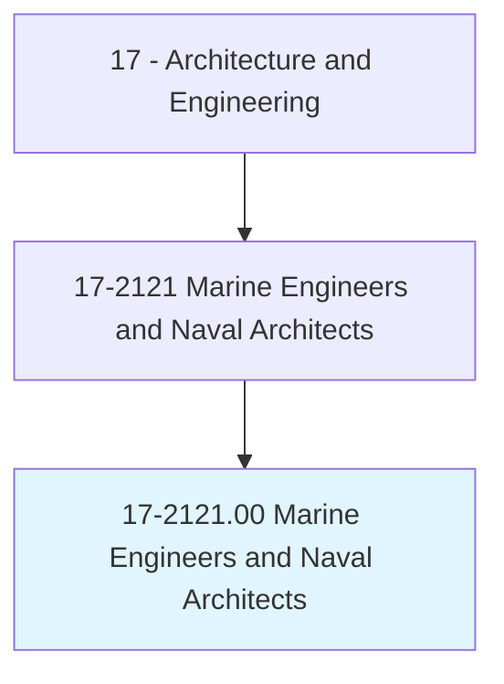
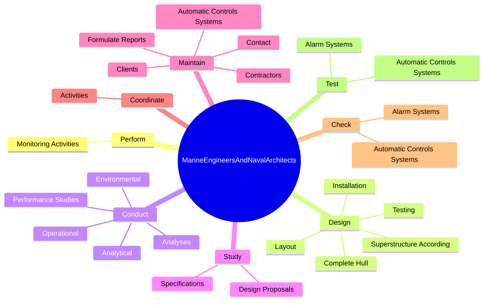
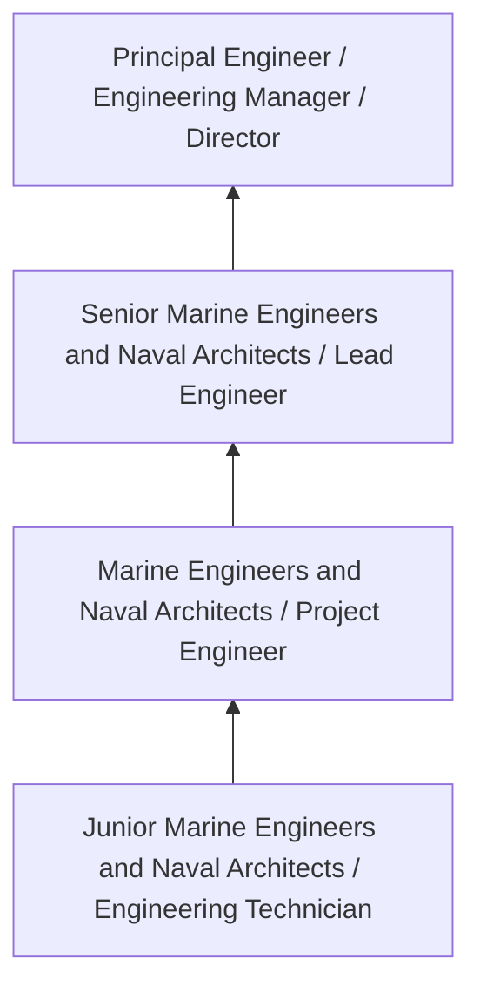
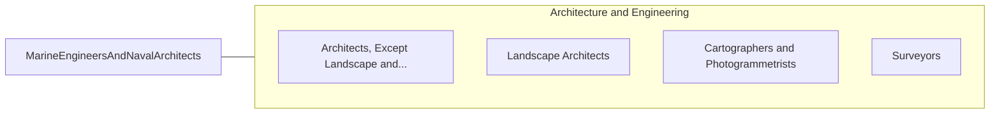

# Marine Engineers and Naval Architects

> Design, develop, and evaluate the operation of marine vessels, ship machinery, and related equipment, such as power supply and propulsion systems.

## Overview

Marine Engineers and Naval Architects professionals design, develop, and evaluate the operation of marine vessels, ship machinery, and related equipment, such as power supply and propulsion systems.. This occupation falls within the Architecture and Engineering category and requires a combination of specialized knowledge, technical skills, and practical experience.

These professionals work across diverse settings and organizational contexts, applying their expertise to meet the demands of their field. They must stay current with industry standards, emerging practices, and regulatory requirements that affect their work. The role demands both independent judgment and collaborative skills, as practitioners regularly interact with colleagues, stakeholders, and the public.

As the field continues to evolve, Marine Engineers and Naval Architects professionals increasingly leverage technology and data-driven approaches to enhance their effectiveness. Career opportunities span the public and private sectors, with demand influenced by economic conditions, demographic shifts, and technological advancement.

## Classification Hierarchy



## Key Statistics

| Metric | Value |
|--------|-------|
| SOC Code | 17-2121.00 |
| Job Zone | N/A |
| Category | [Architecture and Engineering](/occupations/Architecture/index) |
| Core Tasks | N/A+ |
| Salary Range | $55,000 - $140,000 |
| Median Salary | $85,000 |
| Growth Outlook | 4% (As fast as average) |
| Source | O*NET |

## Core Tasks



### perform.MonitoringActivities

Marine Engineers and Naval Architects perform monitoring activities as part of their core responsibilities.

**Actions:**
- `perform.MonitoringActivities.to.ensure.ShipsComplyWithInternationalRegulationsForLifeSavingEquipmentPollutionPreventatives`
- `perform.MonitoringActivities.to.StandardsForLifeSavingEquipmentPollutionPreventatives`

### design.CompleteHull

Marine Engineers and Naval Architects design complete hull as part of their core responsibilities.

**Actions:**
- `design.CompleteHull.to.Specifications`
- `design.CompleteHull.to.test.Data`
- `design.CompleteHull.to.InConformityWithStandardsOfSafety`
- `design.CompleteHull.to.Efficiency`

### conduct.Analyses

Marine Engineers and Naval Architects conduct analyses as part of their core responsibilities.

**Actions:**
- `conduct.Analyses.of.Ships`
- `conduct.Analyses.of.Stability`
- `conduct.Analyses.of.Structural`
- `conduct.Analyses.of.Weight`

### Technical Skills
- **Engineering Design** - Advanced
- **CAD/CAM** - Advanced
- **Technical Analysis** - Advanced

### Soft Skills
- **Communication** - Essential
- **Problem Solving** - Essential
- **Critical Thinking** - Important
- **Teamwork** - Important
- **Adaptability** - Important


## Skills & Competencies

### Technical Skills
- **Technical Design** - Expert
- **Engineering Analysis** - Advanced
- **CAD/BIM Software** - Advanced
- **Project Management** - Advanced
- **Code Compliance** - Advanced
- **Quality Assurance** - Proficient

### Soft Skills
- **Analytical Thinking** - Critical
- **Problem Solving** - Critical
- **Attention to Detail** - Essential
- **Teamwork** - Essential
- **Communication** - Essential

## Education & Certifications

| Requirement | Details |
|-------------|---------|
| Typical Education | Bachelor's degree in engineering, architecture, or related field |
| Work Experience | 2-4 years professional experience |
| On-the-Job Training | Moderate - technical specialization required |
| Certifications | Professional Engineer (PE), Architect License, or field-specific certifications |

## Career Progression



## Industry Variations

### Private Sector Engineering
Design and development work for commercial clients. Marine Engineers and Naval Architects professionals focus on product development, system design, and project delivery.

### Government and Infrastructure
Public works and infrastructure projects with emphasis on regulatory compliance and long-term sustainability.

### Construction and Field Engineering
On-site implementation and oversight of engineering designs. Strong focus on quality control and safety compliance.

### Consulting
Advisory services for diverse clients. Requires strong project management skills and ability to work across multiple simultaneous projects.

## Technology & Tools

- **Computer-Aided Design (CAD) software**
- **Building Information Modeling (BIM)**
- **Geographic Information Systems (GIS)**
- **Structural analysis software**
- **Project management tools**

## Related Occupations



## Industries

- [Engineering Services](/industries/Engineering) - High Employment
- [Construction](/industries/Construction) - High Employment
- [Manufacturing](/industries/Manufacturing) - Moderate Employment
- [Government](/industries/PublicAdministration) - Moderate Employment

## Departments

This occupation typically works in:
- [Engineering](/departments/Engineering/index)
- Design
- Project Management

## GraphDL Semantic Structure

```graphdl
Marine Engineers and Naval Architects perform:
- design.Systems.for.MarineEngineersandNavalArchitectsApplications
- analyze.Requirements.for.ProjectSpecifications
- prepare.TechnicalDocumentation.for.Projects
- review.Designs.for.CodeCompliance
- coordinate.WithTeam.on.EngineeringProjects
```

---

*Source: O*NET 17-2121.00 - ONETOccupation*
