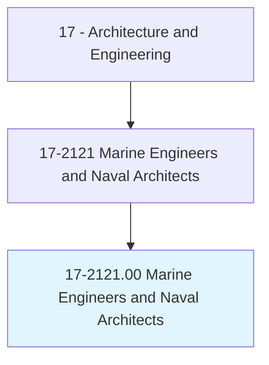
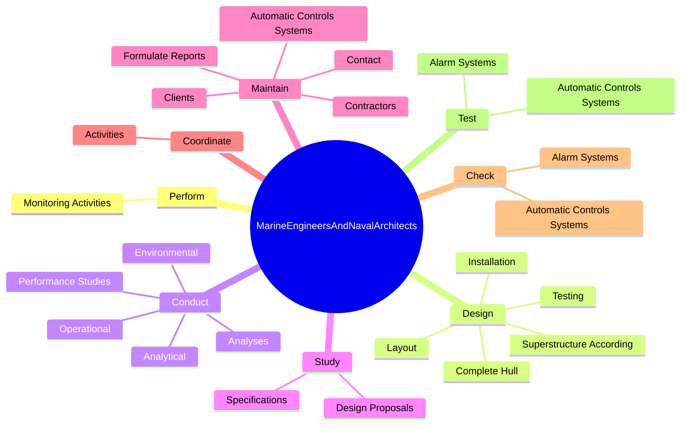
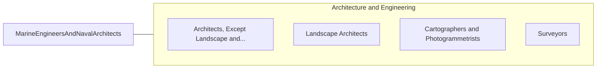

# Marine Engineers and Naval Architects

> Design, develop, and evaluate the operation of marine vessels, ship machinery, and related equipment, such as power supply and propulsion systems.

## Overview

Marine Engineers and Naval Architects is classified under Architecture and Engineering (SOC 17). Design, develop, and evaluate the operation of marine vessels, ship machinery, and related equipment, such as power supply and propulsion systems.

## Classification Hierarchy

## Key Statistics

| Metric | Value |
|--------|-------|
| SOC Code | 17-2121.00 |
| Category | [Architecture and Engineering](/occupations/Architecture) |
| Task Count | 161 |
| Source | O*NET |

## Core Tasks

### perform.MonitoringActivities

Marine Engineers and Naval Architects perform monitoring activities as part of their core responsibilities.

**Actions:**
- `perform.MonitoringActivities.to.ensure.ShipsComplyWithInternationalRegulationsForLifeSavingEquipmentPollutionPreventatives`
- `perform.MonitoringActivities.to.StandardsForLifeSavingEquipmentPollutionPreventatives`

### design.CompleteHull

Marine Engineers and Naval Architects design complete hull as part of their core responsibilities.

**Actions:**
- `design.CompleteHull.to.Specifications`
- `design.CompleteHull.to.test.Data`
- `design.CompleteHull.to.InConformityWithStandardsOfSafety`
- `design.CompleteHull.to.Efficiency`

### conduct.Analyses

Marine Engineers and Naval Architects conduct analyses as part of their core responsibilities.

**Actions:**
- `conduct.Analyses.of.Ships`
- `conduct.Analyses.of.Stability`
- `conduct.Analyses.of.Structural`
- `conduct.Analyses.of.Weight`

## Skills & Competencies

### Technical Skills
- **Engineering Design** - Advanced
- **CAD/CAM** - Advanced
- **Technical Analysis** - Advanced

### Soft Skills
- **Communication** - Essential
- **Problem Solving** - Essential
- **Critical Thinking** - Important
- **Teamwork** - Important
- **Adaptability** - Important

## Related Occupations

## Industries

This occupation is found across multiple industries. See [Industries](/industries) for sector-specific employment data.

## Career Progression

---

*Source: O*NET 17-2121.00 - ONETOccupation*
