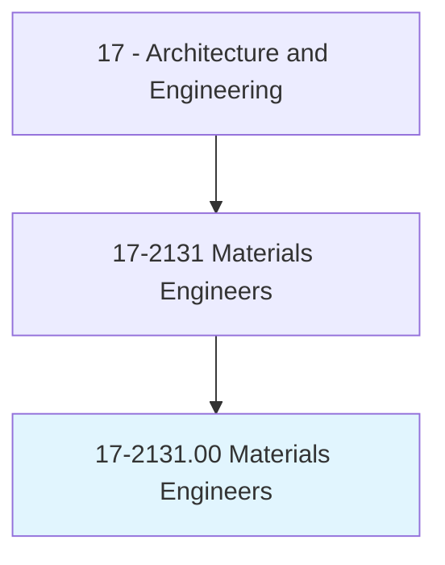
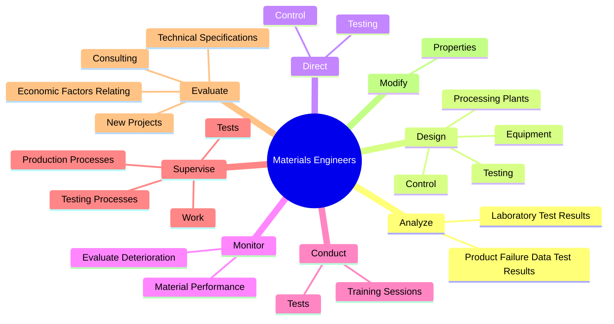
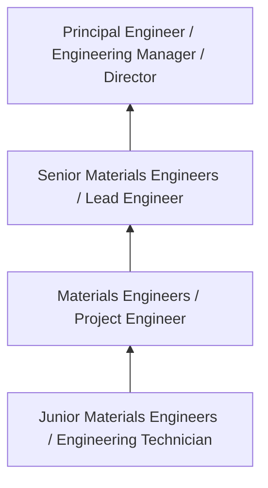

# Materials Engineers

> Evaluate materials and develop machinery and processes to manufacture materials for use in products that must meet specialized design and performance specifications. Develop new uses for known materials. Includes those engineers working with composite materials or specializing in one type of material, such as graphite, metal and metal alloys, ceramics and glass, plastics and polymers, and naturally occurring materials. Includes metallurgists and metallurgical engineers, ceramic engineers, and welding engineers.

## Overview

Materials Engineers professionals evaluate materials and develop machinery and processes to manufacture materials for use in products that must meet specialized design and performance specifications. This occupation falls within the Architecture and Engineering category and requires a combination of specialized knowledge, technical skills, and practical experience.

These professionals work across diverse settings and organizational contexts, applying their expertise to meet the demands of their field. They must stay current with industry standards, emerging practices, and regulatory requirements that affect their work. The role demands both independent judgment and collaborative skills, as practitioners regularly interact with colleagues, stakeholders, and the public.

As the field continues to evolve, Materials Engineers professionals increasingly leverage technology and data-driven approaches to enhance their effectiveness. Career opportunities span the public and private sectors, with demand influenced by economic conditions, demographic shifts, and technological advancement.

## Classification Hierarchy



## Key Statistics

| Metric | Value |
|--------|-------|
| SOC Code | 17-2131.00 |
| Job Zone | N/A |
| Category | [Architecture and Engineering](/occupations/Architecture/index) |
| Core Tasks | 92+ |
| Salary Range | $55,000 - $140,000 |
| Median Salary | $85,000 |
| Growth Outlook | 4% (As fast as average) |
| Source | O*NET |

## Core Tasks



### supervise.Tests

Materials Engineers supervise tests as part of their core responsibilities.

**Actions:**
- `supervise.Tests.on.RawMaterials` - Conduct or supervise tests on raw materials or finished products to ensure th...
- `supervise.Tests.on.FinishedProducts.to.ensure.Quality` - Conduct or supervise tests on raw materials or finished products to ensure th...
- `supervise.Work.of.Technicians` - Supervise the work of technologists, technicians, and other engineers and sci...
- `supervise.Work.of.OtherEngineers` - Supervise the work of technologists, technicians, and other engineers and sci...
- `supervise.Work.of.Scientists` - Supervise the work of technologists, technicians, and other engineers and sci...

### review.NewProductPlans

Materials Engineers review new product plans as part of their core responsibilities.

**Actions:**
- `review.NewProductPlans.for.MaterialSelection` - Review new product plans, and make recommendations for material selection, ba...
- `review.NewProductPlans.for.Based.on.DesignObjectives` - Review new product plans, and make recommendations for material selection, ba...
- `review.NewProductPlans.for.Strength` - Review new product plans, and make recommendations for material selection, ba...
- `review.NewProductPlans.for.Weight` - Review new product plans, and make recommendations for material selection, ba...
- `review.NewProductPlans.for.HeatResistance` - Review new product plans, and make recommendations for material selection, ba...

### evaluate.TechnicalSpecifications

Materials Engineers evaluate technical specifications as part of their core responsibilities.

**Actions:**
- `evaluate.TechnicalSpecifications.to.process.DesignObjectives` - Evaluate technical specifications and economic factors relating to process or...
- `evaluate.TechnicalSpecifications.to.ProductDesignObjectives` - Evaluate technical specifications and economic factors relating to process or...
- `evaluate.EconomicFactorsRelating.to.process.DesignObjectives` - Evaluate technical specifications and economic factors relating to process or...
- `evaluate.EconomicFactorsRelating.to.ProductDesignObjectives` - Evaluate technical specifications and economic factors relating to process or...
- `evaluate.NewProjects.with.OtherEngineersExecutivesAsNecessary` - Plan and evaluate new projects, consulting with other engineers and corporate...

### plan.LaboratoryOperations

Materials Engineers plan laboratory operations as part of their core responsibilities.

**Actions:**
- `plan.LaboratoryOperations.to.develop.MaterialProceduresMeetCost` - Plan and implement laboratory operations to develop material and fabrication ...
- `plan.LaboratoryOperations.to.FabricationProceduresMeetCost` - Plan and implement laboratory operations to develop material and fabrication ...
- `plan.LaboratoryOperations.to.ProductSpecification` - Plan and implement laboratory operations to develop material and fabrication ...
- `plan.LaboratoryOperations.to.PerformanceStandards` - Plan and implement laboratory operations to develop material and fabrication ...
- `plan.NewProjects.with.OtherEngineersExecutivesAsNecessary` - Plan and evaluate new projects, consulting with other engineers and corporate...


## Skills & Competencies

### Technical Skills
- **Technical Design** - Expert
- **Engineering Analysis** - Advanced
- **CAD/BIM Software** - Advanced
- **Project Management** - Advanced
- **Code Compliance** - Advanced
- **Quality Assurance** - Proficient

### Soft Skills
- **Analytical Thinking** - Critical
- **Problem Solving** - Critical
- **Attention to Detail** - Essential
- **Teamwork** - Essential
- **Communication** - Essential

## Education & Certifications

| Requirement | Details |
|-------------|---------|
| Typical Education | Bachelor's degree in engineering, architecture, or related field |
| Work Experience | 2-4 years professional experience |
| On-the-Job Training | Moderate - technical specialization required |
| Certifications | Professional Engineer (PE), Architect License, or field-specific certifications |

## Career Progression



## Industry Variations

### Private Sector Engineering
Design and development work for commercial clients. Materials Engineers professionals focus on product development, system design, and project delivery.

### Government and Infrastructure
Public works and infrastructure projects with emphasis on regulatory compliance and long-term sustainability.

### Construction and Field Engineering
On-site implementation and oversight of engineering designs. Strong focus on quality control and safety compliance.

### Consulting
Advisory services for diverse clients. Requires strong project management skills and ability to work across multiple simultaneous projects.

## Technology & Tools

- **Computer-Aided Design (CAD) software**
- **Building Information Modeling (BIM)**
- **Geographic Information Systems (GIS)**
- **Structural analysis software**
- **Project management tools**

## Related Occupations


## Industries

- [Engineering Services](/industries/Engineering) - High Employment
- [Construction](/industries/Construction) - High Employment
- [Manufacturing](/industries/Manufacturing) - Moderate Employment
- [Government](/industries/PublicAdministration) - Moderate Employment

## Departments

This occupation typically works in:
- [Engineering](/departments/Engineering/index)
- Design
- Project Management

## GraphDL Semantic Structure

```graphdl
Materials Engineers perform:
- analyze.ProductFailureDataTestResults.to.determine.CausesOfProblems
- analyze.ProductFailureDataTestResults.to.develop.Solutions
- analyze.LaboratoryTestResults.to.determine.CausesOfProblems
- analyze.LaboratoryTestResults.to.develop.Solutions
- design.Testing.of.ProcessingProcedures
- design.Control.of.ProcessingProcedures
```

---

*Source: O*NET 17-2131.00 - ONETOccupation*
