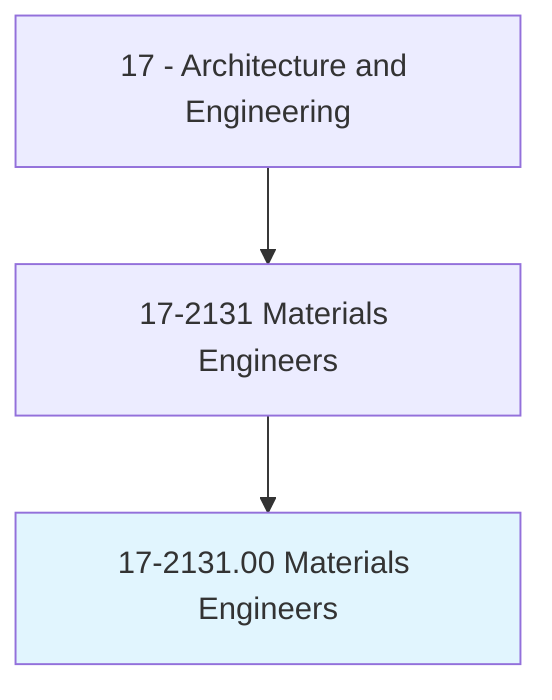
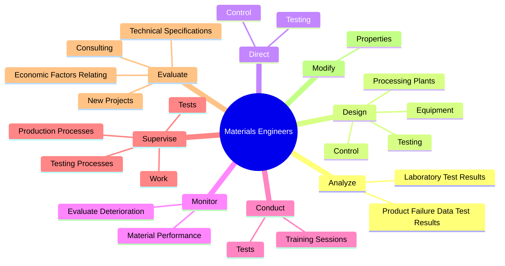

# Materials Engineers

> Evaluate materials and develop machinery and processes to manufacture materials for use in products that must meet specialized design and performance specifications. Develop new uses for known materials. Includes those engineers working with composite materials or specializing in one type of material, such as graphite, metal and metal alloys, ceramics and glass, plastics and polymers, and naturally occurring materials. Includes metallurgists and metallurgical engineers, ceramic engineers, and welding engineers.

## Overview

Materials Engineers is an occupation within the Architecture and Engineering category. Evaluate materials and develop machinery and processes to manufacture materials for use in products that must meet specialized design and performance specifications. Develop new uses for known materials.

## Classification Hierarchy

## Key Statistics

| Metric | Value |
|--------|-------|
| SOC Code | 17-2131.00 |
| Category | [Architecture and Engineering](/occupations/Architecture/index) |
| Task Count | 92 |
| Source | O*NET |

## Core Tasks

### analyze.ProductFailureDataTestResults

Materials Engineers analyze product failure data test results as part of their core responsibilities.

**Actions:**
- `analyze.ProductFailureDataTestResults.to.determine.CausesOfProblems`
- `analyze.ProductFailureDataTestResults.to.develop.Solutions`
- `analyze.LaboratoryTestResults.to.determine.CausesOfProblems`
- `analyze.LaboratoryTestResults.to.develop.Solutions`

### design.Testing

Materials Engineers design testing as part of their core responsibilities.

**Actions:**
- `design.Testing.of.ProcessingProcedures`
- `design.Control.of.ProcessingProcedures`
- `design.ProcessingPlants`
- `design.Equipment`

### direct.Testing

Materials Engineers direct testing as part of their core responsibilities.

**Actions:**
- `direct.Testing.of.ProcessingProcedures`
- `direct.Control.of.ProcessingProcedures`

## Skills & Competencies

### Technical Skills
- **Engineering Design** - Advanced
- **CAD/CAM** - Advanced
- **Technical Analysis** - Advanced

### Soft Skills
- **Communication** - Essential
- **Problem Solving** - Essential
- **Critical Thinking** - Important
- **Teamwork** - Important
- **Adaptability** - Important

## Related Occupations

## Industries

This occupation is found across multiple industries. See [Industries](/industries) for sector-specific employment data.

## Career Progression

---

*Source: O*NET 17-2131.00 - ONETOccupation*
