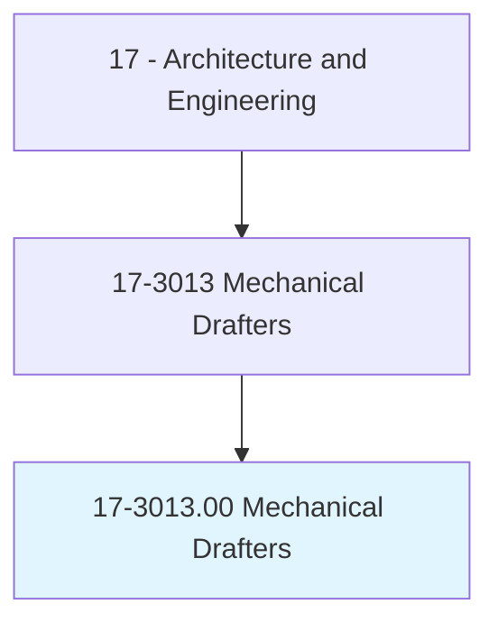
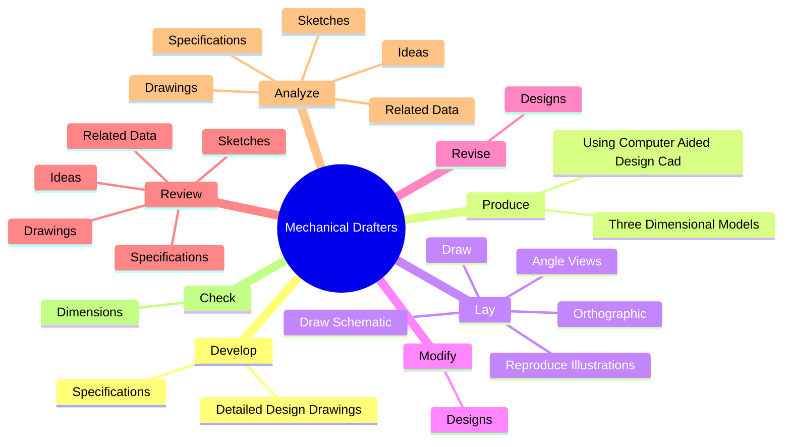
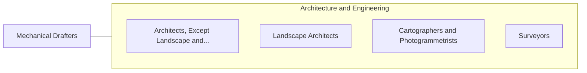

# Mechanical Drafters

> Prepare detailed working diagrams of machinery and mechanical devices, including dimensions, fastening methods, and other engineering information.

## Overview

Mechanical Drafters is classified under Architecture and Engineering (SOC 17). Prepare detailed working diagrams of machinery and mechanical devices, including dimensions, fastening methods, and other engineering information.

## Classification Hierarchy

## Key Statistics

| Metric | Value |
|--------|-------|
| SOC Code | 17-3013.00 |
| Category | [Architecture and Engineering](/occupations/Architecture/index) |
| Task Count | 90 |
| Source | O*NET |

## Core Tasks

### develop.DetailedDesignDrawings

Mechanical Drafters develop detailed design drawings as part of their core responsibilities.

**Actions:**
- `develop.DetailedDesignDrawings.for.Mechanicalequipment`
- `develop.DetailedDesignDrawings.for.Dies`
- `develop.DetailedDesignDrawings.for.Tools`
- `develop.DetailedDesignDrawings.for.Controls`

### produce.ThreeDimensionalModels

Mechanical Drafters produce three dimensional models as part of their core responsibilities.

**Actions:**
- `produce.ThreeDimensionalModels`
- `produce.UsingComputerAidedDesignCad`

### lay.DrawSchematic

Mechanical Drafters lay draw schematic as part of their core responsibilities.

**Actions:**
- `lay.DrawSchematic.to.DepictFunctionalRelationshipsOfComponents`
- `lay.DrawSchematic.to.Assemblies`
- `lay.DrawSchematic.to.Systems`
- `lay.DrawSchematic.to.machines`

## Skills & Competencies

### Technical Skills
- **Engineering Design** - Advanced
- **CAD/CAM** - Advanced
- **Technical Analysis** - Advanced

### Soft Skills
- **Communication** - Essential
- **Problem Solving** - Essential
- **Critical Thinking** - Important
- **Teamwork** - Important
- **Adaptability** - Important

## Related Occupations

## Industries

This occupation is found across multiple industries. See [Industries](/industries) for sector-specific employment data.

## Career Progression

---

*Source: O*NET 17-3013.00 - ONETOccupation*
