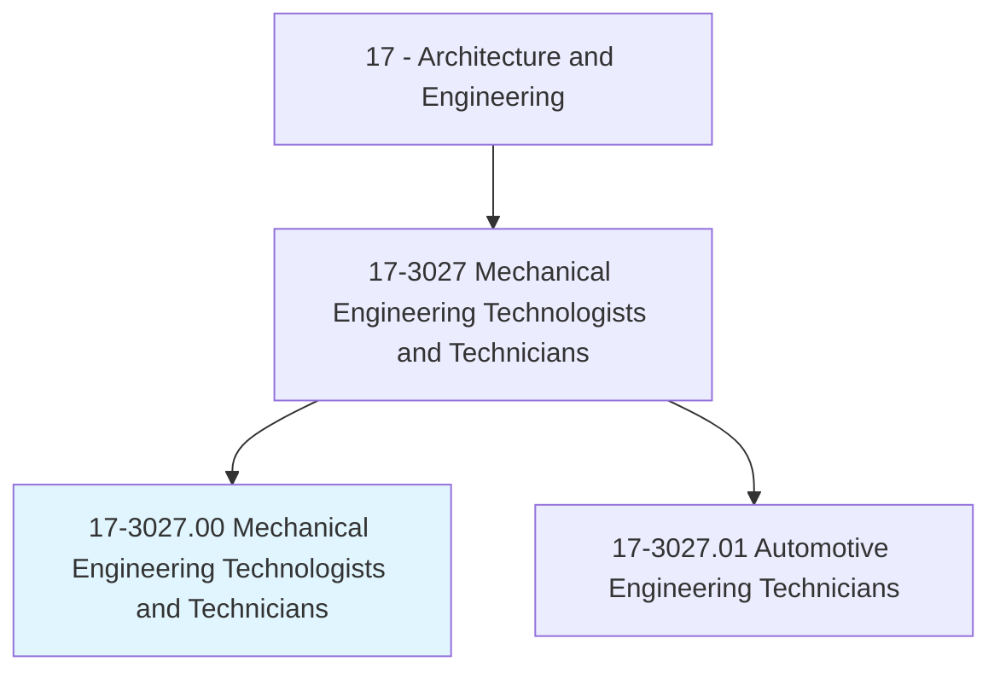
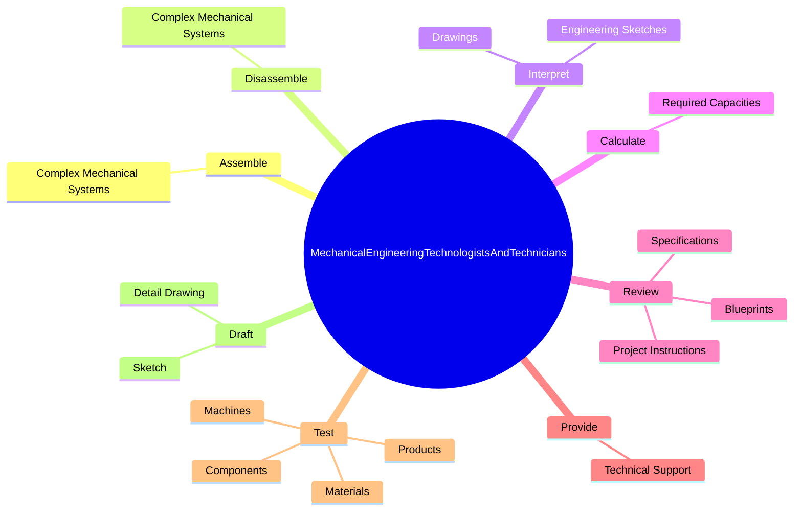
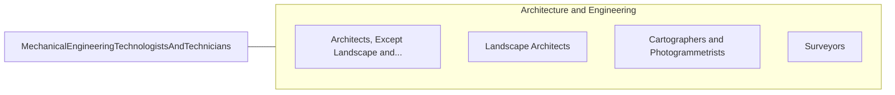

# Mechanical Engineering Technologists and Technicians

> Apply theory and principles of mechanical engineering to modify, develop, test, or adjust machinery and equipment under direction of engineering staff or physical scientists.

## Overview

Mechanical Engineering Technologists and Technicians is classified under Architecture and Engineering (SOC 17). Apply theory and principles of mechanical engineering to modify, develop, test, or adjust machinery and equipment under direction of engineering staff or physical scientists.

## Classification Hierarchy

## Key Statistics

| Metric | Value |
|--------|-------|
| SOC Code | 17-3027.00 |
| Category | [Architecture and Engineering](/occupations/Architecture/index) |
| Task Count | 189 |
| Source | O*NET |

## Core Tasks

### assemble.ComplexMechanicalSystems

Mechanical Engineering Technologists and Technicians assemble complex mechanical systems as part of their core responsibilities.

**Actions:**
- `assemble.ComplexMechanicalSystems`

### disassemble.ComplexMechanicalSystems

Mechanical Engineering Technologists and Technicians disassemble complex mechanical systems as part of their core responsibilities.

**Actions:**
- `disassemble.ComplexMechanicalSystems`

### interpret.EngineeringSketches

Mechanical Engineering Technologists and Technicians interpret engineering sketches as part of their core responsibilities.

**Actions:**
- `interpret.EngineeringSketches`
- `interpret.Drawings`

## Skills & Competencies

### Technical Skills
- **Engineering Design** - Advanced
- **CAD/CAM** - Advanced
- **Technical Analysis** - Advanced

### Soft Skills
- **Communication** - Essential
- **Problem Solving** - Essential
- **Critical Thinking** - Important
- **Teamwork** - Important
- **Adaptability** - Important

## Related Occupations

## Industries

This occupation is found across multiple industries. See [Industries](/industries) for sector-specific employment data.

## Career Progression

---

*Source: O*NET 17-3027.00 - ONETOccupation*
