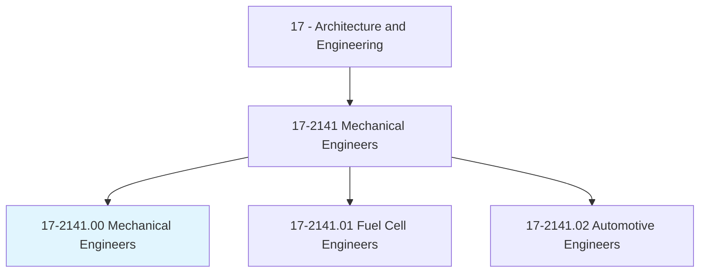
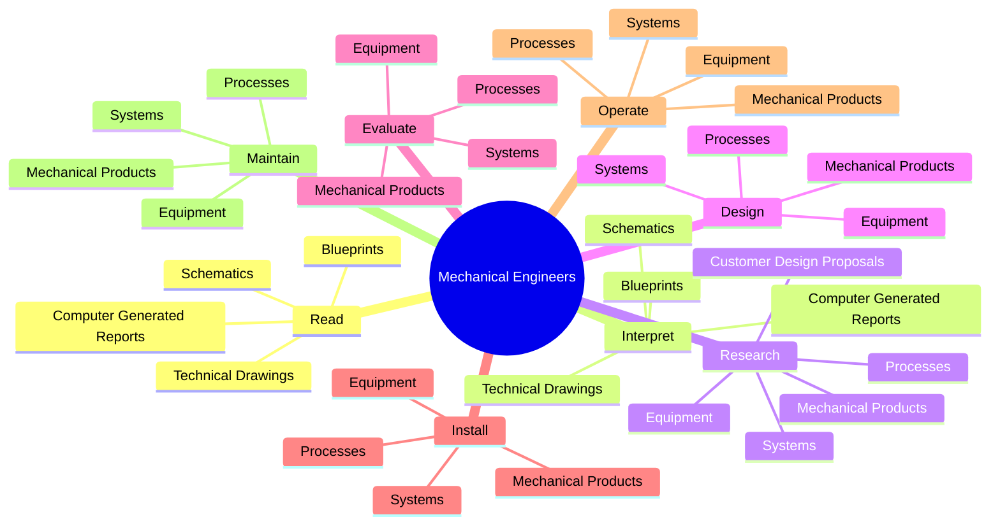
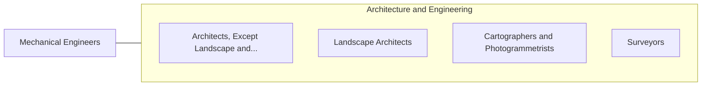

# Mechanical Engineers

> Perform engineering duties in planning and designing tools, engines, machines, and other mechanically functioning equipment. Oversee installation, operation, maintenance, and repair of equipment such as centralized heat, gas, water, and steam systems.

## Overview

Mechanical Engineers is an occupation within the Architecture and Engineering category. Perform engineering duties in planning and designing tools, engines, machines, and other mechanically functioning equipment. 

## Classification Hierarchy

## Key Statistics

| Metric | Value |
|--------|-------|
| SOC Code | 17-2141.00 |
| Category | [Architecture and Engineering](/occupations/Architecture/index) |
| Task Count | 225 |
| Source | O*NET |

## Core Tasks

### read.Blueprints

Mechanical Engineers read blueprints as part of their core responsibilities.

**Actions:**
- `read.Blueprints`
- `read.TechnicalDrawings`
- `read.Schematics`
- `read.ComputerGeneratedReports`

### interpret.Blueprints

Mechanical Engineers interpret blueprints as part of their core responsibilities.

**Actions:**
- `interpret.Blueprints`
- `interpret.TechnicalDrawings`
- `interpret.Schematics`
- `interpret.ComputerGeneratedReports`

### research.MechanicalProducts

Mechanical Engineers research mechanical products as part of their core responsibilities.

**Actions:**
- `research.MechanicalProducts.to.meet.Requirements`
- `research.Equipment.to.meet.Requirements`
- `research.Systems.to.meet.Requirements`
- `research.Processes.to.meet.Requirements`

## Skills & Competencies

### Technical Skills
- **Engineering Design** - Advanced
- **CAD/CAM** - Advanced
- **Technical Analysis** - Advanced

### Soft Skills
- **Communication** - Essential
- **Problem Solving** - Essential
- **Critical Thinking** - Important
- **Teamwork** - Important
- **Adaptability** - Important

## Related Occupations

## Industries

This occupation is found across multiple industries. See [Industries](/industries) for sector-specific employment data.

## Career Progression

---

*Source: O*NET 17-2141.00 - ONETOccupation*
