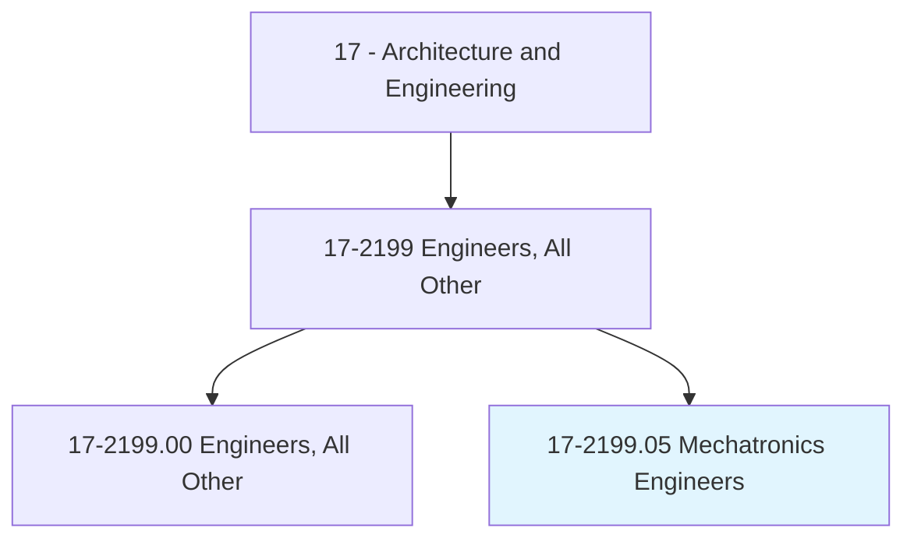
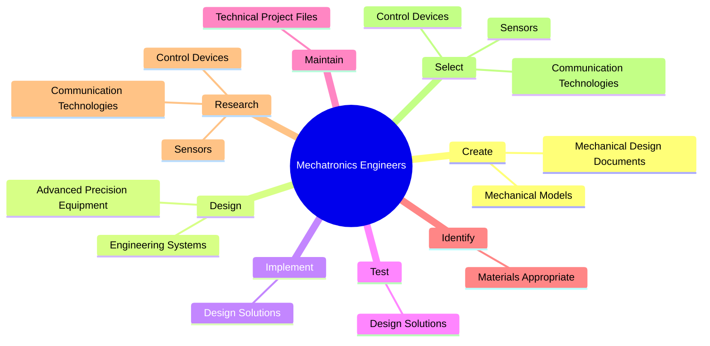
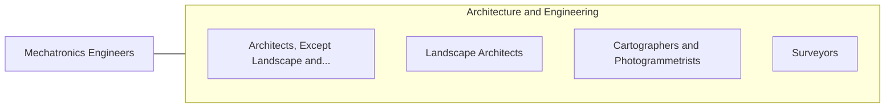

# Mechatronics Engineers

> Research, design, develop, or test automation, intelligent systems, smart devices, or industrial systems control.

## Overview

Mechatronics Engineers is classified under Architecture and Engineering (SOC 17). Research, design, develop, or test automation, intelligent systems, smart devices, or industrial systems control.

## Classification Hierarchy

## Key Statistics

| Metric | Value |
|--------|-------|
| SOC Code | 17-2199.05 |
| Category | [Architecture and Engineering](/occupations/Architecture) |
| Task Count | 106 |
| Source | O*NET |

## Core Tasks

### create.MechanicalDesignDocuments

Mechatronics Engineers create mechanical design documents as part of their core responsibilities.

**Actions:**
- `create.MechanicalDesignDocuments.for.Parts`
- `create.MechanicalDesignDocuments.for.Assemblies`
- `create.MechanicalDesignDocuments.for.FinishedProducts`
- `create.MechanicalModels.to.simulate.MechatronicDesignConcepts`

### design.AdvancedPrecisionEquipment

Mechatronics Engineers design advanced precision equipment as part of their core responsibilities.

**Actions:**
- `design.AdvancedPrecisionEquipment.for.Accurate`
- `design.AdvancedPrecisionEquipment.for.ControlledApplications`
- `design.EngineeringSystems.for.Automation.of.IndustrialTasks`

### implement.DesignSolutions

Mechatronics Engineers implement design solutions as part of their core responsibilities.

**Actions:**
- `implement.DesignSolutions`

## Skills & Competencies

### Technical Skills
- **Engineering Design** - Advanced
- **CAD/CAM** - Advanced
- **Technical Analysis** - Advanced

### Soft Skills
- **Communication** - Essential
- **Problem Solving** - Essential
- **Critical Thinking** - Important
- **Teamwork** - Important
- **Adaptability** - Important

## Related Occupations

## Industries

This occupation is found across multiple industries. See [Industries](/industries) for sector-specific employment data.

## Career Progression

---

*Source: O*NET 17-2199.05 - ONETOccupation*
