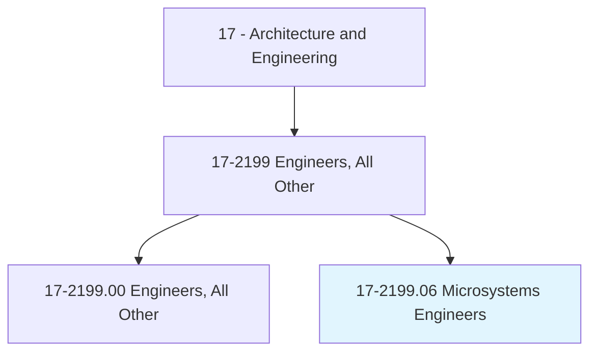
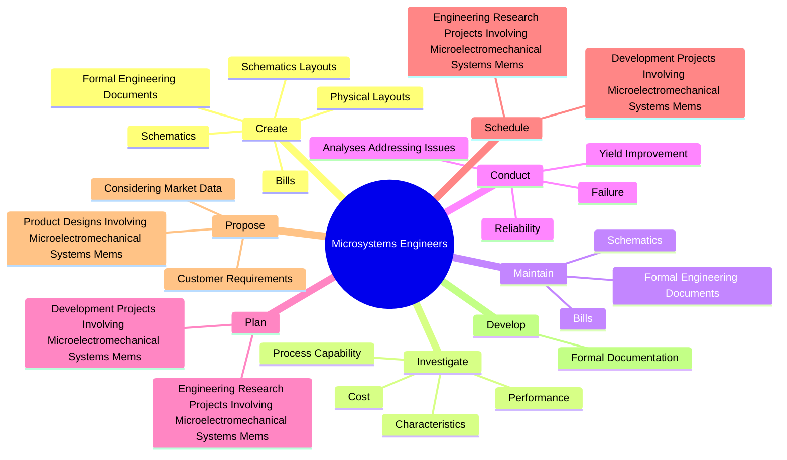
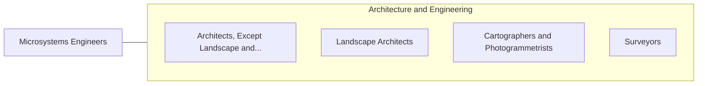

# Microsystems Engineers

> Research, design, develop, or test microelectromechanical systems (MEMS) devices.

## Overview

Microsystems Engineers is classified under Architecture and Engineering (SOC 17). Research, design, develop, or test microelectromechanical systems (MEMS) devices.

## Classification Hierarchy

## Key Statistics

| Metric | Value |
|--------|-------|
| SOC Code | 17-2199.06 |
| Category | [Architecture and Engineering](/occupations/Architecture/index) |
| Task Count | 238 |
| Source | O*NET |

## Core Tasks

### create.SchematicsLayouts

Microsystems Engineers create schematics layouts as part of their core responsibilities.

**Actions:**
- `create.SchematicsLayouts.of.IntegratedMicroelectromechanicalSystemsMems`
- `create.SchematicsLayouts.of.PackagedAssembliesConsistent.with.Process`
- `create.SchematicsLayouts.of.Functional`
- `create.SchematicsLayouts.of.PackageConstraints`

### investigate.Characteristics

Microsystems Engineers investigate characteristics as part of their core responsibilities.

**Actions:**
- `investigate.Characteristics.of.PotentialMicroelectromechanicalSystemsMems`
- `investigate.Characteristics.of.UsingSimulation`
- `investigate.Characteristics.of.ModelingSoftware`
- `investigate.Cost.of.PotentialMicroelectromechanicalSystemsMems`

### maintain.FormalEngineeringDocuments

Microsystems Engineers maintain formal engineering documents as part of their core responsibilities.

**Actions:**
- `maintain.FormalEngineeringDocuments.of.Materials`
- `maintain.FormalEngineeringDocuments.of.Components`
- `maintain.FormalEngineeringDocuments.of.MaterialsSpecifications`
- `maintain.FormalEngineeringDocuments.of.PackagingRequirements`

## Skills & Competencies

### Technical Skills
- **Engineering Design** - Advanced
- **CAD/CAM** - Advanced
- **Technical Analysis** - Advanced

### Soft Skills
- **Communication** - Essential
- **Problem Solving** - Essential
- **Critical Thinking** - Important
- **Teamwork** - Important
- **Adaptability** - Important

## Related Occupations

## Industries

This occupation is found across multiple industries. See [Industries](/industries) for sector-specific employment data.

## Career Progression

---

*Source: O*NET 17-2199.06 - ONETOccupation*
