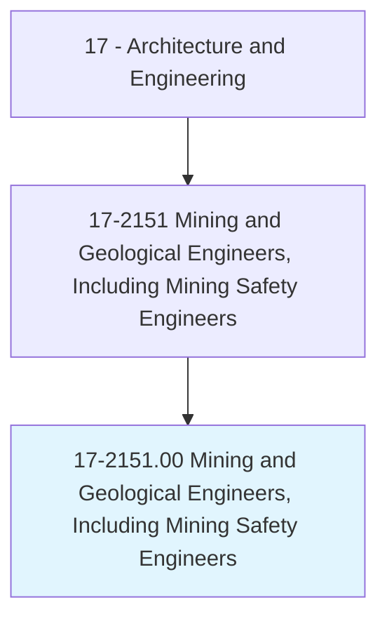
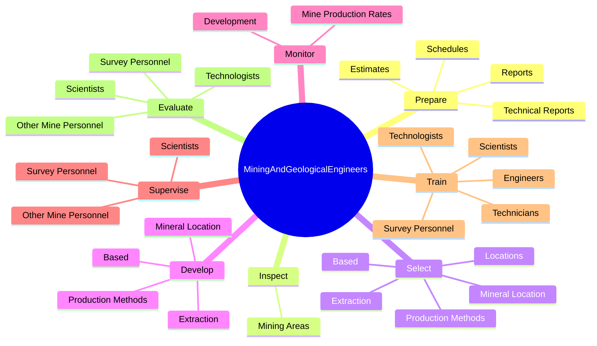
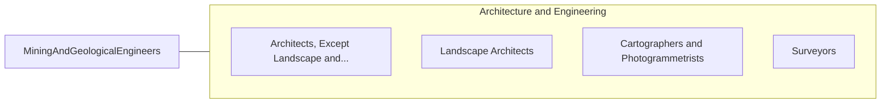

# Mining and Geological Engineers, Including Mining Safety Engineers

> Conduct subsurface surveys to identify the characteristics of potential land or mining development sites. May specify the ground support systems, processes, and equipment for safe, economical, and environmentally sound extraction or underground construction activities. May inspect areas for unsafe geological conditions, equipment, and working conditions. May design, implement, and coordinate mine safety programs.

## Overview

Mining and Geological Engineers, Including Mining Safety Engineers is an occupation within the Architecture and Engineering category. Conduct subsurface surveys to identify the characteristics of potential land or mining development sites. May specify the ground support systems, processes, and equipment for safe, economical, and environmentally sound extraction or underground construction activities.

## Classification Hierarchy

## Key Statistics

| Metric | Value |
|--------|-------|
| SOC Code | 17-2151.00 |
| Category | [Architecture and Engineering](/occupations/Architecture/index) |
| Task Count | 202 |
| Source | O*NET |

## Core Tasks

### prepare.TechnicalReports

Mining and Geological Engineers, Including Mining Safety Engineers prepare technical reports as part of their core responsibilities.

**Actions:**
- `prepare.TechnicalReports.for.Use.by.Mining`
- `prepare.TechnicalReports.for.Engineering`
- `prepare.TechnicalReports.for.ManagementPersonnel`
- `prepare.Schedules.of.Costs.involved.in.Developing`

### inspect.MiningAreas

Mining and Geological Engineers, Including Mining Safety Engineers inspect mining areas as part of their core responsibilities.

**Actions:**
- `inspect.MiningAreas.for.UnsafeStructures`
- `inspect.MiningAreas.for.Equipment`
- `inspect.MiningAreas.for.WorkingConditions`

### select.MineralLocation

Mining and Geological Engineers, Including Mining Safety Engineers select mineral location as part of their core responsibilities.

**Actions:**
- `select.MineralLocation.on.Factors`
- `select.MineralLocation.on.Safety`
- `select.MineralLocation.on.Cost`
- `select.MineralLocation.on.DepositCharacteristics`

## Skills & Competencies

### Technical Skills
- **Engineering Design** - Advanced
- **CAD/CAM** - Advanced
- **Technical Analysis** - Advanced

### Soft Skills
- **Communication** - Essential
- **Problem Solving** - Essential
- **Critical Thinking** - Important
- **Teamwork** - Important
- **Adaptability** - Important

## Related Occupations

## Industries

This occupation is found across multiple industries. See [Industries](/industries) for sector-specific employment data.

## Career Progression

---

*Source: O*NET 17-2151.00 - ONETOccupation*
