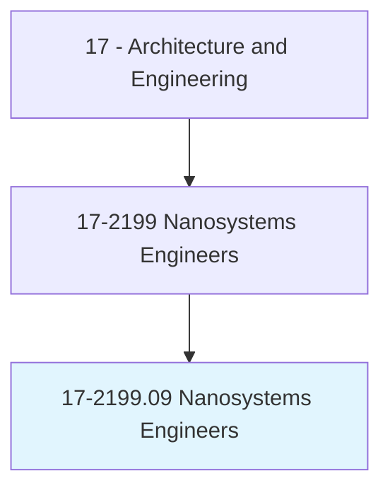
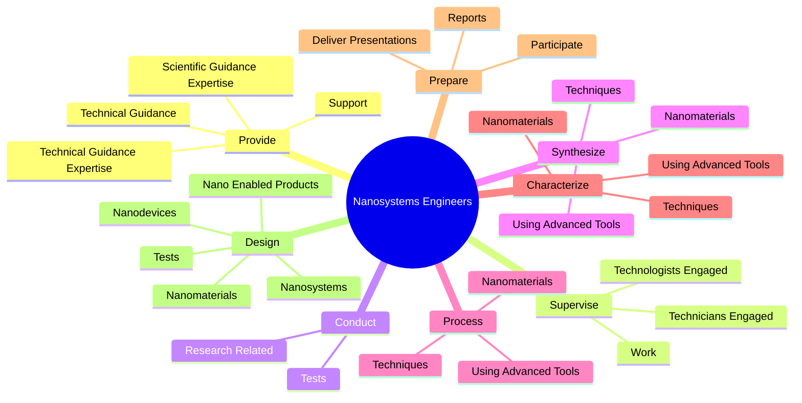
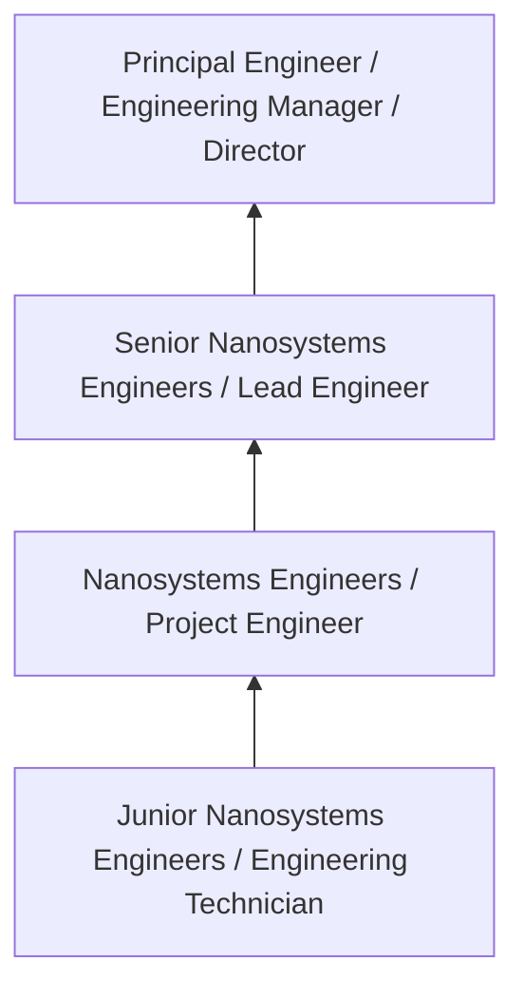
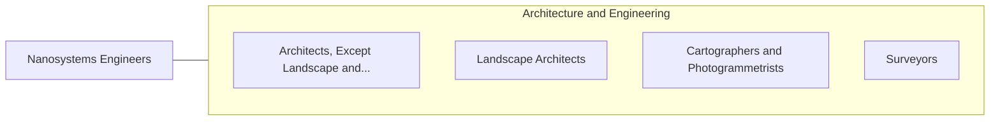

# Nanosystems Engineers

> Design, develop, or supervise the production of materials, devices, or systems of unique molecular or macromolecular composition, applying principles of nanoscale physics and electrical, chemical, or biological engineering.

## Overview

Nanosystems Engineers professionals design, develop, or supervise the production of materials, devices, or systems of unique molecular or macromolecular composition, applying principles of nanoscale physics and electrical, chemical, or biological engineering.. This occupation falls within the Architecture and Engineering category and requires a combination of specialized knowledge, technical skills, and practical experience.

These professionals work across diverse settings and organizational contexts, applying their expertise to meet the demands of their field. They must stay current with industry standards, emerging practices, and regulatory requirements that affect their work. The role demands both independent judgment and collaborative skills, as practitioners regularly interact with colleagues, stakeholders, and the public.

As the field continues to evolve, Nanosystems Engineers professionals increasingly leverage technology and data-driven approaches to enhance their effectiveness. Career opportunities span the public and private sectors, with demand influenced by economic conditions, demographic shifts, and technological advancement.

## Classification Hierarchy



## Key Statistics

| Metric | Value |
|--------|-------|
| SOC Code | 17-2199.09 |
| Job Zone | N/A |
| Category | [Architecture and Engineering](/occupations/Architecture/index) |
| Core Tasks | 150+ |
| Salary Range | $55,000 - $140,000 |
| Median Salary | $85,000 |
| Growth Outlook | 4% (As fast as average) |
| Source | O*NET |

## Core Tasks



### provide.ScientificGuidanceExpertise

Nanosystems Engineers provide scientific guidance expertise as part of their core responsibilities.

**Actions:**
- `provide.ScientificGuidanceExpertise.to.Scientists` - Provide scientific or technical guidance or expertise to scientists, engineer...
- `provide.ScientificGuidanceExpertise.to.engineers` - Provide scientific or technical guidance or expertise to scientists, engineer...
- `provide.ScientificGuidanceExpertise.to.Technologists` - Provide scientific or technical guidance or expertise to scientists, engineer...
- `provide.ScientificGuidanceExpertise.to.Technicians` - Provide scientific or technical guidance or expertise to scientists, engineer...
- `provide.ScientificGuidanceExpertise.to.Others` - Provide scientific or technical guidance or expertise to scientists, engineer...

### develop.ProcessesEquipmentNeeded

Nanosystems Engineers develop processes equipment needed as part of their core responsibilities.

**Actions:**
- `develop.ProcessesEquipmentNeeded.for.PilotNanoscaleScaleProduction` - Develop processes or identify equipment needed for pilot or commercial nanosc...
- `develop.ProcessesEquipmentNeeded.for.CommercialNanoscaleScaleProduction` - Develop processes or identify equipment needed for pilot or commercial nanosc...
- `develop.IdentifyEquipmentNeeded.for.PilotNanoscaleScaleProduction` - Develop processes or identify equipment needed for pilot or commercial nanosc...
- `develop.IdentifyEquipmentNeeded.for.CommercialNanoscaleScaleProduction` - Develop processes or identify equipment needed for pilot or commercial nanosc...
- `develop.CatalysisGreenChemistryMethods.to.synthesize.Nanomaterials` - Develop catalysis or other green chemistry methods to synthesize nanomaterial...

### design.Tests

Nanosystems Engineers design tests as part of their core responsibilities.

**Actions:**
- `design.Tests.of.NewNanotechnologyProducts` - Design or conduct tests of new nanotechnology products, processes, or systems.
- `design.Tests.of.Processes` - Design or conduct tests of new nanotechnology products, processes, or systems.
- `design.Tests.of.Systems` - Design or conduct tests of new nanotechnology products, processes, or systems.
- `design.Nanomaterials` - Design or engineer nanomaterials, nanodevices, nano-enabled products, or nano...
- `design.Nanodevices` - Design or engineer nanomaterials, nanodevices, nano-enabled products, or nano...

### conduct.ResearchRelated

Nanosystems Engineers conduct research related as part of their core responsibilities.

**Actions:**
- `conduct.ResearchRelated.to.RangeOfNanotechnologyTopics` - Conduct research related to a range of nanotechnology topics, such as packagi...
- `conduct.ResearchRelated.to.Packaging` - Conduct research related to a range of nanotechnology topics, such as packagi...
- `conduct.ResearchRelated.to.heat.Transfer` - Conduct research related to a range of nanotechnology topics, such as packagi...
- `conduct.ResearchRelated.to.FluorescenceDetection` - Conduct research related to a range of nanotechnology topics, such as packagi...
- `conduct.ResearchRelated.to.NanoparticleDispersion` - Conduct research related to a range of nanotechnology topics, such as packagi...


## Skills & Competencies

### Technical Skills
- **Technical Design** - Expert
- **Engineering Analysis** - Advanced
- **CAD/BIM Software** - Advanced
- **Project Management** - Advanced
- **Code Compliance** - Advanced
- **Quality Assurance** - Proficient

### Soft Skills
- **Analytical Thinking** - Critical
- **Problem Solving** - Critical
- **Attention to Detail** - Essential
- **Teamwork** - Essential
- **Communication** - Essential

## Education & Certifications

| Requirement | Details |
|-------------|---------|
| Typical Education | Bachelor's degree in engineering, architecture, or related field |
| Work Experience | 2-4 years professional experience |
| On-the-Job Training | Moderate - technical specialization required |
| Certifications | Professional Engineer (PE), Architect License, or field-specific certifications |

## Career Progression



## Industry Variations

### Private Sector Engineering
Design and development work for commercial clients. Nanosystems Engineers professionals focus on product development, system design, and project delivery.

### Government and Infrastructure
Public works and infrastructure projects with emphasis on regulatory compliance and long-term sustainability.

### Construction and Field Engineering
On-site implementation and oversight of engineering designs. Strong focus on quality control and safety compliance.

### Consulting
Advisory services for diverse clients. Requires strong project management skills and ability to work across multiple simultaneous projects.

## Technology & Tools

- **Computer-Aided Design (CAD) software**
- **Building Information Modeling (BIM)**
- **Geographic Information Systems (GIS)**
- **Structural analysis software**
- **Project management tools**

## Related Occupations



## Industries

- [Engineering Services](/industries/Engineering) - High Employment
- [Construction](/industries/Construction) - High Employment
- [Manufacturing](/industries/Manufacturing) - Moderate Employment
- [Government](/industries/PublicAdministration) - Moderate Employment

## Departments

This occupation typically works in:
- [Engineering](/departments/Engineering/index)
- Design
- Project Management

## GraphDL Semantic Structure

```graphdl
Nanosystems Engineers perform:
- provide.ScientificGuidanceExpertise.to.Scientists
- provide.ScientificGuidanceExpertise.to.engineers
- provide.ScientificGuidanceExpertise.to.Technologists
- provide.ScientificGuidanceExpertise.to.Technicians
- provide.ScientificGuidanceExpertise.to.Others
- provide.ScientificGuidanceExpertise.to.UsingKnowledgeOfChemical
```

---

*Source: O*NET 17-2199.09 - ONETOccupation*
