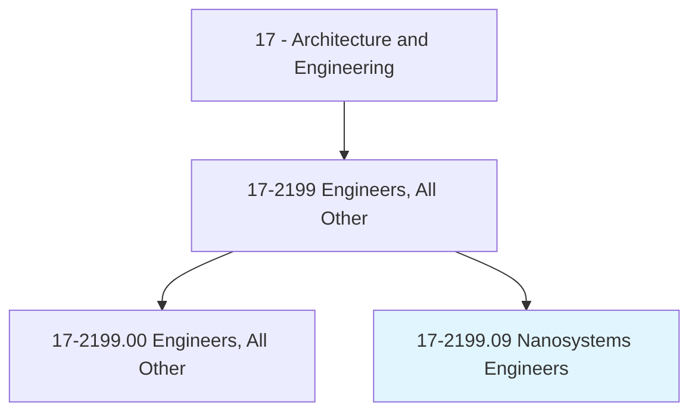
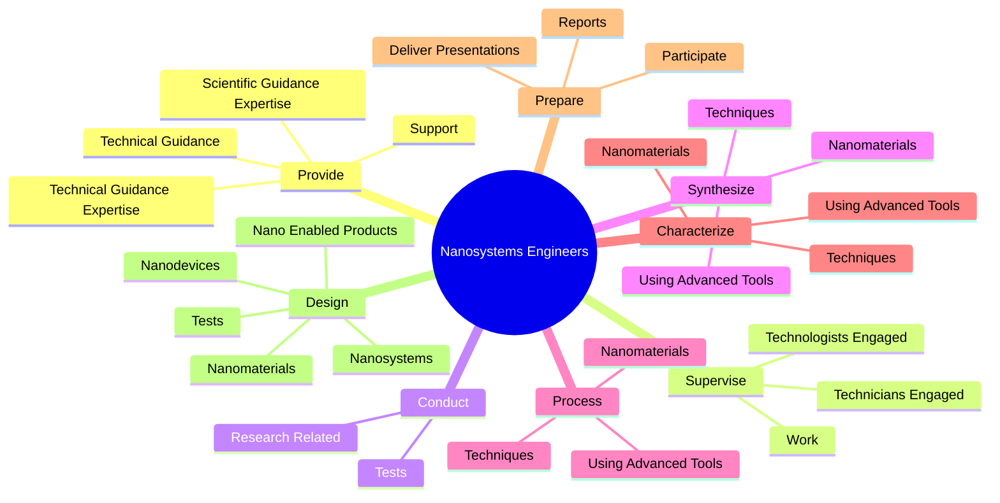
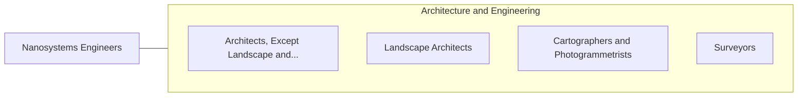

# Nanosystems Engineers

> Design, develop, or supervise the production of materials, devices, or systems of unique molecular or macromolecular composition, applying principles of nanoscale physics and electrical, chemical, or biological engineering.

## Overview

Nanosystems Engineers is classified under Architecture and Engineering (SOC 17). Design, develop, or supervise the production of materials, devices, or systems of unique molecular or macromolecular composition, applying principles of nanoscale physics and electrical, chemical, or biological engineering.

## Classification Hierarchy

## Key Statistics

| Metric | Value |
|--------|-------|
| SOC Code | 17-2199.09 |
| Category | [Architecture and Engineering](/occupations/Architecture/index) |
| Task Count | 150 |
| Source | O*NET |

## Core Tasks

### provide.ScientificGuidanceExpertise

Nanosystems Engineers provide scientific guidance expertise as part of their core responsibilities.

**Actions:**
- `provide.ScientificGuidanceExpertise.to.Scientists`
- `provide.ScientificGuidanceExpertise.to.engineers`
- `provide.ScientificGuidanceExpertise.to.Technologists`
- `provide.ScientificGuidanceExpertise.to.Technicians`

### supervise.TechnologistsEngaged

Nanosystems Engineers supervise technologists engaged as part of their core responsibilities.

**Actions:**
- `supervise.TechnologistsEngaged.in.NanotechnologyResearch`
- `supervise.TechnologistsEngaged.in.Production`
- `supervise.TechniciansEngaged.in.NanotechnologyResearch`
- `supervise.TechniciansEngaged.in.Production`

### conduct.ResearchRelated

Nanosystems Engineers conduct research related as part of their core responsibilities.

**Actions:**
- `conduct.ResearchRelated.to.RangeOfNanotechnologyTopics`
- `conduct.ResearchRelated.to.Packaging`
- `conduct.ResearchRelated.to.heat.Transfer`
- `conduct.ResearchRelated.to.FluorescenceDetection`

## Skills & Competencies

### Technical Skills
- **Engineering Design** - Advanced
- **CAD/CAM** - Advanced
- **Technical Analysis** - Advanced

### Soft Skills
- **Communication** - Essential
- **Problem Solving** - Essential
- **Critical Thinking** - Important
- **Teamwork** - Important
- **Adaptability** - Important

## Related Occupations

## Industries

This occupation is found across multiple industries. See [Industries](/industries) for sector-specific employment data.

## Career Progression

---

*Source: O*NET 17-2199.09 - ONETOccupation*
