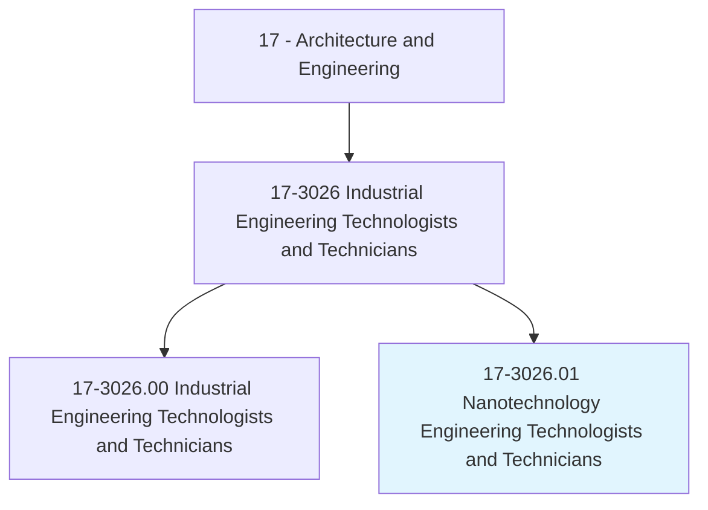
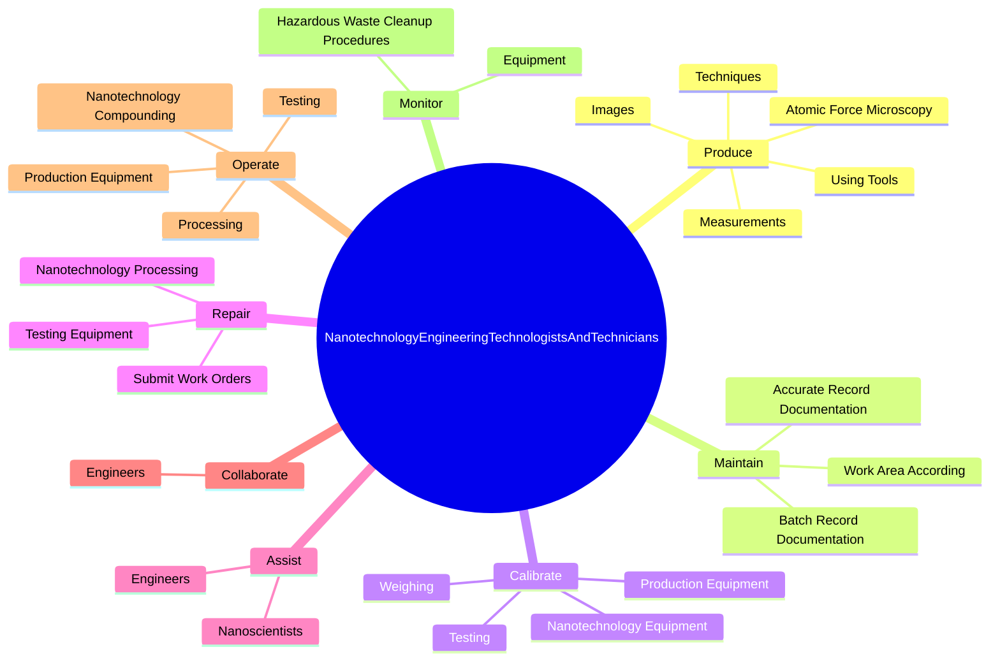
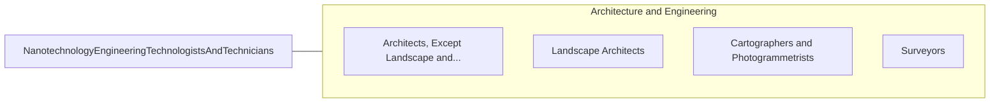

# Nanotechnology Engineering Technologists and Technicians

> Implement production processes and operate commercial-scale production equipment to produce, test, or modify materials, devices, or systems of unique molecular or macromolecular composition. Operate advanced microscopy equipment to manipulate nanoscale objects. Work under the supervision of nanoengineering staff.

## Overview

Nanotechnology Engineering Technologists and Technicians is a specialized variant within the Architecture and Engineering category. Implement production processes and operate commercial-scale production equipment to produce, test, or modify materials, devices, or systems of unique molecular or macromolecular composition. Operate advanced microscopy equipment to manipulate nanoscale objects.

## Classification Hierarchy

## Key Statistics

| Metric | Value |
|--------|-------|
| SOC Code | 17-3026.01 |
| Category | [Architecture and Engineering](/occupations/Architecture/index) |
| Task Count | 140 |
| Source | O*NET |

## Core Tasks

### produce.Images

Nanotechnology Engineering Technologists and Technicians produce images as part of their core responsibilities.

**Actions:**
- `produce.Images`
- `produce.Measurements`
- `produce.UsingTools`
- `produce.Techniques`

### maintain.AccurateRecordDocumentation

Nanotechnology Engineering Technologists and Technicians maintain accurate record documentation as part of their core responsibilities.

**Actions:**
- `maintain.AccurateRecordDocumentation.of.Nanoproduction`
- `maintain.BatchRecordDocumentation.of.Nanoproduction`
- `maintain.WorkAreaAccording.to.CleanroomProcessingStandards`
- `maintain.WorkAreaAccording.to.OtherProcessingStandards`

### calibrate.NanotechnologyEquipment

Nanotechnology Engineering Technologists and Technicians calibrate nanotechnology equipment as part of their core responsibilities.

**Actions:**
- `calibrate.NanotechnologyEquipment`
- `calibrate.Weighing`
- `calibrate.Testing`
- `calibrate.ProductionEquipment`

## Skills & Competencies

### Technical Skills
- **Engineering Design** - Advanced
- **CAD/CAM** - Advanced
- **Technical Analysis** - Advanced

### Soft Skills
- **Communication** - Essential
- **Problem Solving** - Essential
- **Critical Thinking** - Important
- **Teamwork** - Important
- **Adaptability** - Important

## Related Occupations

## Industries

This occupation is found across multiple industries. See [Industries](/industries) for sector-specific employment data.

## Career Progression

---

*Source: O*NET 17-3026.01 - ONETOccupation*
