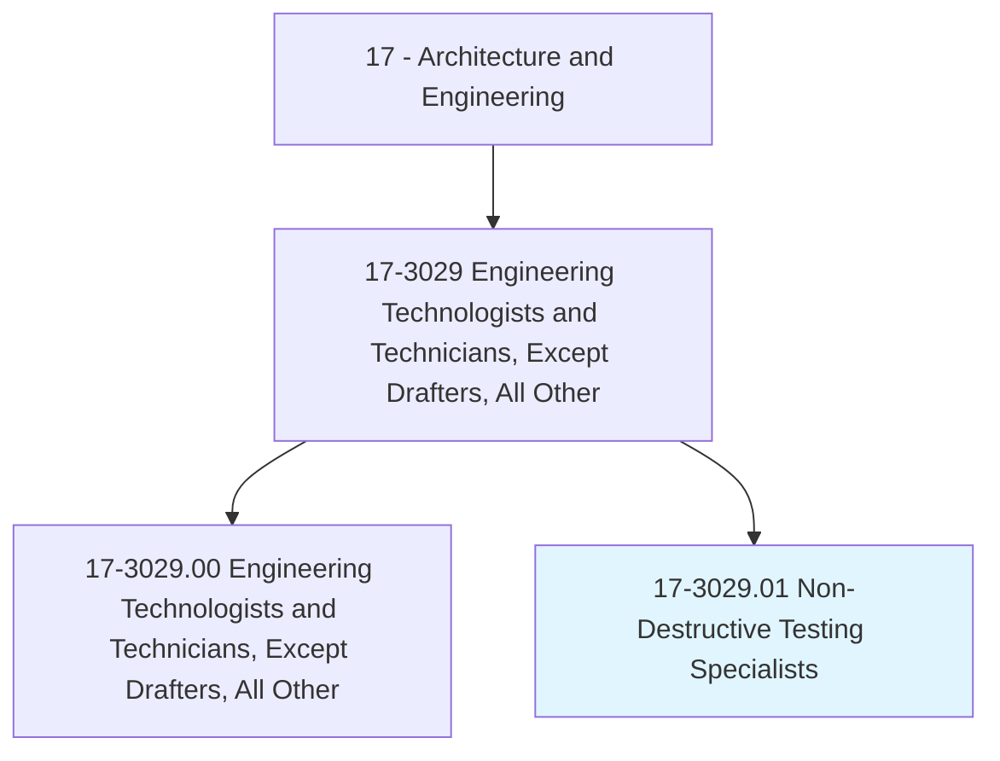
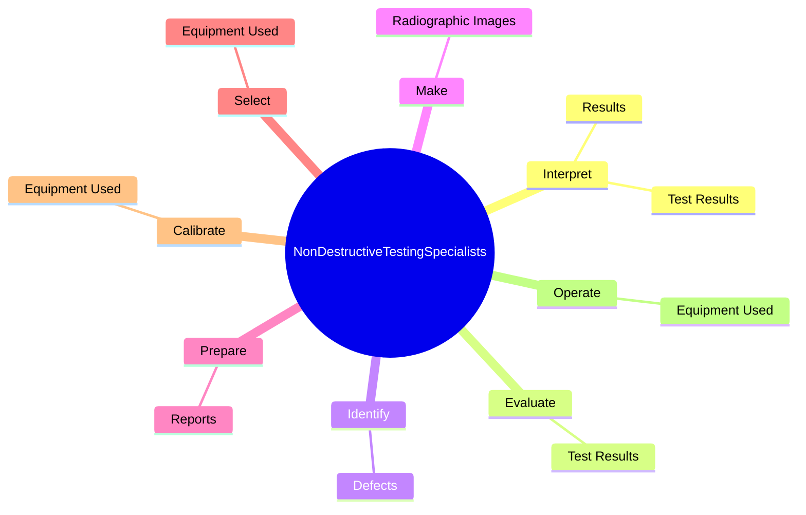
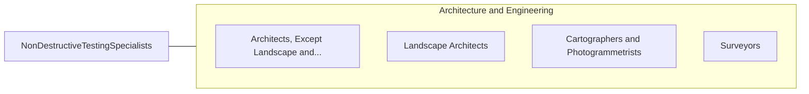

# Non-Destructive Testing Specialists

> Test the safety of structures, vehicles, or vessels using x-ray, ultrasound, fiber optic or related equipment.

## Overview

Non-Destructive Testing Specialists is classified under Architecture and Engineering (SOC 17). Test the safety of structures, vehicles, or vessels using x-ray, ultrasound, fiber optic or related equipment.

## Classification Hierarchy

## Key Statistics

| Metric | Value |
|--------|-------|
| SOC Code | 17-3029.01 |
| Category | [Architecture and Engineering](/occupations/Architecture/index) |
| Task Count | 99 |
| Source | O*NET |

## Core Tasks

### interpret.Results

Non-Destructive Testing Specialists interpret results as part of their core responsibilities.

**Actions:**
- `interpret.Results.of.Methods.of.NonDestructiveTestingNdt`
- `interpret.Results.of.AcousticEmission`
- `interpret.Results.of.Electromagnetic`
- `interpret.Results.of.Leak`

### evaluate.TestResults

Non-Destructive Testing Specialists evaluate test results as part of their core responsibilities.

**Actions:**
- `evaluate.TestResults.in.Accordance.with.ApplicableCodes`
- `evaluate.TestResults.in.Standards`
- `evaluate.TestResults.in.Specifications`
- `evaluate.TestResults.in.Procedures`

### identify.Defects

Non-Destructive Testing Specialists identify defects as part of their core responsibilities.

**Actions:**
- `identify.Defects.in.SolidMaterials`
- `identify.Defects.in.UsingUltrasonicTestingTechniques`
- `identify.Defects.in.ConcreteBuildingMaterials`
- `identify.Defects.in.OtherBuildingMaterials`

## Skills & Competencies

### Technical Skills
- **Engineering Design** - Advanced
- **CAD/CAM** - Advanced
- **Technical Analysis** - Advanced

### Soft Skills
- **Communication** - Essential
- **Problem Solving** - Essential
- **Critical Thinking** - Important
- **Teamwork** - Important
- **Adaptability** - Important

## Related Occupations

## Industries

This occupation is found across multiple industries. See [Industries](/industries) for sector-specific employment data.

## Career Progression

---

*Source: O*NET 17-3029.01 - ONETOccupation*
