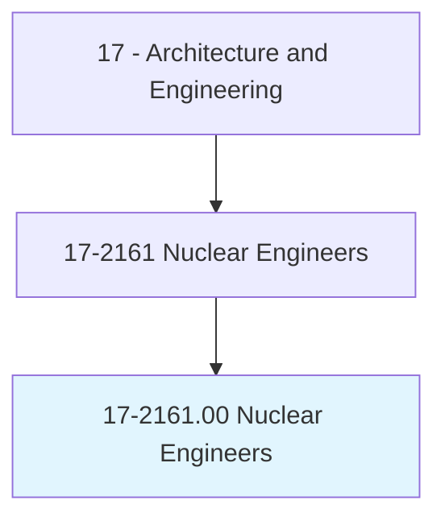
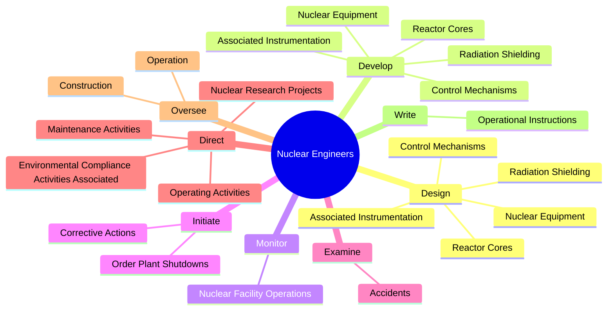
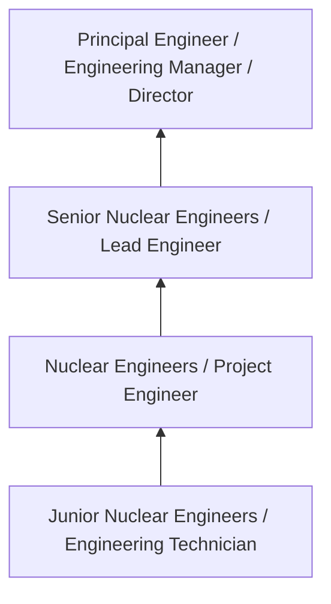
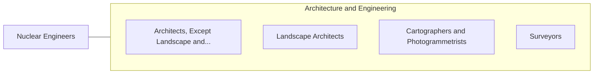

# Nuclear Engineers

> Conduct research on nuclear engineering projects or apply principles and theory of nuclear science to problems concerned with release, control, and use of nuclear energy and nuclear waste disposal.

## Overview

Nuclear Engineers professionals conduct research on nuclear engineering projects or apply principles and theory of nuclear science to problems concerned with release, control, and use of nuclear energy and nuclear waste disposal.. This occupation falls within the Architecture and Engineering category and requires a combination of specialized knowledge, technical skills, and practical experience.

These professionals work across diverse settings and organizational contexts, applying their expertise to meet the demands of their field. They must stay current with industry standards, emerging practices, and regulatory requirements that affect their work. The role demands both independent judgment and collaborative skills, as practitioners regularly interact with colleagues, stakeholders, and the public.

As the field continues to evolve, Nuclear Engineers professionals increasingly leverage technology and data-driven approaches to enhance their effectiveness. Career opportunities span the public and private sectors, with demand influenced by economic conditions, demographic shifts, and technological advancement.

## Classification Hierarchy



## Key Statistics

| Metric | Value |
|--------|-------|
| SOC Code | 17-2161.00 |
| Job Zone | N/A |
| Category | [Architecture and Engineering](/occupations/Architecture/index) |
| Core Tasks | 79+ |
| Salary Range | $55,000 - $140,000 |
| Median Salary | $85,000 |
| Growth Outlook | 4% (As fast as average) |
| Source | O*NET |

## Core Tasks



### design.NuclearEquipment

Nuclear Engineers design nuclear equipment as part of their core responsibilities.

**Actions:**
- `design.NuclearEquipment` - Design or develop nuclear equipment, such as reactor cores, radiation shieldi...
- `design.ReactorCores` - Design or develop nuclear equipment, such as reactor cores, radiation shieldi...
- `design.RadiationShielding` - Design or develop nuclear equipment, such as reactor cores, radiation shieldi...
- `design.AssociatedInstrumentation` - Design or develop nuclear equipment, such as reactor cores, radiation shieldi...
- `design.ControlMechanisms` - Design or develop nuclear equipment, such as reactor cores, radiation shieldi...

### direct.OperatingActivities

Nuclear Engineers direct operating activities as part of their core responsibilities.

**Actions:**
- `direct.OperatingActivities.of.NuclearPowerPlants.to.ensure.EfficiencyToSafetyStandards` - Direct operating or maintenance activities of nuclear power plants to ensure ...
- `direct.OperatingActivities.of.ConformityToSafetyStandards` - Direct operating or maintenance activities of nuclear power plants to ensure ...
- `direct.MaintenanceActivities.of.NuclearPowerPlants.to.ensure.EfficiencyToSafetyStandards` - Direct operating or maintenance activities of nuclear power plants to ensure ...
- `direct.MaintenanceActivities.of.ConformityToSafetyStandards` - Direct operating or maintenance activities of nuclear power plants to ensure ...
- `direct.EnvironmentalComplianceActivitiesAssociated.with.NuclearPlantOperations` - Direct environmental compliance activities associated with nuclear plant oper...

### oversee.Construction

Nuclear Engineers oversee construction as part of their core responsibilities.

**Actions:**
- `oversee.Construction.of.NuclearReactors` - Design or oversee construction or operation of nuclear reactors, power plants...
- `oversee.Construction.of.PowerPlants` - Design or oversee construction or operation of nuclear reactors, power plants...
- `oversee.Construction.of.NuclearFuelsReprocessingSystems` - Design or oversee construction or operation of nuclear reactors, power plants...
- `oversee.Construction.of.ReclamationSystems` - Design or oversee construction or operation of nuclear reactors, power plants...
- `oversee.Operation.of.NuclearReactors` - Design or oversee construction or operation of nuclear reactors, power plants...

### prepare.TechnicalReports

Nuclear Engineers prepare technical reports as part of their core responsibilities.

**Actions:**
- `prepare.TechnicalReports.of.FindingsBased.on.SynthesizedAnalysesOfTestResults` - Prepare technical reports of findings or recommendations, based on synthesize...
- `prepare.TechnicalReports.of.RecommendationsBased.on.SynthesizedAnalysesOfTestResults` - Prepare technical reports of findings or recommendations, based on synthesize...
- `prepare.EnvironmentalImpactStatements.for.RegulatoryAgencies` - Prepare environmental impact statements, reports, or presentations for regula...
- `prepare.EnvironmentalImpactStatements.for.OtherAgencies` - Prepare environmental impact statements, reports, or presentations for regula...
- `prepare.Reports.for.RegulatoryAgencies` - Prepare environmental impact statements, reports, or presentations for regula...


## Skills & Competencies

### Technical Skills
- **Technical Design** - Expert
- **Engineering Analysis** - Advanced
- **CAD/BIM Software** - Advanced
- **Project Management** - Advanced
- **Code Compliance** - Advanced
- **Quality Assurance** - Proficient

### Soft Skills
- **Analytical Thinking** - Critical
- **Problem Solving** - Critical
- **Attention to Detail** - Essential
- **Teamwork** - Essential
- **Communication** - Essential

## Education & Certifications

| Requirement | Details |
|-------------|---------|
| Typical Education | Bachelor's degree in engineering, architecture, or related field |
| Work Experience | 2-4 years professional experience |
| On-the-Job Training | Moderate - technical specialization required |
| Certifications | Professional Engineer (PE), Architect License, or field-specific certifications |

## Career Progression



## Industry Variations

### Private Sector Engineering
Design and development work for commercial clients. Nuclear Engineers professionals focus on product development, system design, and project delivery.

### Government and Infrastructure
Public works and infrastructure projects with emphasis on regulatory compliance and long-term sustainability.

### Construction and Field Engineering
On-site implementation and oversight of engineering designs. Strong focus on quality control and safety compliance.

### Consulting
Advisory services for diverse clients. Requires strong project management skills and ability to work across multiple simultaneous projects.

## Technology & Tools

- **Computer-Aided Design (CAD) software**
- **Building Information Modeling (BIM)**
- **Geographic Information Systems (GIS)**
- **Structural analysis software**
- **Project management tools**

## Related Occupations



## Industries

- [Engineering Services](/industries/Engineering) - High Employment
- [Construction](/industries/Construction) - High Employment
- [Manufacturing](/industries/Manufacturing) - Moderate Employment
- [Government](/industries/PublicAdministration) - Moderate Employment

## Departments

This occupation typically works in:
- [Engineering](/departments/Engineering/index)
- Design
- Project Management

## GraphDL Semantic Structure

```graphdl
Nuclear Engineers perform:
- design.NuclearEquipment
- design.ReactorCores
- design.RadiationShielding
- design.AssociatedInstrumentation
- design.ControlMechanisms
- develop.NuclearEquipment
```

---

*Source: O*NET 17-2161.00 - ONETOccupation*
