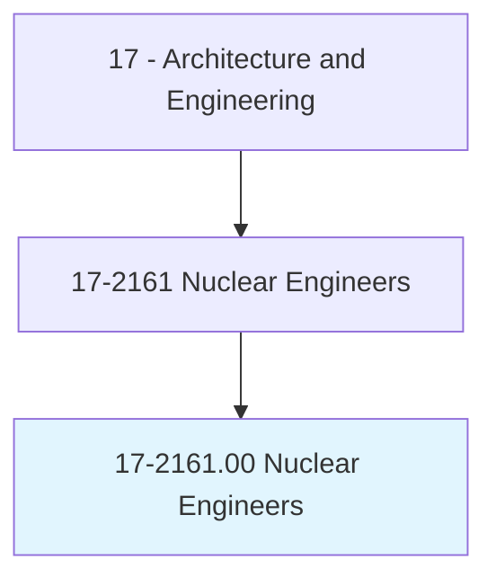
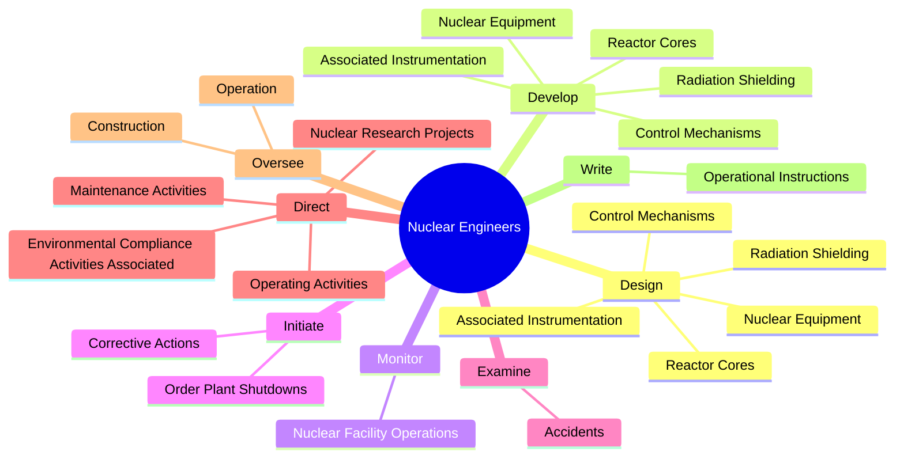
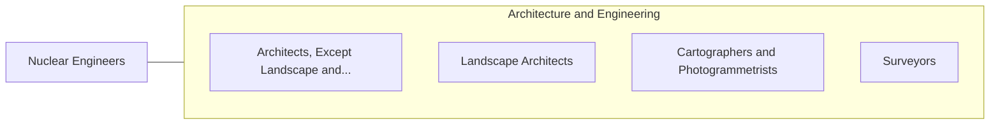

# Nuclear Engineers

> Conduct research on nuclear engineering projects or apply principles and theory of nuclear science to problems concerned with release, control, and use of nuclear energy and nuclear waste disposal.

## Overview

Nuclear Engineers is classified under Architecture and Engineering (SOC 17). Conduct research on nuclear engineering projects or apply principles and theory of nuclear science to problems concerned with release, control, and use of nuclear energy and nuclear waste disposal.

## Classification Hierarchy

## Key Statistics

| Metric | Value |
|--------|-------|
| SOC Code | 17-2161.00 |
| Category | [Architecture and Engineering](/occupations/Architecture/index) |
| Task Count | 79 |
| Source | O*NET |

## Core Tasks

### design.NuclearEquipment

Nuclear Engineers design nuclear equipment as part of their core responsibilities.

**Actions:**
- `design.NuclearEquipment`
- `design.ReactorCores`
- `design.RadiationShielding`
- `design.AssociatedInstrumentation`

### develop.NuclearEquipment

Nuclear Engineers develop nuclear equipment as part of their core responsibilities.

**Actions:**
- `develop.NuclearEquipment`
- `develop.ReactorCores`
- `develop.RadiationShielding`
- `develop.AssociatedInstrumentation`

### monitor.NuclearFacilityOperations

Nuclear Engineers monitor nuclear facility operations as part of their core responsibilities.

**Actions:**
- `monitor.NuclearFacilityOperations.to.identify.Design`
- `monitor.NuclearFacilityOperations.to.Construction`
- `monitor.NuclearFacilityOperations.to.OperationPracticesViolateSafetyRegulationsCouldJeopardizeSafeOperations`
- `monitor.NuclearFacilityOperations.to.LawsCouldJeopardizeSafeOperations`

## Skills & Competencies

### Technical Skills
- **Engineering Design** - Advanced
- **CAD/CAM** - Advanced
- **Technical Analysis** - Advanced

### Soft Skills
- **Communication** - Essential
- **Problem Solving** - Essential
- **Critical Thinking** - Important
- **Teamwork** - Important
- **Adaptability** - Important

## Related Occupations

## Industries

This occupation is found across multiple industries. See [Industries](/industries) for sector-specific employment data.

## Career Progression

---

*Source: O*NET 17-2161.00 - ONETOccupation*
