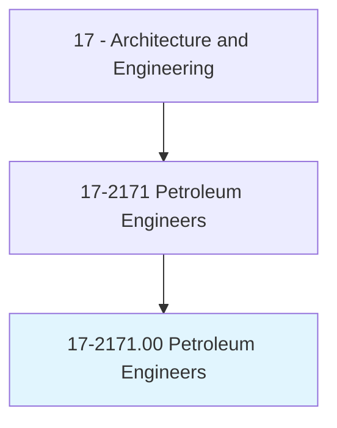
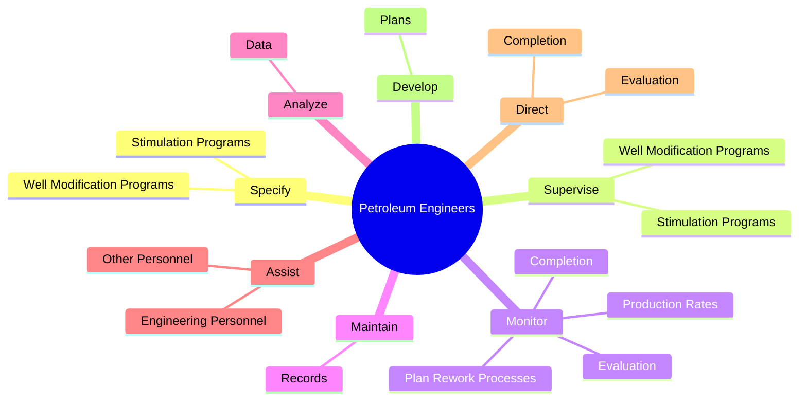
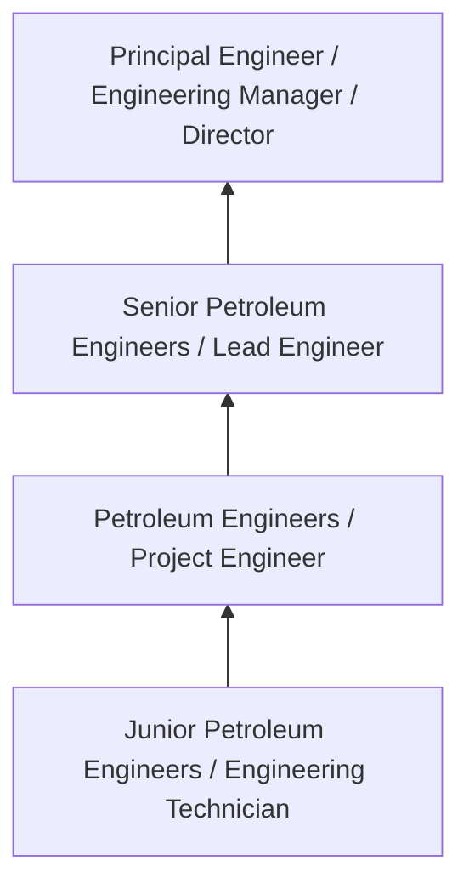
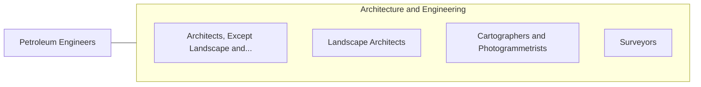

# Petroleum Engineers

> Devise methods to improve oil and gas extraction and production and determine the need for new or modified tool designs. Oversee drilling and offer technical advice.

## Overview

Petroleum Engineers professionals devise methods to improve oil and gas extraction and production and determine the need for new or modified tool designs. This occupation falls within the Architecture and Engineering category and requires a combination of specialized knowledge, technical skills, and practical experience.

These professionals work across diverse settings and organizational contexts, applying their expertise to meet the demands of their field. They must stay current with industry standards, emerging practices, and regulatory requirements that affect their work. The role demands both independent judgment and collaborative skills, as practitioners regularly interact with colleagues, stakeholders, and the public.

As the field continues to evolve, Petroleum Engineers professionals increasingly leverage technology and data-driven approaches to enhance their effectiveness. Career opportunities span the public and private sectors, with demand influenced by economic conditions, demographic shifts, and technological advancement.

## Classification Hierarchy



## Key Statistics

| Metric | Value |
|--------|-------|
| SOC Code | 17-2171.00 |
| Job Zone | N/A |
| Category | [Architecture and Engineering](/occupations/Architecture/index) |
| Core Tasks | 91+ |
| Salary Range | $55,000 - $140,000 |
| Median Salary | $85,000 |
| Growth Outlook | 4% (As fast as average) |
| Source | O*NET |

## Core Tasks



### coordinate.Activities

Petroleum Engineers coordinate activities as part of their core responsibilities.

**Actions:**
- `coordinate.Activities.of.Workers.engaged.in.Research` - Coordinate activities of workers engaged in research, planning, and development.
- `coordinate.Activities.of.Planning` - Coordinate activities of workers engaged in research, planning, and development.
- `coordinate.Activities.of.Development` - Coordinate activities of workers engaged in research, planning, and development.
- `coordinate.Installation.of.Mining` - Coordinate the installation, maintenance, and operation of mining and oil fie...
- `coordinate.Installation.of.OilFieldEquipment` - Coordinate the installation, maintenance, and operation of mining and oil fie...

### supervise.WellModificationPrograms

Petroleum Engineers supervise well modification programs as part of their core responsibilities.

**Actions:**
- `supervise.WellModificationPrograms.to.maximize.OilRecovery` - Specify and supervise well modification and stimulation programs to maximize ...
- `supervise.WellModificationPrograms.to.GasRecovery` - Specify and supervise well modification and stimulation programs to maximize ...
- `supervise.StimulationPrograms.to.maximize.OilRecovery` - Specify and supervise well modification and stimulation programs to maximize ...
- `supervise.StimulationPrograms.to.GasRecovery` - Specify and supervise well modification and stimulation programs to maximize ...
- `supervise.Removal.of.DrillingEquipment` - Supervise the removal of drilling equipment, the removal of any waste, and th...

### monitor.ProductionRates

Petroleum Engineers monitor production rates as part of their core responsibilities.

**Actions:**
- `monitor.ProductionRates.to.improve.Production` - Monitor production rates, and plan rework processes to improve production.
- `monitor.PlanReworkProcesses.to.improve.Production` - Monitor production rates, and plan rework processes to improve production.
- `monitor.Completion.of.Wells` - Direct and monitor the completion and evaluation of wells, well testing, or w...
- `monitor.Completion.of.WellTesting` - Direct and monitor the completion and evaluation of wells, well testing, or w...
- `monitor.Completion.of.WellSurveys` - Direct and monitor the completion and evaluation of wells, well testing, or w...

### direct.Completion

Petroleum Engineers direct completion as part of their core responsibilities.

**Actions:**
- `direct.Completion.of.Wells` - Direct and monitor the completion and evaluation of wells, well testing, or w...
- `direct.Completion.of.WellTesting` - Direct and monitor the completion and evaluation of wells, well testing, or w...
- `direct.Completion.of.WellSurveys` - Direct and monitor the completion and evaluation of wells, well testing, or w...
- `direct.Evaluation.of.Wells` - Direct and monitor the completion and evaluation of wells, well testing, or w...
- `direct.Evaluation.of.WellTesting` - Direct and monitor the completion and evaluation of wells, well testing, or w...


## Skills & Competencies

### Technical Skills
- **Technical Design** - Expert
- **Engineering Analysis** - Advanced
- **CAD/BIM Software** - Advanced
- **Project Management** - Advanced
- **Code Compliance** - Advanced
- **Quality Assurance** - Proficient

### Soft Skills
- **Analytical Thinking** - Critical
- **Problem Solving** - Critical
- **Attention to Detail** - Essential
- **Teamwork** - Essential
- **Communication** - Essential

## Education & Certifications

| Requirement | Details |
|-------------|---------|
| Typical Education | Bachelor's degree in engineering, architecture, or related field |
| Work Experience | 2-4 years professional experience |
| On-the-Job Training | Moderate - technical specialization required |
| Certifications | Professional Engineer (PE), Architect License, or field-specific certifications |

## Career Progression



## Industry Variations

### Private Sector Engineering
Design and development work for commercial clients. Petroleum Engineers professionals focus on product development, system design, and project delivery.

### Government and Infrastructure
Public works and infrastructure projects with emphasis on regulatory compliance and long-term sustainability.

### Construction and Field Engineering
On-site implementation and oversight of engineering designs. Strong focus on quality control and safety compliance.

### Consulting
Advisory services for diverse clients. Requires strong project management skills and ability to work across multiple simultaneous projects.

## Technology & Tools

- **Computer-Aided Design (CAD) software**
- **Building Information Modeling (BIM)**
- **Geographic Information Systems (GIS)**
- **Structural analysis software**
- **Project management tools**

## Related Occupations



## Industries

- [Engineering Services](/industries/Engineering) - High Employment
- [Construction](/industries/Construction) - High Employment
- [Manufacturing](/industries/Manufacturing) - Moderate Employment
- [Government](/industries/Government) - Moderate Employment

## Departments

This occupation typically works in:
- [Engineering](/departments/Engineering/index)
- [Design](/departments/Design)
- [Project Management](/departments/ProjectManagement)

## GraphDL Semantic Structure

```
Petroleum Engineers perform:
- specify.WellModificationPrograms.to.maximize.OilRecovery
- specify.WellModificationPrograms.to.GasRecovery
- specify.StimulationPrograms.to.maximize.OilRecovery
- specify.StimulationPrograms.to.GasRecovery
- supervise.WellModificationPrograms.to.maximize.OilRecovery
- supervise.WellModificationPrograms.to.GasRecovery
```

---

*Source: O*NET 17-2171.00 - ONETOccupation*
