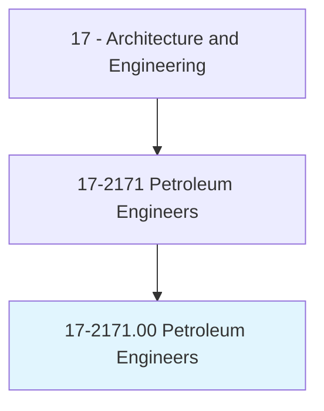
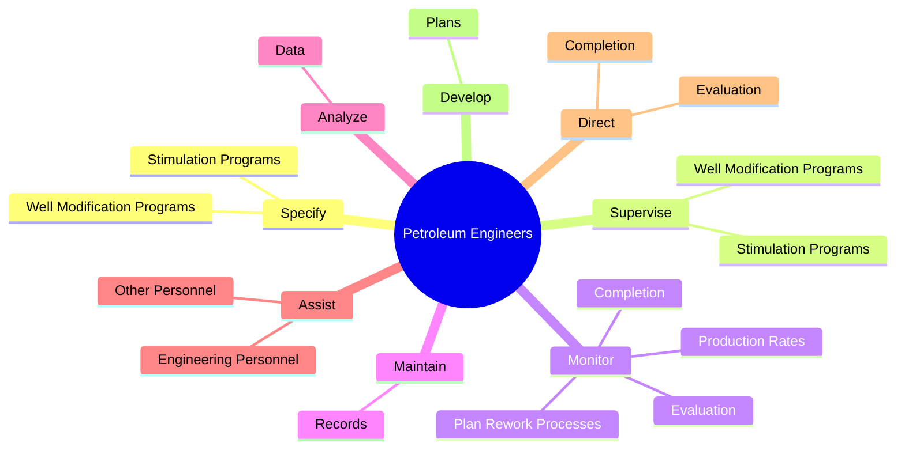
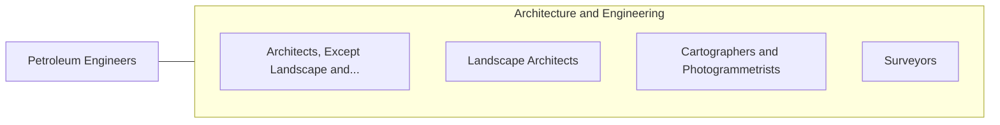

# Petroleum Engineers

> Devise methods to improve oil and gas extraction and production and determine the need for new or modified tool designs. Oversee drilling and offer technical advice.

## Overview

Petroleum Engineers is an occupation within the Architecture and Engineering category. Devise methods to improve oil and gas extraction and production and determine the need for new or modified tool designs. 

## Classification Hierarchy

## Key Statistics

| Metric | Value |
|--------|-------|
| SOC Code | 17-2171.00 |
| Category | [Architecture and Engineering](/occupations/Architecture/index) |
| Task Count | 91 |
| Source | O*NET |

## Core Tasks

### specify.WellModificationPrograms

Petroleum Engineers specify well modification programs as part of their core responsibilities.

**Actions:**
- `specify.WellModificationPrograms.to.maximize.OilRecovery`
- `specify.WellModificationPrograms.to.GasRecovery`
- `specify.StimulationPrograms.to.maximize.OilRecovery`
- `specify.StimulationPrograms.to.GasRecovery`

### supervise.WellModificationPrograms

Petroleum Engineers supervise well modification programs as part of their core responsibilities.

**Actions:**
- `supervise.WellModificationPrograms.to.maximize.OilRecovery`
- `supervise.WellModificationPrograms.to.GasRecovery`
- `supervise.StimulationPrograms.to.maximize.OilRecovery`
- `supervise.StimulationPrograms.to.GasRecovery`

### monitor.ProductionRates

Petroleum Engineers monitor production rates as part of their core responsibilities.

**Actions:**
- `monitor.ProductionRates.to.improve.Production`
- `monitor.PlanReworkProcesses.to.improve.Production`
- `monitor.Completion.of.Wells`
- `monitor.Completion.of.WellTesting`

## Skills & Competencies

### Technical Skills
- **Engineering Design** - Advanced
- **CAD/CAM** - Advanced
- **Technical Analysis** - Advanced

### Soft Skills
- **Communication** - Essential
- **Problem Solving** - Essential
- **Critical Thinking** - Important
- **Teamwork** - Important
- **Adaptability** - Important

## Related Occupations

## Industries

This occupation is found across multiple industries. See [Industries](/industries) for sector-specific employment data.

## Career Progression

---

*Source: O*NET 17-2171.00 - ONETOccupation*
