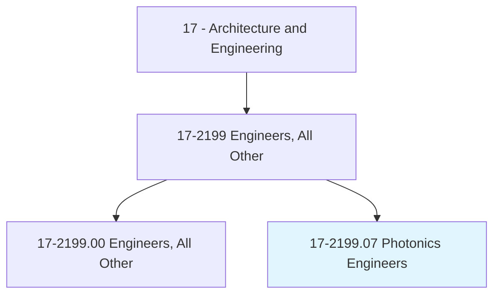
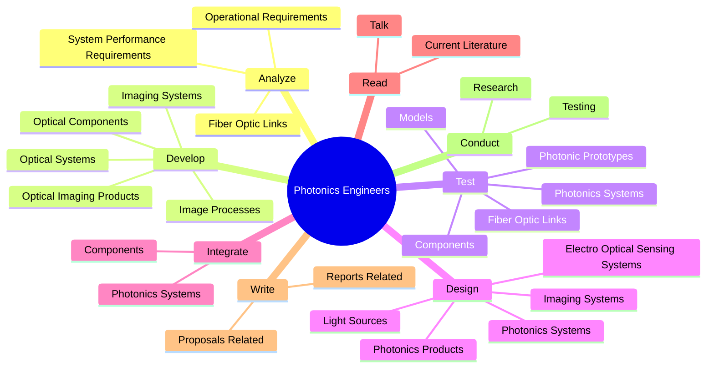
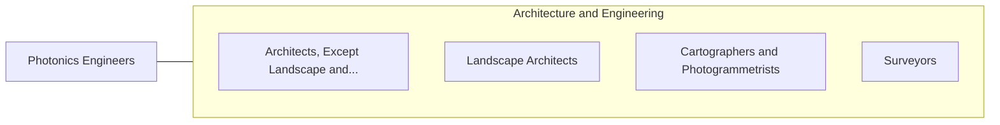

# Photonics Engineers

> Design technologies specializing in light information or light energy, such as laser or fiber optics technology.

## Overview

Photonics Engineers is classified under Architecture and Engineering (SOC 17). Design technologies specializing in light information or light energy, such as laser or fiber optics technology.

## Classification Hierarchy

## Key Statistics

| Metric | Value |
|--------|-------|
| SOC Code | 17-2199.07 |
| Category | [Architecture and Engineering](/occupations/Architecture) |
| Task Count | 82 |
| Source | O*NET |

## Core Tasks

### analyze.SystemPerformanceRequirements

Photonics Engineers analyze system performance requirements as part of their core responsibilities.

**Actions:**
- `analyze.SystemPerformanceRequirements`
- `analyze.OperationalRequirements`
- `analyze.FiberOpticLinks`

### develop.OpticalSystems

Photonics Engineers develop optical systems as part of their core responsibilities.

**Actions:**
- `develop.OpticalSystems`
- `develop.ImagingSystems`
- `develop.OpticalImagingProducts`
- `develop.OpticalComponents`

### test.PhotonicPrototypes

Photonics Engineers test photonic prototypes as part of their core responsibilities.

**Actions:**
- `test.PhotonicPrototypes`
- `test.Models`
- `test.PhotonicsSystems`
- `test.Components`

## Skills & Competencies

### Technical Skills
- **Engineering Design** - Advanced
- **CAD/CAM** - Advanced
- **Technical Analysis** - Advanced

### Soft Skills
- **Communication** - Essential
- **Problem Solving** - Essential
- **Critical Thinking** - Important
- **Teamwork** - Important
- **Adaptability** - Important

## Related Occupations

## Industries

This occupation is found across multiple industries. See [Industries](/industries) for sector-specific employment data.

## Career Progression

---

*Source: O*NET 17-2199.07 - ONETOccupation*
