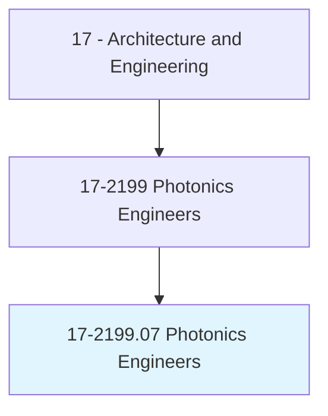
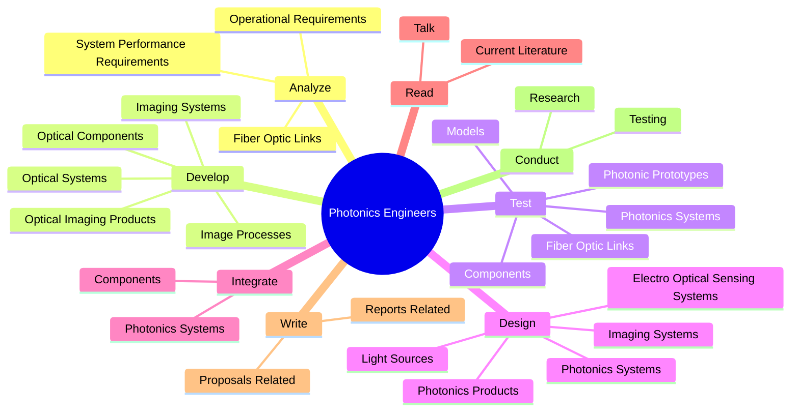
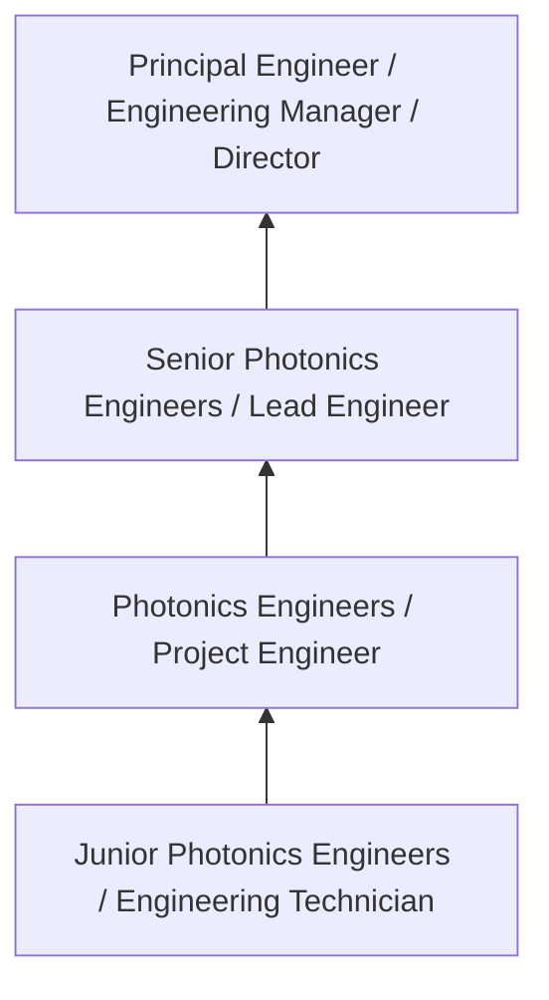
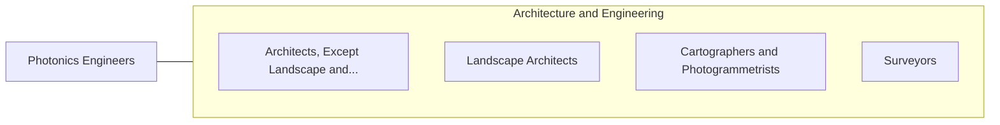

# Photonics Engineers

> Design technologies specializing in light information or light energy, such as laser or fiber optics technology.

## Overview

Photonics Engineers professionals design technologies specializing in light information or light energy, such as laser or fiber optics technology.. This occupation falls within the Architecture and Engineering category and requires a combination of specialized knowledge, technical skills, and practical experience.

These professionals work across diverse settings and organizational contexts, applying their expertise to meet the demands of their field. They must stay current with industry standards, emerging practices, and regulatory requirements that affect their work. The role demands both independent judgment and collaborative skills, as practitioners regularly interact with colleagues, stakeholders, and the public.

As the field continues to evolve, Photonics Engineers professionals increasingly leverage technology and data-driven approaches to enhance their effectiveness. Career opportunities span the public and private sectors, with demand influenced by economic conditions, demographic shifts, and technological advancement.

## Classification Hierarchy



## Key Statistics

| Metric | Value |
|--------|-------|
| SOC Code | 17-2199.07 |
| Job Zone | N/A |
| Category | [Architecture and Engineering](/occupations/Architecture/index) |
| Core Tasks | 82+ |
| Salary Range | $55,000 - $140,000 |
| Median Salary | $85,000 |
| Growth Outlook | 4% (As fast as average) |
| Source | O*NET |

## Core Tasks



### design.PhotonicsSystems

Photonics Engineers design photonics systems as part of their core responsibilities.

**Actions:**
- `design.PhotonicsSystems` - Design, integrate, or test photonics systems or components.
- `design.ElectroOpticalSensingSystems` - Design electro-optical sensing or imaging systems.
- `design.ImagingSystems` - Design electro-optical sensing or imaging systems.
- `design.PhotonicsProducts.to.achieve.IncreasedEnergyEfficiency` - Design photonics products, such as light sources, displays, or photovoltaics,...
- `design.LightSources.to.achieve.IncreasedEnergyEfficiency` - Design photonics products, such as light sources, displays, or photovoltaics,...

### develop.OpticalSystems

Photonics Engineers develop optical systems as part of their core responsibilities.

**Actions:**
- `develop.OpticalSystems` - Develop optical or imaging systems, such as optical imaging products, optical...
- `develop.ImagingSystems` - Develop optical or imaging systems, such as optical imaging products, optical...
- `develop.OpticalImagingProducts` - Develop optical or imaging systems, such as optical imaging products, optical...
- `develop.OpticalComponents` - Develop optical or imaging systems, such as optical imaging products, optical...
- `develop.ImageProcesses` - Develop optical or imaging systems, such as optical imaging products, optical...

### determine.Applications

Photonics Engineers determine applications as part of their core responsibilities.

**Actions:**
- `determine.Applications.of.PhotonicsAppropriate.to.meet.ProductObjectives` - Determine applications of photonics appropriate to meet product objectives or...
- `determine.Applications.of.Features` - Determine applications of photonics appropriate to meet product objectives or...
- `determine.Commercial.for.ElectroOpticalApplications` - Determine commercial, industrial, scientific, or other uses for electro-optic...
- `determine.Commercial.for.Devices` - Determine commercial, industrial, scientific, or other uses for electro-optic...
- `determine.Industrial.for.ElectroOpticalApplications` - Determine commercial, industrial, scientific, or other uses for electro-optic...

### test.PhotonicPrototypes

Photonics Engineers test photonic prototypes as part of their core responsibilities.

**Actions:**
- `test.PhotonicPrototypes` - Develop or test photonic prototypes or models.
- `test.Models` - Develop or test photonic prototypes or models.
- `test.PhotonicsSystems` - Design, integrate, or test photonics systems or components.
- `test.Components` - Design, integrate, or test photonics systems or components.
- `test.FiberOpticLinks` - Analyze, fabricate, or test fiber-optic links.


## Skills & Competencies

### Technical Skills
- **Technical Design** - Expert
- **Engineering Analysis** - Advanced
- **CAD/BIM Software** - Advanced
- **Project Management** - Advanced
- **Code Compliance** - Advanced
- **Quality Assurance** - Proficient

### Soft Skills
- **Analytical Thinking** - Critical
- **Problem Solving** - Critical
- **Attention to Detail** - Essential
- **Teamwork** - Essential
- **Communication** - Essential

## Education & Certifications

| Requirement | Details |
|-------------|---------|
| Typical Education | Bachelor's degree in engineering, architecture, or related field |
| Work Experience | 2-4 years professional experience |
| On-the-Job Training | Moderate - technical specialization required |
| Certifications | Professional Engineer (PE), Architect License, or field-specific certifications |

## Career Progression



## Industry Variations

### Private Sector Engineering
Design and development work for commercial clients. Photonics Engineers professionals focus on product development, system design, and project delivery.

### Government and Infrastructure
Public works and infrastructure projects with emphasis on regulatory compliance and long-term sustainability.

### Construction and Field Engineering
On-site implementation and oversight of engineering designs. Strong focus on quality control and safety compliance.

### Consulting
Advisory services for diverse clients. Requires strong project management skills and ability to work across multiple simultaneous projects.

## Technology & Tools

- **Computer-Aided Design (CAD) software**
- **Building Information Modeling (BIM)**
- **Geographic Information Systems (GIS)**
- **Structural analysis software**
- **Project management tools**

## Related Occupations



## Industries

- [Engineering Services](/industries/Engineering) - High Employment
- [Construction](/industries/Construction) - High Employment
- [Manufacturing](/industries/Manufacturing) - Moderate Employment
- [Government](/industries/PublicAdministration) - Moderate Employment

## Departments

This occupation typically works in:
- [Engineering](/departments/Engineering/index)
- Design
- Project Management

## GraphDL Semantic Structure

```graphdl
Photonics Engineers perform:
- analyze.SystemPerformanceRequirements
- analyze.OperationalRequirements
- develop.OpticalSystems
- develop.ImagingSystems
- develop.OpticalImagingProducts
- develop.OpticalComponents
```

---

*Source: O*NET 17-2199.07 - ONETOccupation*
