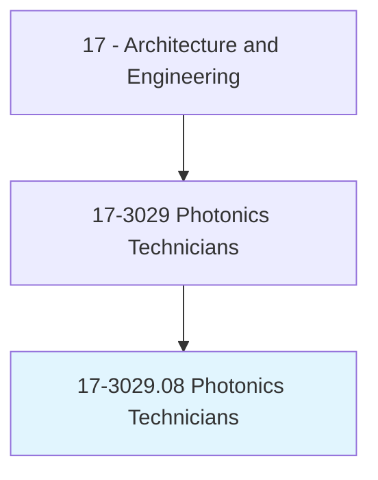
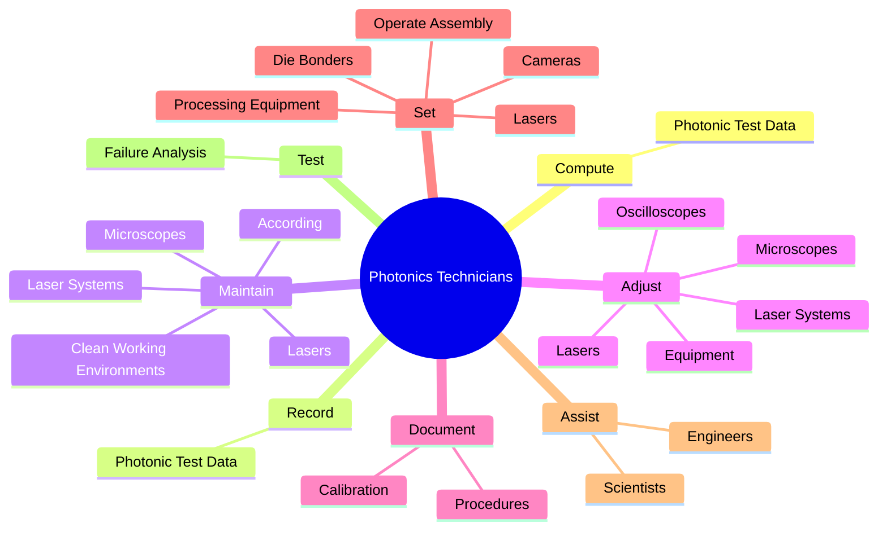
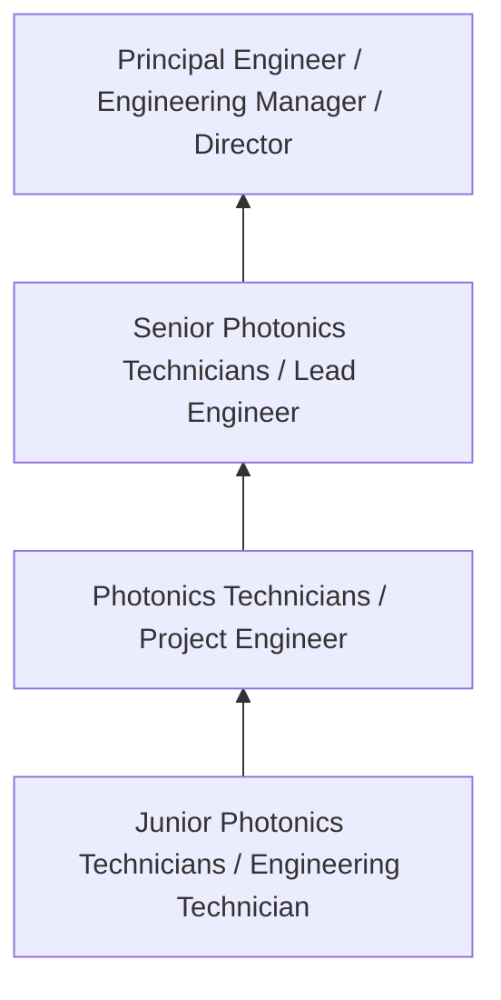
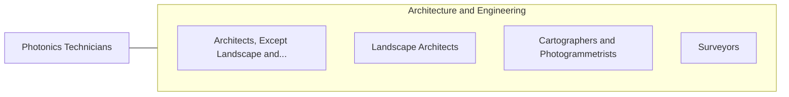

# Photonics Technicians

> Build, install, test, or maintain optical or fiber optic equipment, such as lasers, lenses, or mirrors, using spectrometers, interferometers, or related equipment.

## Overview

Photonics Technicians professionals build, install, test, or maintain optical or fiber optic equipment, such as lasers, lenses, or mirrors, using spectrometers, interferometers, or related equipment.. This occupation falls within the Architecture and Engineering category and requires a combination of specialized knowledge, technical skills, and practical experience.

These professionals work across diverse settings and organizational contexts, applying their expertise to meet the demands of their field. They must stay current with industry standards, emerging practices, and regulatory requirements that affect their work. The role demands both independent judgment and collaborative skills, as practitioners regularly interact with colleagues, stakeholders, and the public.

As the field continues to evolve, Photonics Technicians professionals increasingly leverage technology and data-driven approaches to enhance their effectiveness. Career opportunities span the public and private sectors, with demand influenced by economic conditions, demographic shifts, and technological advancement.

## Classification Hierarchy



## Key Statistics

| Metric | Value |
|--------|-------|
| SOC Code | 17-3029.08 |
| Job Zone | N/A |
| Category | [Architecture and Engineering](/occupations/Architecture/index) |
| Core Tasks | 102+ |
| Salary Range | $55,000 - $140,000 |
| Median Salary | $85,000 |
| Growth Outlook | 4% (As fast as average) |
| Source | O*NET |

## Core Tasks



### set.OperateAssembly

Photonics Technicians set operate assembly as part of their core responsibilities.

**Actions:**
- `set.OperateAssembly` - Set up or operate assembly or processing equipment, such as lasers, cameras, ...
- `set.ProcessingEquipment` - Set up or operate assembly or processing equipment, such as lasers, cameras, ...
- `set.Lasers` - Set up or operate assembly or processing equipment, such as lasers, cameras, ...
- `set.Cameras` - Set up or operate assembly or processing equipment, such as lasers, cameras, ...
- `set.DieBonders` - Set up or operate assembly or processing equipment, such as lasers, cameras, ...

### adjust.Equipment

Photonics Technicians adjust equipment as part of their core responsibilities.

**Actions:**
- `adjust.Equipment` - Adjust or maintain equipment, such as lasers, laser systems, microscopes, osc...
- `adjust.Lasers` - Adjust or maintain equipment, such as lasers, laser systems, microscopes, osc...
- `adjust.LaserSystems` - Adjust or maintain equipment, such as lasers, laser systems, microscopes, osc...
- `adjust.Microscopes` - Adjust or maintain equipment, such as lasers, laser systems, microscopes, osc...
- `adjust.Oscilloscopes` - Adjust or maintain equipment, such as lasers, laser systems, microscopes, osc...

### maintain.CleanWorkingEnvironments

Photonics Technicians maintain clean working environments as part of their core responsibilities.

**Actions:**
- `maintain.CleanWorkingEnvironments.to.clean.RoomStandards` - Maintain clean working environments, according to clean room standards.
- `maintain.According.to.clean.RoomStandards` - Maintain clean working environments, according to clean room standards.
- `maintain.Lasers` - Adjust or maintain equipment, such as lasers, laser systems, microscopes, osc...
- `maintain.LaserSystems` - Adjust or maintain equipment, such as lasers, laser systems, microscopes, osc...
- `maintain.Microscopes` - Adjust or maintain equipment, such as lasers, laser systems, microscopes, osc...

### assemble.FiberOptical

Photonics Technicians assemble fiber optical as part of their core responsibilities.

**Actions:**
- `assemble.FiberOptical` - Assemble fiber optical, optoelectronic, or free-space optics components, subc...
- `assemble.Optoelectronic` - Assemble fiber optical, optoelectronic, or free-space optics components, subc...
- `assemble.FreeSpaceOpticsComponents` - Assemble fiber optical, optoelectronic, or free-space optics components, subc...
- `assemble.Subcomponents` - Assemble fiber optical, optoelectronic, or free-space optics components, subc...
- `assemble.Subassemblies` - Assemble fiber optical, optoelectronic, or free-space optics components, subc...


## Skills & Competencies

### Technical Skills
- **Technical Design** - Expert
- **Engineering Analysis** - Advanced
- **CAD/BIM Software** - Advanced
- **Project Management** - Advanced
- **Code Compliance** - Advanced
- **Quality Assurance** - Proficient

### Soft Skills
- **Analytical Thinking** - Critical
- **Problem Solving** - Critical
- **Attention to Detail** - Essential
- **Teamwork** - Essential
- **Communication** - Essential

## Education & Certifications

| Requirement | Details |
|-------------|---------|
| Typical Education | Bachelor's degree in engineering, architecture, or related field |
| Work Experience | 2-4 years professional experience |
| On-the-Job Training | Moderate - technical specialization required |
| Certifications | Professional Engineer (PE), Architect License, or field-specific certifications |

## Career Progression



## Industry Variations

### Private Sector Engineering
Design and development work for commercial clients. Photonics Technicians professionals focus on product development, system design, and project delivery.

### Government and Infrastructure
Public works and infrastructure projects with emphasis on regulatory compliance and long-term sustainability.

### Construction and Field Engineering
On-site implementation and oversight of engineering designs. Strong focus on quality control and safety compliance.

### Consulting
Advisory services for diverse clients. Requires strong project management skills and ability to work across multiple simultaneous projects.

## Technology & Tools

- **Computer-Aided Design (CAD) software**
- **Building Information Modeling (BIM)**
- **Geographic Information Systems (GIS)**
- **Structural analysis software**
- **Project management tools**

## Related Occupations



## Industries

- [Engineering Services](/industries/Engineering) - High Employment
- [Construction](/industries/Construction) - High Employment
- [Manufacturing](/industries/Manufacturing) - Moderate Employment
- [Government](/industries/PublicAdministration) - Moderate Employment

## Departments

This occupation typically works in:
- [Engineering](/departments/Engineering/index)
- Design
- Project Management

## GraphDL Semantic Structure

```graphdl
Photonics Technicians perform:
- compute.PhotonicTestData
- record.PhotonicTestData
- maintain.CleanWorkingEnvironments.to.clean.RoomStandards
- maintain.According.to.clean.RoomStandards
- adjust.Equipment
- adjust.Lasers
```

---

*Source: O*NET 17-3029.08 - ONETOccupation*
