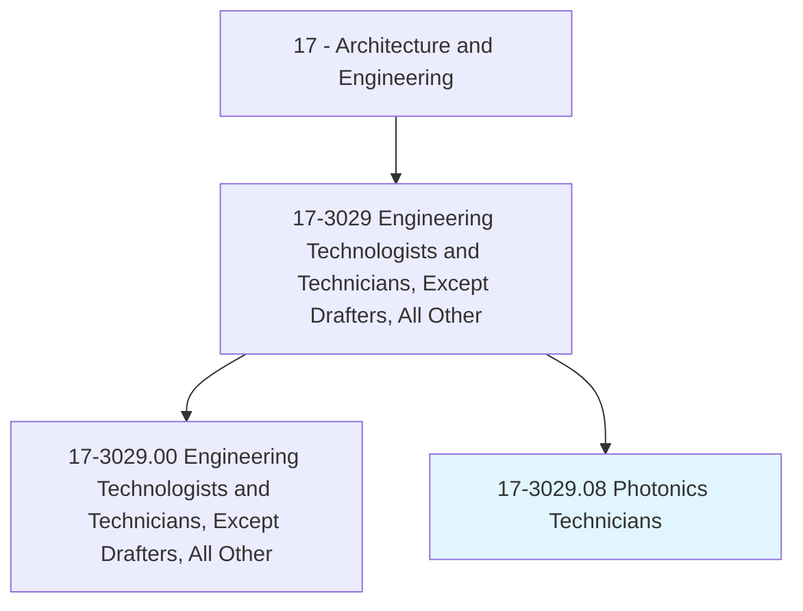
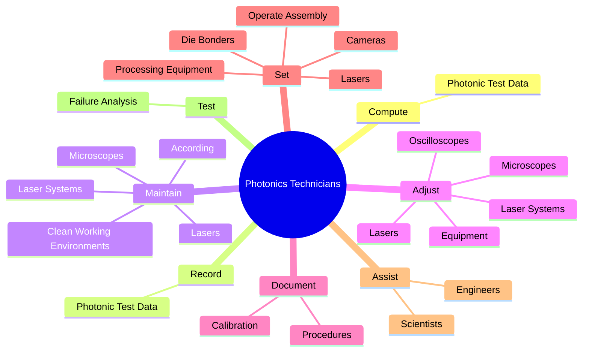
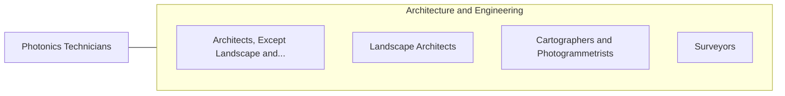

# Photonics Technicians

> Build, install, test, or maintain optical or fiber optic equipment, such as lasers, lenses, or mirrors, using spectrometers, interferometers, or related equipment.

## Overview

Photonics Technicians is classified under Architecture and Engineering (SOC 17). Build, install, test, or maintain optical or fiber optic equipment, such as lasers, lenses, or mirrors, using spectrometers, interferometers, or related equipment.

## Classification Hierarchy

## Key Statistics

| Metric | Value |
|--------|-------|
| SOC Code | 17-3029.08 |
| Category | [Architecture and Engineering](/occupations/Architecture/index) |
| Task Count | 102 |
| Source | O*NET |

## Core Tasks

### compute.PhotonicTestData

Photonics Technicians compute photonic test data as part of their core responsibilities.

**Actions:**
- `compute.PhotonicTestData`

### record.PhotonicTestData

Photonics Technicians record photonic test data as part of their core responsibilities.

**Actions:**
- `record.PhotonicTestData`

### maintain.CleanWorkingEnvironments

Photonics Technicians maintain clean working environments as part of their core responsibilities.

**Actions:**
- `maintain.CleanWorkingEnvironments.to.clean.RoomStandards`
- `maintain.According.to.clean.RoomStandards`
- `maintain.Lasers`
- `maintain.LaserSystems`

## Skills & Competencies

### Technical Skills
- **Engineering Design** - Advanced
- **CAD/CAM** - Advanced
- **Technical Analysis** - Advanced

### Soft Skills
- **Communication** - Essential
- **Problem Solving** - Essential
- **Critical Thinking** - Important
- **Teamwork** - Important
- **Adaptability** - Important

## Related Occupations

## Industries

This occupation is found across multiple industries. See [Industries](/industries) for sector-specific employment data.

## Career Progression

---

*Source: O*NET 17-3029.08 - ONETOccupation*
