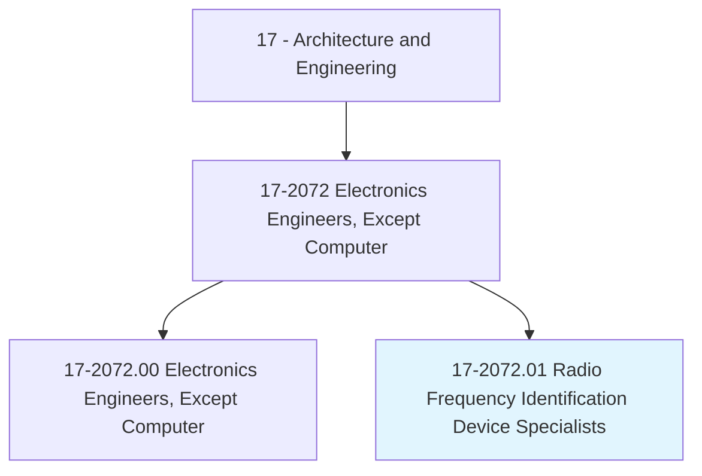
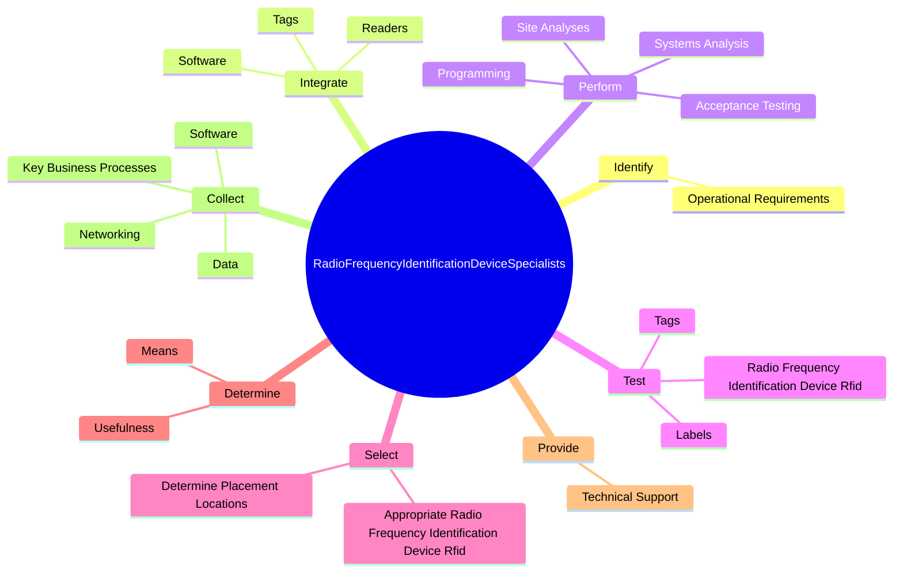
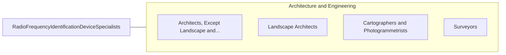

# Radio Frequency Identification Device Specialists

> Design and implement radio frequency identification device (RFID) systems used to track shipments or goods.

## Overview

Radio Frequency Identification Device Specialists is classified under Architecture and Engineering (SOC 17). Design and implement radio frequency identification device (RFID) systems used to track shipments or goods.

## Classification Hierarchy

## Key Statistics

| Metric | Value |
|--------|-------|
| SOC Code | 17-2072.01 |
| Category | [Architecture and Engineering](/occupations/Architecture) |
| Task Count | 43 |
| Source | O*NET |

## Core Tasks

### identify.OperationalRequirements

Radio Frequency Identification Device Specialists identify operational requirements as part of their core responsibilities.

**Actions:**
- `identify.OperationalRequirements.for.NewSystems.to.inform.SelectionOfTechnologicalSolutions`

### integrate.Tags

Radio Frequency Identification Device Specialists integrate tags as part of their core responsibilities.

**Actions:**
- `integrate.Tags.in.RadioFrequencyIdentificationDeviceRfid`
- `integrate.Readers.in.RadioFrequencyIdentificationDeviceRfid`
- `integrate.Software.in.RadioFrequencyIdentificationDeviceRfid`

### perform.SystemsAnalysis

Radio Frequency Identification Device Specialists perform systems analysis as part of their core responsibilities.

**Actions:**
- `perform.SystemsAnalysis.of.RadioFrequencyIdentificationDeviceRfid`
- `perform.Programming.of.RadioFrequencyIdentificationDeviceRfid`
- `perform.SiteAnalyses.to.determine.SystemConfigurations`
- `perform.SiteAnalyses.to.processes.ToBeImpacted`

## Skills & Competencies

### Technical Skills
- **Engineering Design** - Advanced
- **CAD/CAM** - Advanced
- **Technical Analysis** - Advanced

### Soft Skills
- **Communication** - Essential
- **Problem Solving** - Essential
- **Critical Thinking** - Important
- **Teamwork** - Important
- **Adaptability** - Important

## Related Occupations

## Industries

This occupation is found across multiple industries. See [Industries](/industries) for sector-specific employment data.

## Career Progression

---

*Source: O*NET 17-2072.01 - ONETOccupation*
