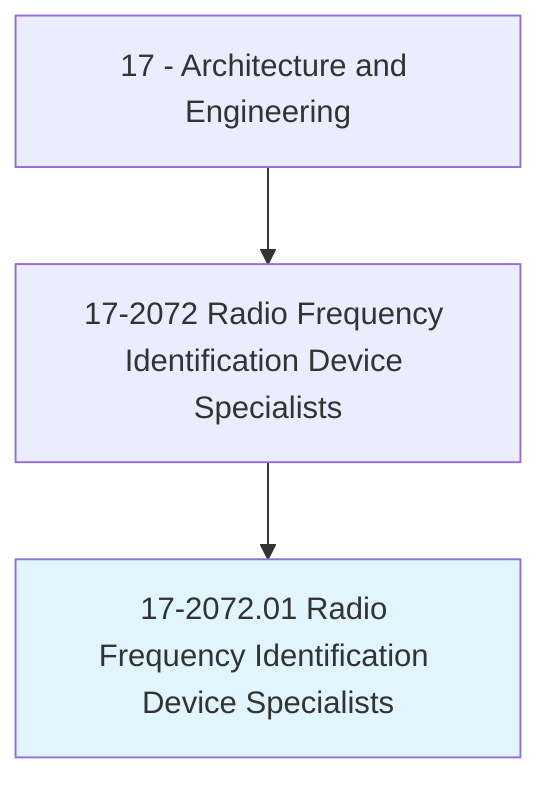
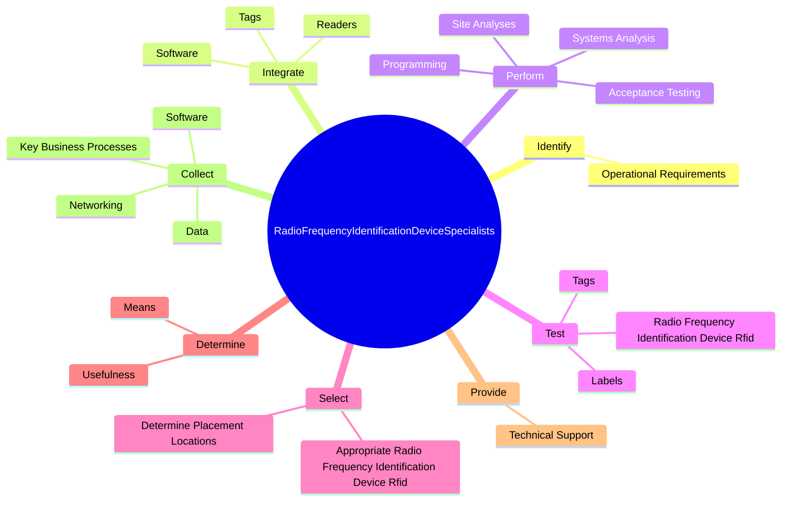
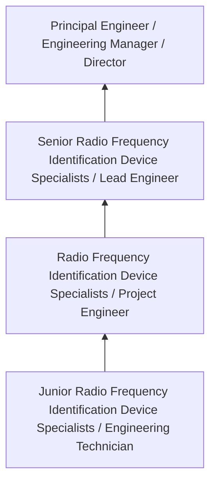
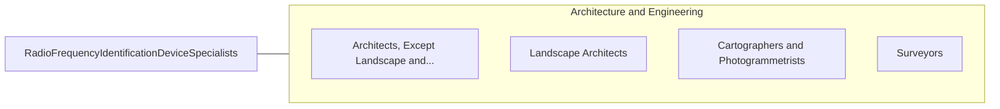

# Radio Frequency Identification Device Specialists

> Design and implement radio frequency identification device (RFID) systems used to track shipments or goods.

## Overview

Radio Frequency Identification Device Specialists professionals design and implement radio frequency identification device (RFID) systems used to track shipments or goods.. This occupation falls within the Architecture and Engineering category and requires a combination of specialized knowledge, technical skills, and practical experience.

These professionals work across diverse settings and organizational contexts, applying their expertise to meet the demands of their field. They must stay current with industry standards, emerging practices, and regulatory requirements that affect their work. The role demands both independent judgment and collaborative skills, as practitioners regularly interact with colleagues, stakeholders, and the public.

As the field continues to evolve, Radio Frequency Identification Device Specialists professionals increasingly leverage technology and data-driven approaches to enhance their effectiveness. Career opportunities span the public and private sectors, with demand influenced by economic conditions, demographic shifts, and technological advancement.

## Classification Hierarchy



## Key Statistics

| Metric | Value |
|--------|-------|
| SOC Code | 17-2072.01 |
| Job Zone | N/A |
| Category | [Architecture and Engineering](/occupations/Architecture/index) |
| Core Tasks | 43+ |
| Salary Range | $55,000 - $140,000 |
| Median Salary | $85,000 |
| Growth Outlook | 4% (As fast as average) |
| Source | O*NET |

## Core Tasks



### perform.SystemsAnalysis

Radio Frequency Identification Device Specialists perform systems analysis as part of their core responsibilities.

**Actions:**
- `perform.SystemsAnalysis.of.RadioFrequencyIdentificationDeviceRfid` - Perform systems analysis or programming of radio frequency identification dev...
- `perform.Programming.of.RadioFrequencyIdentificationDeviceRfid` - Perform systems analysis or programming of radio frequency identification dev...
- `perform.SiteAnalyses.to.determine.SystemConfigurations` - Perform site analyses to determine system configurations, processes to be imp...
- `perform.SiteAnalyses.to.processes.ToBeImpacted` - Perform site analyses to determine system configurations, processes to be imp...
- `perform.SiteAnalyses.to.OnSiteObstaclesToTechnologyImplementation` - Perform site analyses to determine system configurations, processes to be imp...

### collect.Data

Radio Frequency Identification Device Specialists collect data as part of their core responsibilities.

**Actions:**
- `collect.Data.about.ExistingClientHardware.to.inform.ImplementationOfRadioFrequencyIdentificationDeviceRfid` - Collect data about existing client hardware, software, networking, or key bus...
- `collect.Software.to.inform.ImplementationOfRadioFrequencyIdentificationDeviceRfid` - Collect data about existing client hardware, software, networking, or key bus...
- `collect.Networking.to.inform.ImplementationOfRadioFrequencyIdentificationDeviceRfid` - Collect data about existing client hardware, software, networking, or key bus...
- `collect.KeyBusinessProcesses.to.inform.ImplementationOfRadioFrequencyIdentificationDeviceRfid` - Collect data about existing client hardware, software, networking, or key bus...

### read.CurrentLiterature

Radio Frequency Identification Device Specialists read current literature as part of their core responsibilities.

**Actions:**
- `read.CurrentLiterature.with.Colleagues.to.stay.AbreastOfIndustryResearchAboutNewTechnologies` - Read current literature, attend meetings or conferences, or talk with colleag...
- `read.AttendMeetings.with.Colleagues.to.stay.AbreastOfIndustryResearchAboutNewTechnologies` - Read current literature, attend meetings or conferences, or talk with colleag...
- `read.Conferences.with.Colleagues.to.stay.AbreastOfIndustryResearchAboutNewTechnologies` - Read current literature, attend meetings or conferences, or talk with colleag...
- `read.Talk.with.Colleagues.to.stay.AbreastOfIndustryResearchAboutNewTechnologies` - Read current literature, attend meetings or conferences, or talk with colleag...

### create.Simulations

Radio Frequency Identification Device Specialists create simulations as part of their core responsibilities.

**Actions:**
- `create.Simulations.of.RadioFrequencyIdentificationDeviceRfid` - Create simulations or models of radio frequency identification device (RFID) ...
- `create.Simulations.of.Configuration` - Create simulations or models of radio frequency identification device (RFID) ...
- `create.Models.of.RadioFrequencyIdentificationDeviceRfid` - Create simulations or models of radio frequency identification device (RFID) ...
- `create.Models.of.Configuration` - Create simulations or models of radio frequency identification device (RFID) ...


## Skills & Competencies

### Technical Skills
- **Technical Design** - Expert
- **Engineering Analysis** - Advanced
- **CAD/BIM Software** - Advanced
- **Project Management** - Advanced
- **Code Compliance** - Advanced
- **Quality Assurance** - Proficient

### Soft Skills
- **Analytical Thinking** - Critical
- **Problem Solving** - Critical
- **Attention to Detail** - Essential
- **Teamwork** - Essential
- **Communication** - Essential

## Education & Certifications

| Requirement | Details |
|-------------|---------|
| Typical Education | Bachelor's degree in engineering, architecture, or related field |
| Work Experience | 2-4 years professional experience |
| On-the-Job Training | Moderate - technical specialization required |
| Certifications | Professional Engineer (PE), Architect License, or field-specific certifications |

## Career Progression



## Industry Variations

### Private Sector Engineering
Design and development work for commercial clients. Radio Frequency Identification Device Specialists professionals focus on product development, system design, and project delivery.

### Government and Infrastructure
Public works and infrastructure projects with emphasis on regulatory compliance and long-term sustainability.

### Construction and Field Engineering
On-site implementation and oversight of engineering designs. Strong focus on quality control and safety compliance.

### Consulting
Advisory services for diverse clients. Requires strong project management skills and ability to work across multiple simultaneous projects.

## Technology & Tools

- **Computer-Aided Design (CAD) software**
- **Building Information Modeling (BIM)**
- **Geographic Information Systems (GIS)**
- **Structural analysis software**
- **Project management tools**

## Related Occupations



## Industries

- [Engineering Services](/industries/Engineering) - High Employment
- [Construction](/industries/Construction) - High Employment
- [Manufacturing](/industries/Manufacturing) - Moderate Employment
- [Government](/industries/Government) - Moderate Employment

## Departments

This occupation typically works in:
- [Engineering](/departments/Engineering/index)
- [Design](/departments/Design)
- [Project Management](/departments/ProjectManagement)

## GraphDL Semantic Structure

```
Radio Frequency Identification Device Specialists perform:
- identify.OperationalRequirements.for.NewSystems.to.inform.SelectionOfTechnologicalSolutions
- integrate.Tags.in.RadioFrequencyIdentificationDeviceRfid
- integrate.Readers.in.RadioFrequencyIdentificationDeviceRfid
- integrate.Software.in.RadioFrequencyIdentificationDeviceRfid
- perform.SystemsAnalysis.of.RadioFrequencyIdentificationDeviceRfid
- perform.Programming.of.RadioFrequencyIdentificationDeviceRfid
```

---

*Source: O*NET 17-2072.01 - ONETOccupation*
