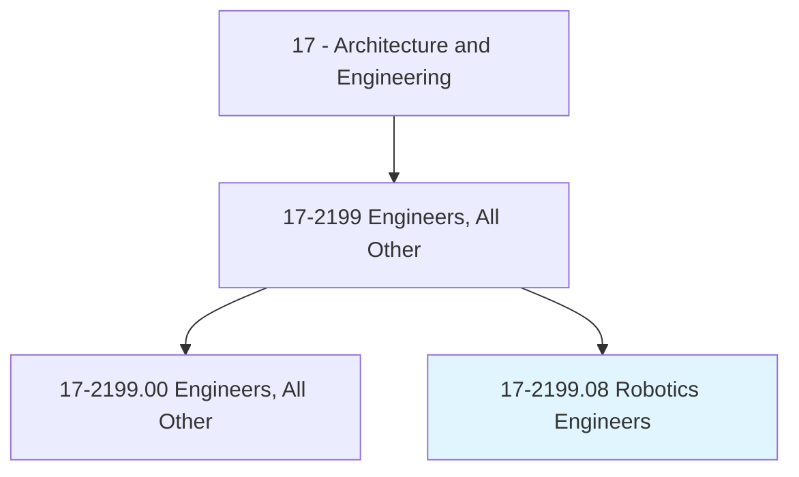
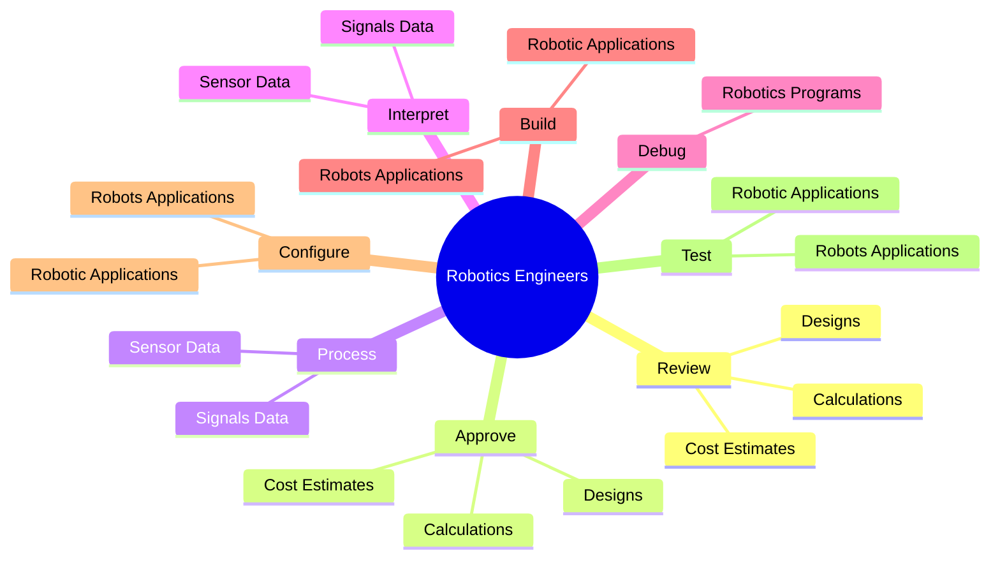
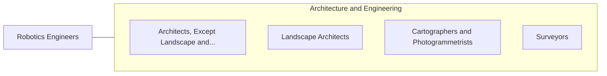

# Robotics Engineers

> Research, design, develop, or test robotic applications.

## Overview

Robotics Engineers is classified under Architecture and Engineering (SOC 17). Research, design, develop, or test robotic applications.

## Classification Hierarchy

## Key Statistics

| Metric | Value |
|--------|-------|
| SOC Code | 17-2199.08 |
| Category | [Architecture and Engineering](/occupations/Architecture) |
| Task Count | 94 |
| Source | O*NET |

## Core Tasks

### review.Designs

Robotics Engineers review designs as part of their core responsibilities.

**Actions:**
- `review.Designs`
- `review.Calculations`
- `review.CostEstimates`

### approve.Designs

Robotics Engineers approve designs as part of their core responsibilities.

**Actions:**
- `approve.Designs`
- `approve.Calculations`
- `approve.CostEstimates`

### process.SignalsData

Robotics Engineers process signals data as part of their core responsibilities.

**Actions:**
- `process.SignalsData`
- `process.SensorData`

## Skills & Competencies

### Technical Skills
- **Engineering Design** - Advanced
- **CAD/CAM** - Advanced
- **Technical Analysis** - Advanced

### Soft Skills
- **Communication** - Essential
- **Problem Solving** - Essential
- **Critical Thinking** - Important
- **Teamwork** - Important
- **Adaptability** - Important

## Related Occupations

## Industries

This occupation is found across multiple industries. See [Industries](/industries) for sector-specific employment data.

## Career Progression

---

*Source: O*NET 17-2199.08 - ONETOccupation*
