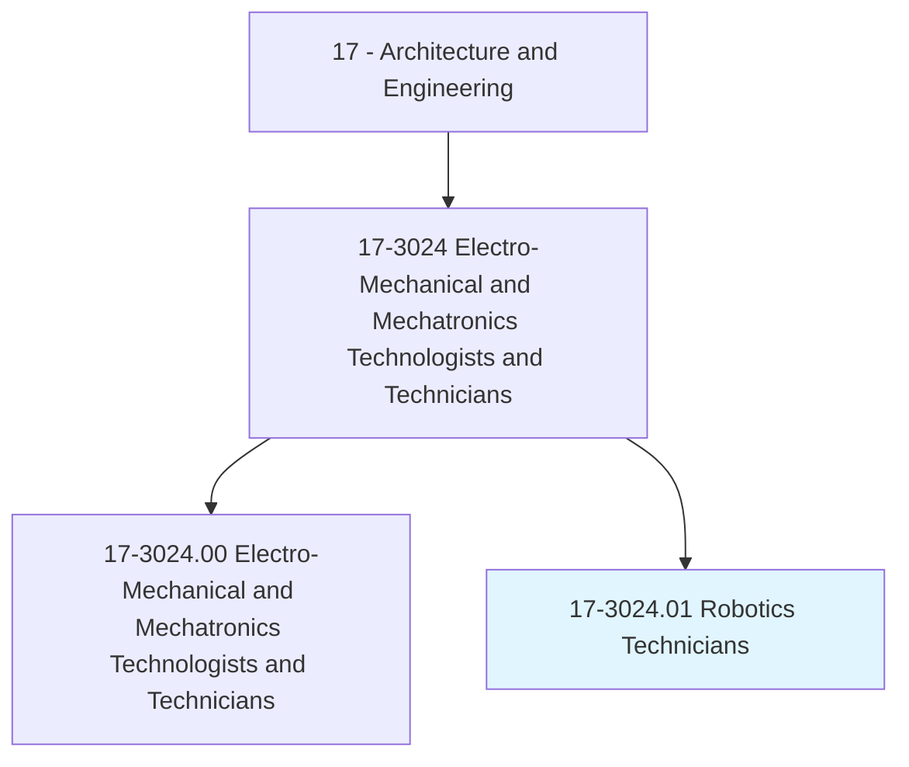
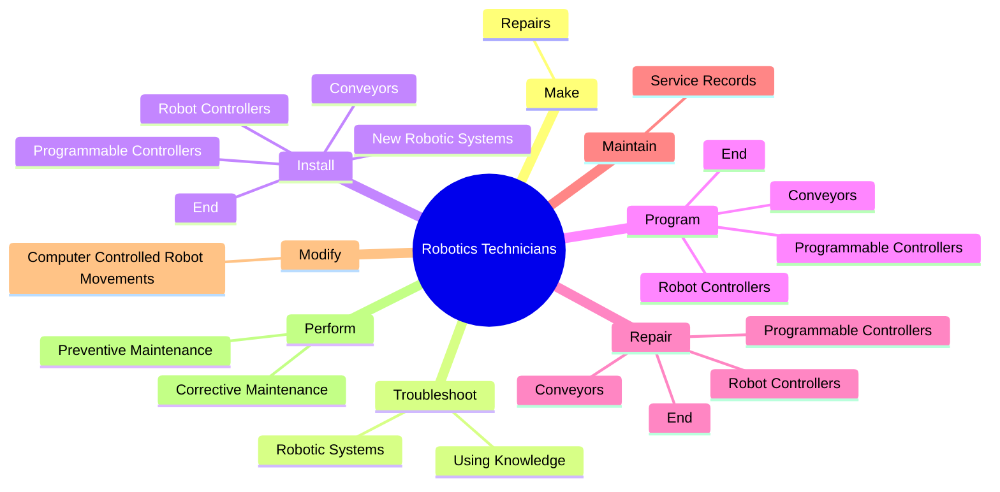
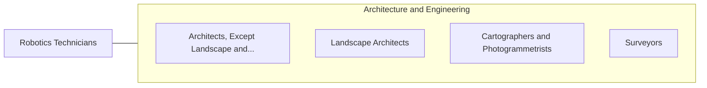

# Robotics Technicians

> Build, install, test, or maintain robotic equipment or related automated production systems.

## Overview

Robotics Technicians is classified under Architecture and Engineering (SOC 17). Build, install, test, or maintain robotic equipment or related automated production systems.

## Classification Hierarchy

## Key Statistics

| Metric | Value |
|--------|-------|
| SOC Code | 17-3024.01 |
| Category | [Architecture and Engineering](/occupations/Architecture/index) |
| Task Count | 104 |
| Source | O*NET |

## Core Tasks

### make.Repairs

Robotics Technicians make repairs as part of their core responsibilities.

**Actions:**
- `make.Repairs.to.RobotsEquipment`
- `make.Repairs.to.PeripheralEquipment`
- `make.Repairs.to.ReplacementOfDefectiveCircuitBoards`
- `make.Repairs.to.Sensors`

### troubleshoot.RoboticSystems

Robotics Technicians troubleshoot robotic systems as part of their core responsibilities.

**Actions:**
- `troubleshoot.RoboticSystems.of.Microprocessors`
- `troubleshoot.RoboticSystems.of.ProgrammableControllers`
- `troubleshoot.RoboticSystems.of.Electronics`
- `troubleshoot.RoboticSystems.of.CircuitAnalysis`

### install.ProgrammableControllers

Robotics Technicians install programmable controllers as part of their core responsibilities.

**Actions:**
- `install.ProgrammableControllers`
- `install.RobotControllers`
- `install.End.of.ArmTools`
- `install.Conveyors`

## Skills & Competencies

### Technical Skills
- **Engineering Design** - Advanced
- **CAD/CAM** - Advanced
- **Technical Analysis** - Advanced

### Soft Skills
- **Communication** - Essential
- **Problem Solving** - Essential
- **Critical Thinking** - Important
- **Teamwork** - Important
- **Adaptability** - Important

## Related Occupations

## Industries

This occupation is found across multiple industries. See [Industries](/industries) for sector-specific employment data.

## Career Progression

---

*Source: O*NET 17-3024.01 - ONETOccupation*
