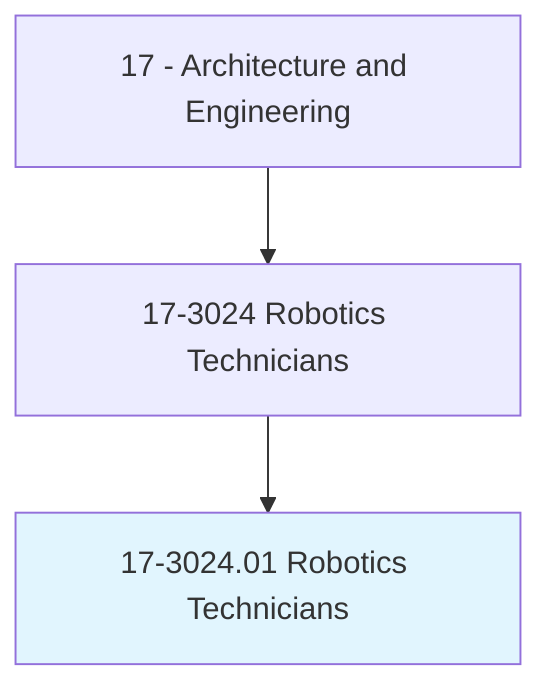
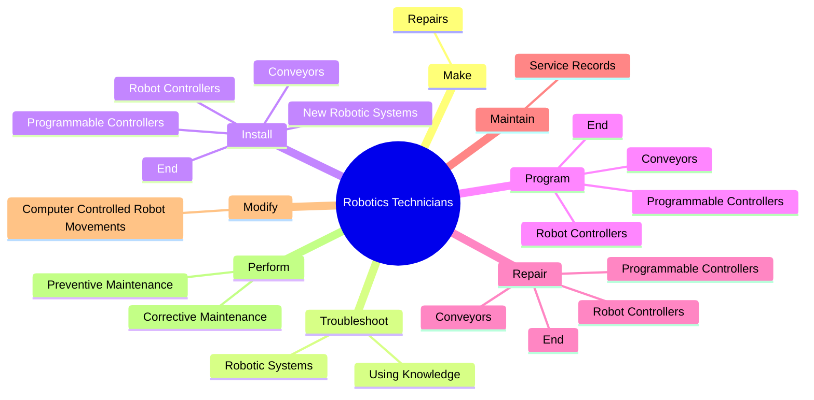
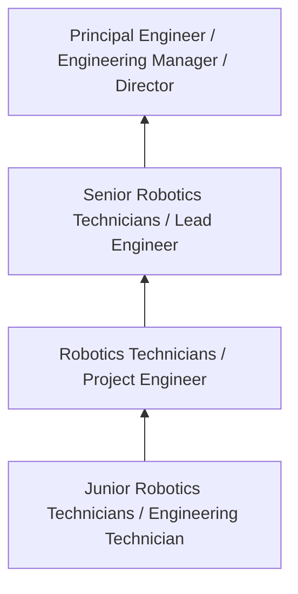
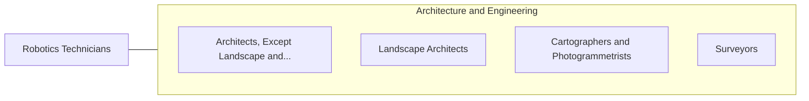

# Robotics Technicians

> Build, install, test, or maintain robotic equipment or related automated production systems.

## Overview

Robotics Technicians professionals build, install, test, or maintain robotic equipment or related automated production systems.. This occupation falls within the Architecture and Engineering category and requires a combination of specialized knowledge, technical skills, and practical experience.

These professionals work across diverse settings and organizational contexts, applying their expertise to meet the demands of their field. They must stay current with industry standards, emerging practices, and regulatory requirements that affect their work. The role demands both independent judgment and collaborative skills, as practitioners regularly interact with colleagues, stakeholders, and the public.

As the field continues to evolve, Robotics Technicians professionals increasingly leverage technology and data-driven approaches to enhance their effectiveness. Career opportunities span the public and private sectors, with demand influenced by economic conditions, demographic shifts, and technological advancement.

## Classification Hierarchy



## Key Statistics

| Metric | Value |
|--------|-------|
| SOC Code | 17-3024.01 |
| Job Zone | N/A |
| Category | [Architecture and Engineering](/occupations/Architecture/index) |
| Core Tasks | 104+ |
| Salary Range | $55,000 - $140,000 |
| Median Salary | $85,000 |
| Growth Outlook | 4% (As fast as average) |
| Source | O*NET |

## Core Tasks



### troubleshoot.RoboticSystems

Robotics Technicians troubleshoot robotic systems as part of their core responsibilities.

**Actions:**
- `troubleshoot.RoboticSystems.of.Microprocessors` - Troubleshoot robotic systems, using knowledge of microprocessors, programmabl...
- `troubleshoot.RoboticSystems.of.ProgrammableControllers` - Troubleshoot robotic systems, using knowledge of microprocessors, programmabl...
- `troubleshoot.RoboticSystems.of.Electronics` - Troubleshoot robotic systems, using knowledge of microprocessors, programmabl...
- `troubleshoot.RoboticSystems.of.CircuitAnalysis` - Troubleshoot robotic systems, using knowledge of microprocessors, programmabl...
- `troubleshoot.RoboticSystems.of.Mechanics` - Troubleshoot robotic systems, using knowledge of microprocessors, programmabl...

### train.CustomersPersonnel

Robotics Technicians train customers personnel as part of their core responsibilities.

**Actions:**
- `train.CustomersPersonnel.to.install` - Train customers or other personnel to install, use, or maintain robots.
- `train.CustomersPersonnel.to.use` - Train customers or other personnel to install, use, or maintain robots.
- `train.CustomersPersonnel.to.maintain.Robots` - Train customers or other personnel to install, use, or maintain robots.
- `train.OtherPersonnel.to.install` - Train customers or other personnel to install, use, or maintain robots.
- `train.OtherPersonnel.to.use` - Train customers or other personnel to install, use, or maintain robots.

### evaluate.Efficiency

Robotics Technicians evaluate efficiency as part of their core responsibilities.

**Actions:**
- `evaluate.Efficiency.of.IndustrialRoboticSystems` - Evaluate the efficiency and reliability of industrial robotic systems, reprog...
- `evaluate.Efficiency.of.Reprogramming` - Evaluate the efficiency and reliability of industrial robotic systems, reprog...
- `evaluate.Efficiency.of.Calibrating.to.achieve.MaximumQuantity` - Evaluate the efficiency and reliability of industrial robotic systems, reprog...
- `evaluate.Efficiency.of.Quality` - Evaluate the efficiency and reliability of industrial robotic systems, reprog...
- `evaluate.Reliability.of.IndustrialRoboticSystems` - Evaluate the efficiency and reliability of industrial robotic systems, reprog...

### make.Repairs

Robotics Technicians make repairs as part of their core responsibilities.

**Actions:**
- `make.Repairs.to.RobotsEquipment` - Make repairs to robots or peripheral equipment, such as replacement of defect...
- `make.Repairs.to.PeripheralEquipment` - Make repairs to robots or peripheral equipment, such as replacement of defect...
- `make.Repairs.to.ReplacementOfDefectiveCircuitBoards` - Make repairs to robots or peripheral equipment, such as replacement of defect...
- `make.Repairs.to.Sensors` - Make repairs to robots or peripheral equipment, such as replacement of defect...
- `make.Repairs.to.Controllers` - Make repairs to robots or peripheral equipment, such as replacement of defect...


## Skills & Competencies

### Technical Skills
- **Technical Design** - Expert
- **Engineering Analysis** - Advanced
- **CAD/BIM Software** - Advanced
- **Project Management** - Advanced
- **Code Compliance** - Advanced
- **Quality Assurance** - Proficient

### Soft Skills
- **Analytical Thinking** - Critical
- **Problem Solving** - Critical
- **Attention to Detail** - Essential
- **Teamwork** - Essential
- **Communication** - Essential

## Education & Certifications

| Requirement | Details |
|-------------|---------|
| Typical Education | Bachelor's degree in engineering, architecture, or related field |
| Work Experience | 2-4 years professional experience |
| On-the-Job Training | Moderate - technical specialization required |
| Certifications | Professional Engineer (PE), Architect License, or field-specific certifications |

## Career Progression



## Industry Variations

### Private Sector Engineering
Design and development work for commercial clients. Robotics Technicians professionals focus on product development, system design, and project delivery.

### Government and Infrastructure
Public works and infrastructure projects with emphasis on regulatory compliance and long-term sustainability.

### Construction and Field Engineering
On-site implementation and oversight of engineering designs. Strong focus on quality control and safety compliance.

### Consulting
Advisory services for diverse clients. Requires strong project management skills and ability to work across multiple simultaneous projects.

## Technology & Tools

- **Computer-Aided Design (CAD) software**
- **Building Information Modeling (BIM)**
- **Geographic Information Systems (GIS)**
- **Structural analysis software**
- **Project management tools**

## Related Occupations



## Industries

- [Engineering Services](/industries/Engineering) - High Employment
- [Construction](/industries/Construction) - High Employment
- [Manufacturing](/industries/Manufacturing) - Moderate Employment
- [Government](/industries/Government) - Moderate Employment

## Departments

This occupation typically works in:
- [Engineering](/departments/Engineering/index)
- [Design](/departments/Design)
- [Project Management](/departments/ProjectManagement)

## GraphDL Semantic Structure

```
Robotics Technicians perform:
- make.Repairs.to.RobotsEquipment
- make.Repairs.to.PeripheralEquipment
- make.Repairs.to.ReplacementOfDefectiveCircuitBoards
- make.Repairs.to.Sensors
- make.Repairs.to.Controllers
- make.Repairs.to.Encoders
```

---

*Source: O*NET 17-3024.01 - ONETOccupation*
