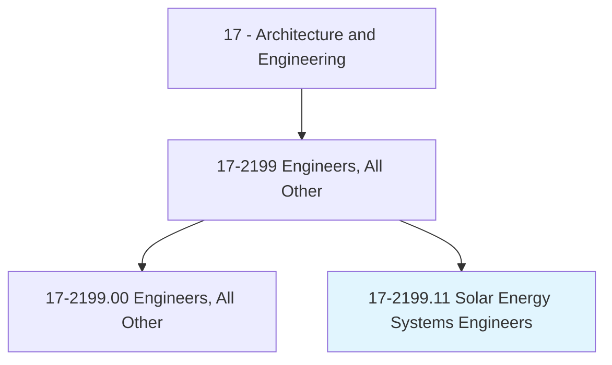
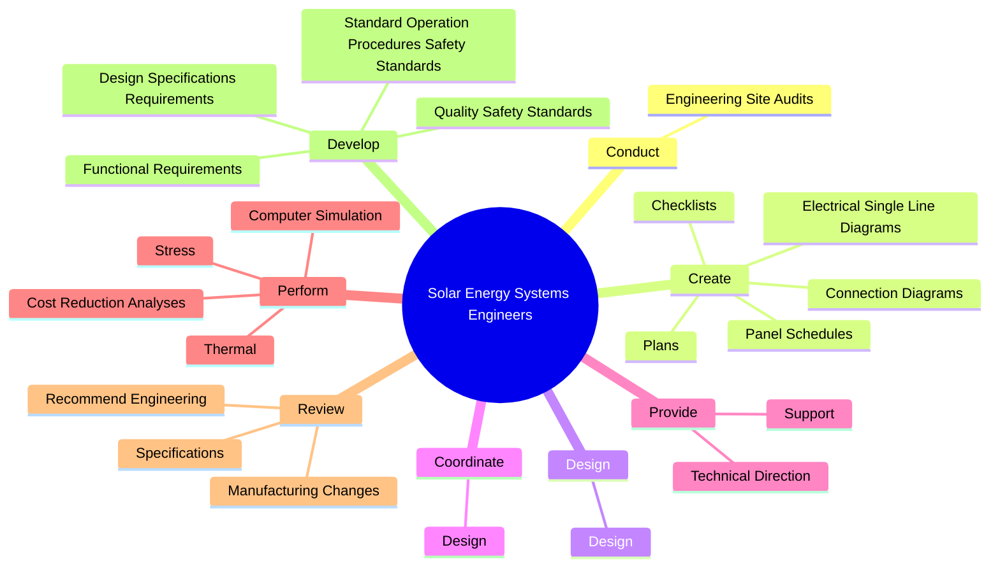
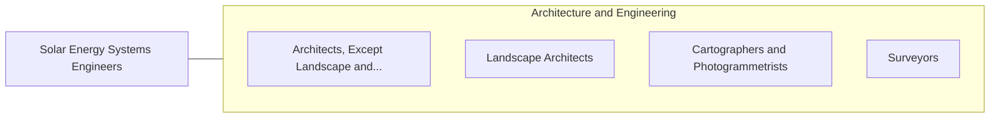

# Solar Energy Systems Engineers

> Perform site-specific engineering analysis or evaluation of energy efficiency and solar projects involving residential, commercial, or industrial customers. Design solar domestic hot water and space heating systems for new and existing structures, applying knowledge of structural energy requirements, local climates, solar technology, and thermodynamics.

## Overview

Solar Energy Systems Engineers is a specialized variant within the Architecture and Engineering category. Perform site-specific engineering analysis or evaluation of energy efficiency and solar projects involving residential, commercial, or industrial customers. 

## Classification Hierarchy

## Key Statistics

| Metric | Value |
|--------|-------|
| SOC Code | 17-2199.11 |
| Category | [Architecture and Engineering](/occupations/Architecture/index) |
| Task Count | 61 |
| Source | O*NET |

## Core Tasks

### conduct.EngineeringSiteAudits

Solar Energy Systems Engineers conduct engineering site audits as part of their core responsibilities.

**Actions:**
- `conduct.EngineeringSiteAudits.to.collect.Structural`
- `conduct.EngineeringSiteAudits.to.Electrical`
- `conduct.EngineeringSiteAudits.to.related.SiteInformationForUseInDesignOfResidentialSolarPowerSystems`
- `conduct.EngineeringSiteAudits.to.CommercialSolarPowerSystems`

### create.Plans

Solar Energy Systems Engineers create plans as part of their core responsibilities.

**Actions:**
- `create.Plans.for.SolarEnergySystemDevelopment`
- `create.Plans.for.Monitoring`
- `create.Plans.for.EvaluationActivities`
- `create.ElectricalSingleLineDiagrams.for.SolarElectricSystems`

### design.Design

Solar Energy Systems Engineers design design as part of their core responsibilities.

**Actions:**
- `design.Design.of.PhotovoltaicPv`
- `design.Design.of.SolarThermalSystems`
- `design.Design.of.IncludingSystemComponents`
- `design.Design.of.F`

## Skills & Competencies

### Technical Skills
- **Engineering Design** - Advanced
- **CAD/CAM** - Advanced
- **Technical Analysis** - Advanced

### Soft Skills
- **Communication** - Essential
- **Problem Solving** - Essential
- **Critical Thinking** - Important
- **Teamwork** - Important
- **Adaptability** - Important

## Related Occupations

## Industries

This occupation is found across multiple industries. See [Industries](/industries) for sector-specific employment data.

## Career Progression

---

*Source: O*NET 17-2199.11 - ONETOccupation*
