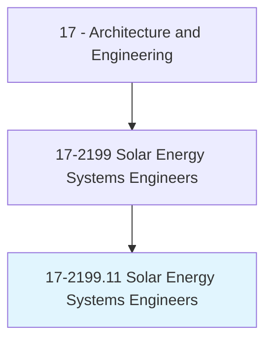
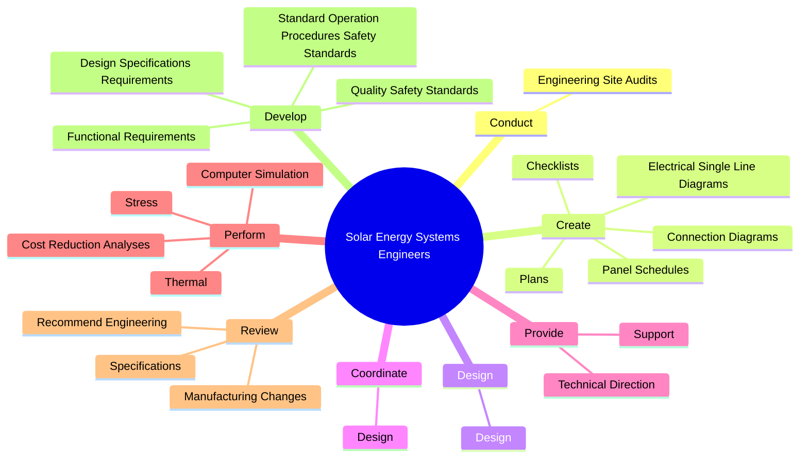
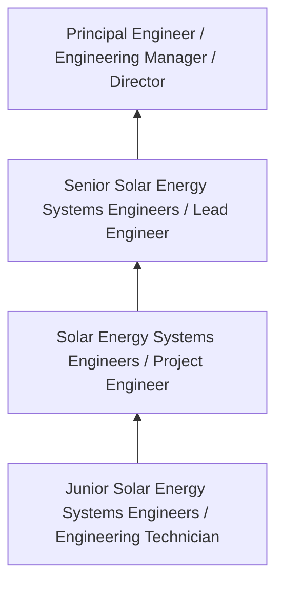
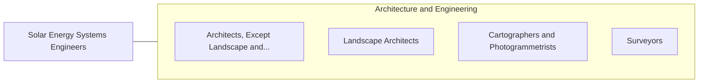

# Solar Energy Systems Engineers

> Perform site-specific engineering analysis or evaluation of energy efficiency and solar projects involving residential, commercial, or industrial customers. Design solar domestic hot water and space heating systems for new and existing structures, applying knowledge of structural energy requirements, local climates, solar technology, and thermodynamics.

## Overview

Solar Energy Systems Engineers professionals perform site-specific engineering analysis or evaluation of energy efficiency and solar projects involving residential, commercial, or industrial customers. This occupation falls within the Architecture and Engineering category and requires a combination of specialized knowledge, technical skills, and practical experience.

These professionals work across diverse settings and organizational contexts, applying their expertise to meet the demands of their field. They must stay current with industry standards, emerging practices, and regulatory requirements that affect their work. The role demands both independent judgment and collaborative skills, as practitioners regularly interact with colleagues, stakeholders, and the public.

As the field continues to evolve, Solar Energy Systems Engineers professionals increasingly leverage technology and data-driven approaches to enhance their effectiveness. Career opportunities span the public and private sectors, with demand influenced by economic conditions, demographic shifts, and technological advancement.

## Classification Hierarchy



## Key Statistics

| Metric | Value |
|--------|-------|
| SOC Code | 17-2199.11 |
| Job Zone | N/A |
| Category | [Architecture and Engineering](/occupations/Architecture/index) |
| Core Tasks | 61+ |
| Salary Range | $55,000 - $140,000 |
| Median Salary | $85,000 |
| Growth Outlook | 4% (As fast as average) |
| Source | O*NET |

## Core Tasks



### create.Plans

Solar Energy Systems Engineers create plans as part of their core responsibilities.

**Actions:**
- `create.Plans.for.SolarEnergySystemDevelopment` - Create plans for solar energy system development, monitoring, and evaluation ...
- `create.Plans.for.Monitoring` - Create plans for solar energy system development, monitoring, and evaluation ...
- `create.Plans.for.EvaluationActivities` - Create plans for solar energy system development, monitoring, and evaluation ...
- `create.ElectricalSingleLineDiagrams.for.SolarElectricSystems` - Create electrical single-line diagrams, panel schedules, or connection diagra...
- `create.ElectricalSingleLineDiagrams.for.UsingComputerAidedDesignCad` - Create electrical single-line diagrams, panel schedules, or connection diagra...

### develop.DesignSpecificationsRequirements

Solar Energy Systems Engineers develop design specifications requirements as part of their core responsibilities.

**Actions:**
- `develop.DesignSpecificationsRequirements.for.Residential` - Develop design specifications and functional requirements for residential, co...
- `develop.DesignSpecificationsRequirements.for.Commercial` - Develop design specifications and functional requirements for residential, co...
- `develop.DesignSpecificationsRequirements.for.IndustrialSolarEnergySystems` - Develop design specifications and functional requirements for residential, co...
- `develop.DesignSpecificationsRequirements.for.Components` - Develop design specifications and functional requirements for residential, co...
- `develop.FunctionalRequirements.for.Residential` - Develop design specifications and functional requirements for residential, co...

### provide.TechnicalDirection

Solar Energy Systems Engineers provide technical direction as part of their core responsibilities.

**Actions:**
- `provide.TechnicalDirection.to.InstallationTeamsDuringInstallation` - Provide technical direction or support to installation teams during installat...
- `provide.TechnicalDirection.to.start.Up` - Provide technical direction or support to installation teams during installat...
- `provide.TechnicalDirection.to.Testing` - Provide technical direction or support to installation teams during installat...
- `provide.TechnicalDirection.to.SystemCommissioning` - Provide technical direction or support to installation teams during installat...
- `provide.TechnicalDirection.to.PerformanceMonitoring` - Provide technical direction or support to installation teams during installat...

### design.Design

Solar Energy Systems Engineers design design as part of their core responsibilities.

**Actions:**
- `design.Design.of.PhotovoltaicPv` - Design or coordinate design of photovoltaic (PV) or solar thermal systems, in...
- `design.Design.of.SolarThermalSystems` - Design or coordinate design of photovoltaic (PV) or solar thermal systems, in...
- `design.Design.of.IncludingSystemComponents` - Design or coordinate design of photovoltaic (PV) or solar thermal systems, in...
- `design.Design.of.F` - Design or coordinate design of photovoltaic (PV) or solar thermal systems, in...
- `design.Design.of.ResidentialBuildings` - Design or coordinate design of photovoltaic (PV) or solar thermal systems, in...


## Skills & Competencies

### Technical Skills
- **Technical Design** - Expert
- **Engineering Analysis** - Advanced
- **CAD/BIM Software** - Advanced
- **Project Management** - Advanced
- **Code Compliance** - Advanced
- **Quality Assurance** - Proficient

### Soft Skills
- **Analytical Thinking** - Critical
- **Problem Solving** - Critical
- **Attention to Detail** - Essential
- **Teamwork** - Essential
- **Communication** - Essential

## Education & Certifications

| Requirement | Details |
|-------------|---------|
| Typical Education | Bachelor's degree in engineering, architecture, or related field |
| Work Experience | 2-4 years professional experience |
| On-the-Job Training | Moderate - technical specialization required |
| Certifications | Professional Engineer (PE), Architect License, or field-specific certifications |

## Career Progression



## Industry Variations

### Private Sector Engineering
Design and development work for commercial clients. Solar Energy Systems Engineers professionals focus on product development, system design, and project delivery.

### Government and Infrastructure
Public works and infrastructure projects with emphasis on regulatory compliance and long-term sustainability.

### Construction and Field Engineering
On-site implementation and oversight of engineering designs. Strong focus on quality control and safety compliance.

### Consulting
Advisory services for diverse clients. Requires strong project management skills and ability to work across multiple simultaneous projects.

## Technology & Tools

- **Computer-Aided Design (CAD) software**
- **Building Information Modeling (BIM)**
- **Geographic Information Systems (GIS)**
- **Structural analysis software**
- **Project management tools**

## Related Occupations



## Industries

- [Engineering Services](/industries/Engineering) - High Employment
- [Construction](/industries/Construction) - High Employment
- [Manufacturing](/industries/Manufacturing) - Moderate Employment
- [Government](/industries/Government) - Moderate Employment

## Departments

This occupation typically works in:
- [Engineering](/departments/Engineering/index)
- [Design](/departments/Design)
- [Project Management](/departments/ProjectManagement)

## GraphDL Semantic Structure

```
Solar Energy Systems Engineers perform:
- conduct.EngineeringSiteAudits.to.collect.Structural
- conduct.EngineeringSiteAudits.to.Electrical
- conduct.EngineeringSiteAudits.to.related.SiteInformationForUseInDesignOfResidentialSolarPowerSystems
- conduct.EngineeringSiteAudits.to.CommercialSolarPowerSystems
- create.Plans.for.SolarEnergySystemDevelopment
- create.Plans.for.Monitoring
```

---

*Source: O*NET 17-2199.11 - ONETOccupation*
