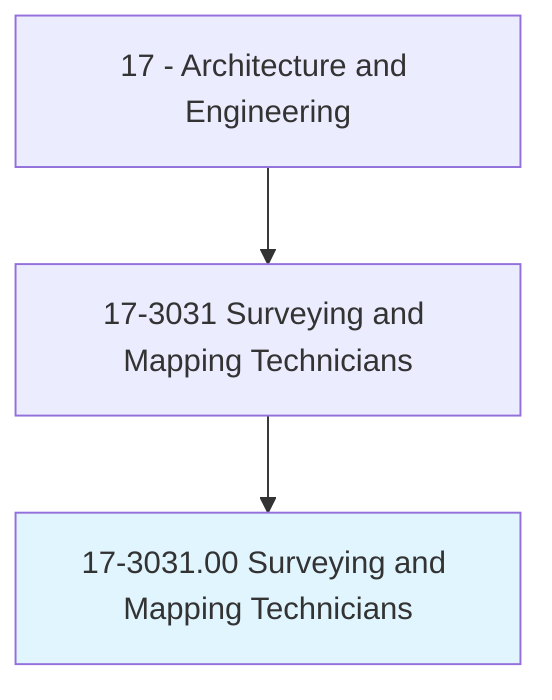
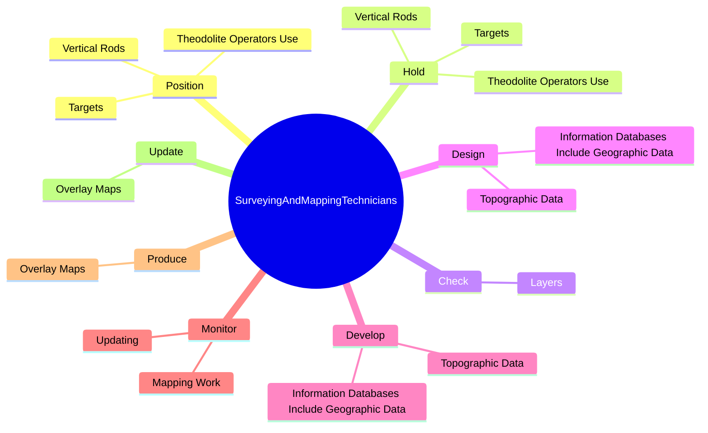
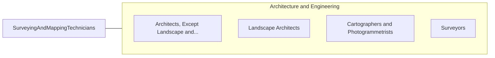

# Surveying and Mapping Technicians

> Perform surveying and mapping duties, usually under the direction of an engineer, surveyor, cartographer, or photogrammetrist, to obtain data used for construction, mapmaking, boundary location, mining, or other purposes. May calculate mapmaking information and create maps from source data, such as surveying notes, aerial photography, satellite data, or other maps to show topographical features, political boundaries, and other features. May verify accuracy and completeness of maps.

## Overview

Surveying and Mapping Technicians is an occupation within the Architecture and Engineering category. Perform surveying and mapping duties, usually under the direction of an engineer, surveyor, cartographer, or photogrammetrist, to obtain data used for construction, mapmaking, boundary location, mining, or other purposes. May calculate mapmaking information and create maps from source data, such as surveying notes, aerial photography, satellite data, or other maps to show topographical features, political boundaries, and other features.

## Classification Hierarchy

## Key Statistics

| Metric | Value |
|--------|-------|
| SOC Code | 17-3031.00 |
| Category | [Architecture and Engineering](/occupations/Architecture/index) |
| Task Count | 216 |
| Source | O*NET |

## Core Tasks

### position.VerticalRods

Surveying and Mapping Technicians position vertical rods as part of their core responsibilities.

**Actions:**
- `position.VerticalRods.for.Sighting.to.measure.Angles`
- `position.VerticalRods.for.Distances`
- `position.VerticalRods.for.Elevations`
- `position.Targets.for.Sighting.to.measure.Angles`

### hold.VerticalRods

Surveying and Mapping Technicians hold vertical rods as part of their core responsibilities.

**Actions:**
- `hold.VerticalRods.for.Sighting.to.measure.Angles`
- `hold.VerticalRods.for.Distances`
- `hold.VerticalRods.for.Elevations`
- `hold.Targets.for.Sighting.to.measure.Angles`

### check.Layers

Surveying and Mapping Technicians check layers as part of their core responsibilities.

**Actions:**
- `check.Layers.of.Maps.to.ensure.Accuracy`
- `check.Layers.of.Identifying`
- `check.Layers.of.MarkingErrors`
- `check.Layers.of.MakingCorrections`

## Skills & Competencies

### Technical Skills
- **Engineering Design** - Advanced
- **CAD/CAM** - Advanced
- **Technical Analysis** - Advanced

### Soft Skills
- **Communication** - Essential
- **Problem Solving** - Essential
- **Critical Thinking** - Important
- **Teamwork** - Important
- **Adaptability** - Important

## Related Occupations

## Industries

This occupation is found across multiple industries. See [Industries](/industries) for sector-specific employment data.

## Career Progression

---

*Source: O*NET 17-3031.00 - ONETOccupation*
