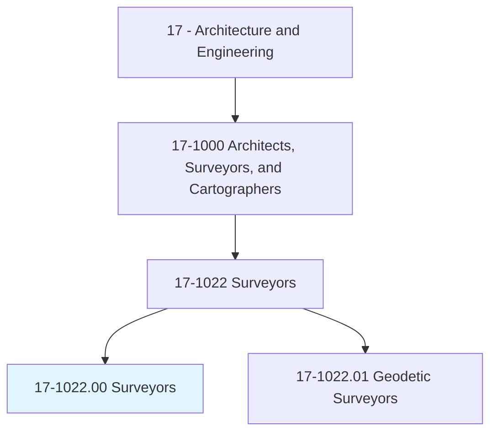
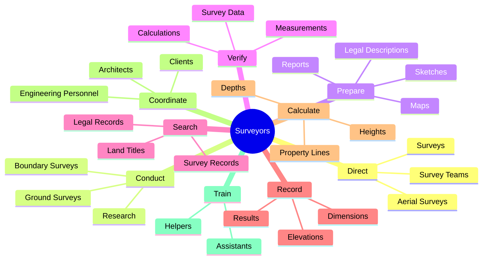
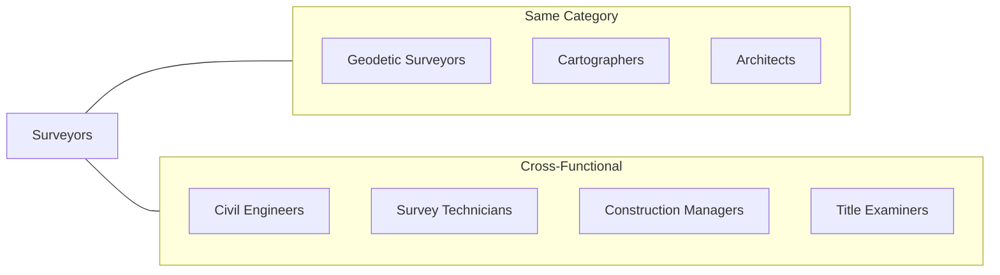
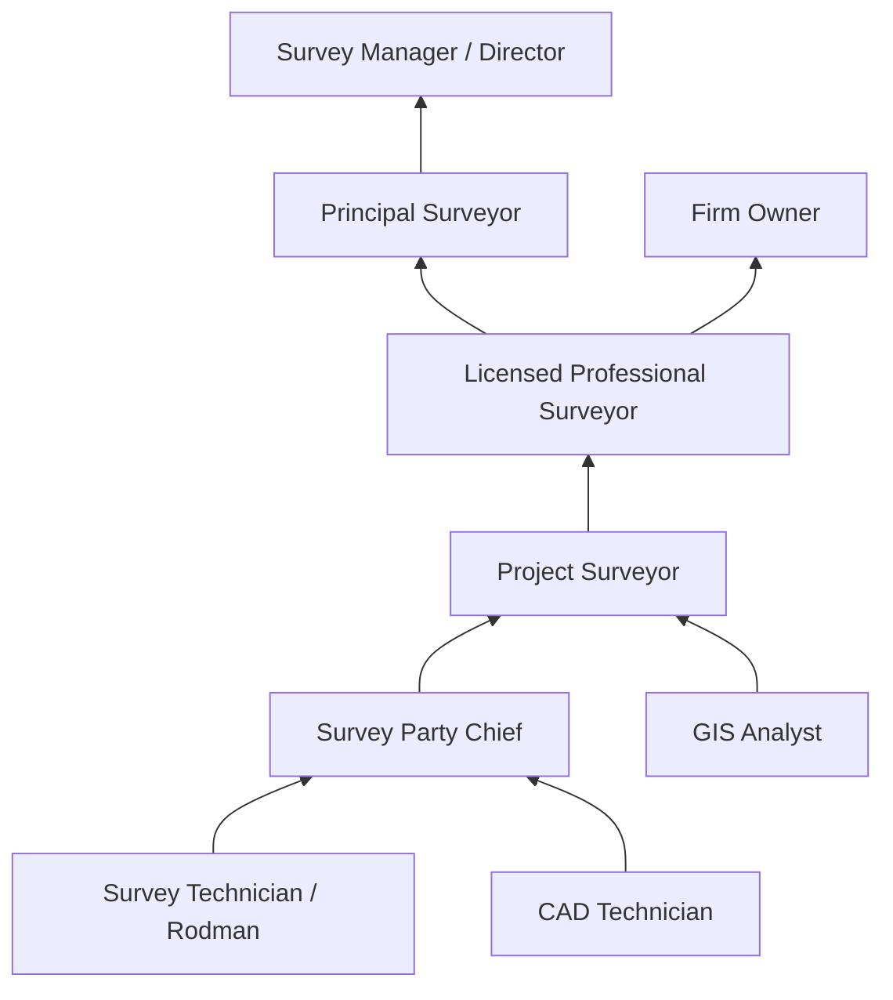

# Surveyors

> Make exact measurements and determine property boundaries. Provide data relevant to the shape, contour, gravitation, location, elevation, or dimension of land or land features on or near the earth's surface for engineering, mapmaking, mining, land evaluation, construction, and other purposes.

## Overview

Surveyors are licensed professionals who measure and map the physical features of land, establishing legal boundaries and providing critical data for construction, engineering, and land development projects. Using precision instruments including GPS receivers, total stations, and laser scanners, surveyors collect accurate measurements of land features, elevations, and boundaries. They translate these measurements into maps, reports, and legal descriptions that form the foundation for property ownership, construction planning, and infrastructure development. Surveyors must combine technical expertise with legal knowledge, as their work often has significant legal implications for property rights and land use.

## Classification Hierarchy

## Key Statistics

| Metric | Value |
|--------|-------|
| SOC Code | 17-1022.00 |
| Job Zone | 4 (Considerable Preparation) |
| Category | [Architecture and Engineering](/occupations/Architecture/index) |
| Core Tasks | 20+ |
| Variant | [Geodetic Surveyors](./GeodeticSurveyors.mdx) |
| Source | O*NET |

## Core Tasks

### direct.Surveys

Surveyors lead and direct surveying operations to establish legal property boundaries.

**Actions:**
- `direct.Surveys.to.establish.LegalBoundariesForProperties` - Lead boundary survey projects
- `direct.Surveys.to.BasedOnLegalDeeds` - Direct surveys based on deed research
- `conduct.Surveys.to.establish.LegalBoundariesForProperties` - Perform field surveying work

### prepare.Documentation

Surveyors create comprehensive documentation of survey results for legal and technical purposes.

**Actions:**
- `prepare.Sketches.of.Surveys.to.Describe` - Create visual representations of survey findings
- `prepare.Maps.of.Surveys.to.Describe` - Develop detailed survey maps
- `prepare.Reports.of.Surveys.to.Describe` - Write technical survey reports
- `prepare.LegalDescriptions.of.Surveys.to.Describe` - Draft legal property descriptions
- `prepare.LegalDescriptions.of.AssumeLiability.for.WorkPerformed` - Certify and sign survey documents

### verify.Accuracy

Surveyors ensure the precision and accuracy of all survey data and calculations.

**Actions:**
- `verify.Accuracy.of.SurveyData` - Validate collected survey information
- `verify.Accuracy.of.IncludingMeasurements` - Check measurement precision
- `verify.Accuracy.of.CalculationsConducted.at.SurveySites` - Review computational accuracy

### search.Records

Surveyors research historical and legal records to inform boundary determinations.

**Actions:**
- `search.LegalRecords.to.obtain.InformationAboutPropertyBoundariesInAreasToBeSurveyed` - Research legal documents
- `search.SurveyRecords.to.obtain.InformationAboutPropertyBoundariesInAreasToBeSurveyed` - Review prior surveys
- `search.LandTitles.to.obtain.InformationAboutPropertyBoundariesInAreasToBeSurveyed` - Examine title records

### record.Results

Surveyors document survey findings with precise measurements and descriptions.

**Actions:**
- `record.Results.of.Surveys` - Document all survey findings
- `record.Results.of.IncludingShape` - Record land shape characteristics
- `record.Results.of.Contour` - Document terrain contours
- `record.Results.of.Location` - Record precise locations
- `record.Results.of.Elevation` - Document elevation data
- `record.Results.of.Dimensions.of.LandFeatures` - Measure and record feature dimensions

### calculate.Terrain

Surveyors compute measurements to determine terrain characteristics and property boundaries.

**Actions:**
- `calculate.Heights.of.Terrain` - Determine elevation differences
- `calculate.Depths.of.Terrain` - Measure below-grade features
- `calculate.RelativePositions.of.Terrain` - Compute spatial relationships
- `calculate.PropertyLines.of.Terrain` - Establish boundary locations
- `compute.GeodeticMeasurements.to.determine.Positions` - Calculate precise coordinates

### coordinate.Findings

Surveyors collaborate with other professionals to integrate survey data into broader projects.

**Actions:**
- `coordinate.Findings.with.Work.of.EngineeringPersonnel` - Share data with engineers
- `coordinate.Findings.with.ArchitecturalPersonnel` - Coordinate with architects
- `coordinate.Findings.with.Clients` - Communicate results to clients
- `coordinate.Findings.with.Others.concerned.with.Projects` - Collaborate with project stakeholders

### testify.ExpertWitness

Surveyors provide expert testimony in legal proceedings involving land boundaries.

**Actions:**
- `testify.AsExpertWitness.in.CourtCases.on.LandSurveyIssues` - Provide expert testimony
- `testify.AsExpertWitness.in.PropertyBoundaries` - Explain boundary determinations in court

## Skills & Competencies

### Technical Skills
- **Land Surveying** - Expert
- **GPS/GNSS Technology** - Expert
- **Total Station Operation** - Expert
- **CAD Software** - Advanced
- **Legal Description Writing** - Expert
- **Geodetic Calculations** - Advanced
- **GIS Applications** - Advanced
- **Construction Layout** - Advanced

### Soft Skills
- **Attention to Detail** - Critical
- **Mathematical Reasoning** - Critical
- **Problem Solving** - Essential
- **Communication** - Essential
- **Leadership** - Essential
- **Client Relations** - Essential
- **Legal Understanding** - Essential

## Related Occupations

## Industries

- [Professional, Scientific, and Technical Services](/industries/ProfessionalServices) - High Employment
- [Construction](/industries/Construction/index) - High Employment
- [Government](/industries/Government) - High Employment
- [Mining, Quarrying, and Oil and Gas Extraction](/industries/Mining/index) - Moderate Employment
- [Real Estate](/industries/RealEstate/index) - Moderate Employment

## Industry Variations

### Boundary/Cadastral Surveying
Establishes legal property boundaries for land ownership, subdivisions, and easements. Requires extensive legal knowledge and deed research skills.

### Construction Surveying
Provides layout and control for construction projects. Requires understanding of construction processes and close coordination with contractors.

### Topographic Surveying
Maps terrain features and elevations for engineering design and planning. Emphasizes detailed data collection and 3D modeling.

### Hydrographic Surveying
Surveys bodies of water for navigation, dredging, and marine construction. Requires specialized equipment and maritime knowledge.

### Mining Surveying
Supports mining operations with underground and surface surveys. Involves specialized safety considerations and volume calculations.

### Geodetic Surveying
Performs high-precision surveys over large areas, often for government agencies. See [Geodetic Surveyors](./GeodeticSurveyors.mdx) for specialized information.

## Career Progression

## Education & Training

| Requirement | Details |
|-------------|---------|
| Typical Education | Bachelor's degree in Surveying, Geomatics, Civil Engineering, or related field |
| Work Experience | 2-4 years supervised experience under licensed surveyor (varies by state) |
| On-the-Job Training | Extensive field training with surveying equipment and procedures |
| Licensure | Required in all 50 states - pass FS (Fundamentals of Surveying) and PS (Principles and Practice of Surveying) exams |
| Common Certifications | CFedS (Certified Federal Surveyor), CST (Certified Survey Technician), various state certifications |

## Departments

This occupation typically works in:
- [Surveying](/departments/Surveying)
- [Engineering](/departments/Engineering)
- [Land Development](/departments/LandDevelopment)
- [Construction](/departments/Construction)

## Tools & Technologies

### Field Equipment
- GPS/GNSS Receivers
- Total Stations
- Robotic Total Stations
- Laser Scanners (LIDAR)
- Digital Levels
- Data Collectors

### Office Software
- AutoCAD Civil 3D
- Trimble Business Center
- Carlson Survey
- MicroSurvey
- ArcGIS

### Data Processing
- Point Cloud Software
- Adjustment Software
- Coordinate Geometry (COGO)

---

*Source: O*NET 17-1022.00 - ONETOccupation*
