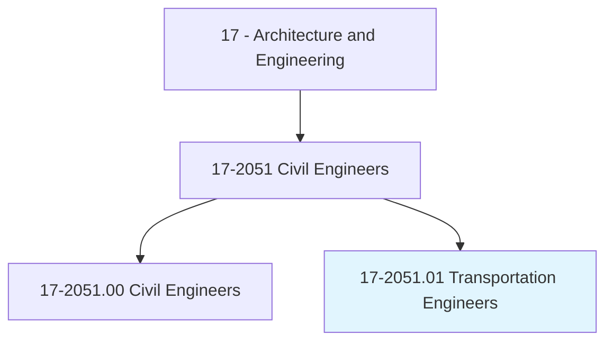
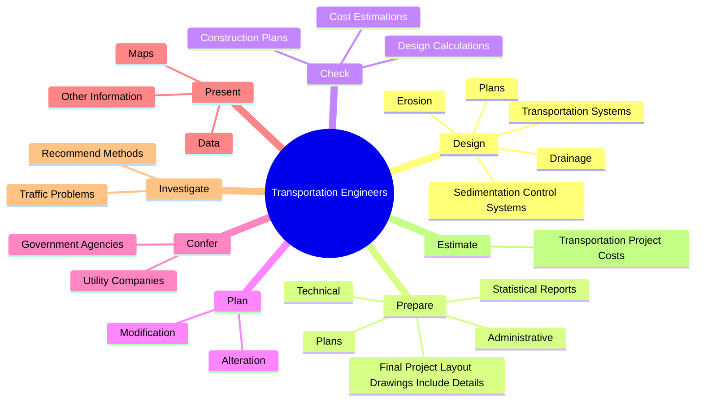
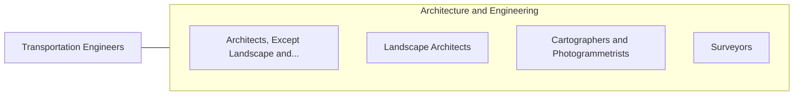

# Transportation Engineers

> Develop plans for surface transportation projects, according to established engineering standards and state or federal construction policy. Prepare designs, specifications, or estimates for transportation facilities. Plan modifications of existing streets, highways, or freeways to improve traffic flow.

## Overview

Transportation Engineers is a specialized variant within the Architecture and Engineering category. Develop plans for surface transportation projects, according to established engineering standards and state or federal construction policy. Prepare designs, specifications, or estimates for transportation facilities.

## Classification Hierarchy

## Key Statistics

| Metric | Value |
|--------|-------|
| SOC Code | 17-2051.01 |
| Category | [Architecture and Engineering](/occupations/Architecture) |
| Task Count | 120 |
| Source | O*NET |

## Core Tasks

### design.Plans

Transportation Engineers design plans as part of their core responsibilities.

**Actions:**
- `design.Plans.for.NewTransportationSystems.of.Systems`
- `design.Plans.for.Parts.of.Systems`
- `design.Plans.for.Airports`
- `design.Plans.for.CommuterTrains`

### prepare.Plans

Transportation Engineers prepare plans as part of their core responsibilities.

**Actions:**
- `prepare.Plans.for.NewTransportationSystems.of.Systems`
- `prepare.Plans.for.Parts.of.Systems`
- `prepare.Plans.for.Airports`
- `prepare.Plans.for.CommuterTrains`

### check.ConstructionPlans

Transportation Engineers check construction plans as part of their core responsibilities.

**Actions:**
- `check.ConstructionPlans.to.ensure.Completeness`
- `check.ConstructionPlans.to.Accuracy`
- `check.ConstructionPlans.to.ConformityToEngineeringStandards`
- `check.ConstructionPlans.to.practices`

## Skills & Competencies

### Technical Skills
- **Engineering Design** - Advanced
- **CAD/CAM** - Advanced
- **Technical Analysis** - Advanced

### Soft Skills
- **Communication** - Essential
- **Problem Solving** - Essential
- **Critical Thinking** - Important
- **Teamwork** - Important
- **Adaptability** - Important

## Related Occupations

## Industries

This occupation is found across multiple industries. See [Industries](/industries) for sector-specific employment data.

## Career Progression

---

*Source: O*NET 17-2051.01 - ONETOccupation*
