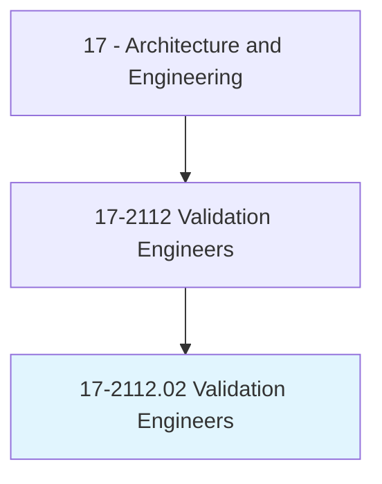
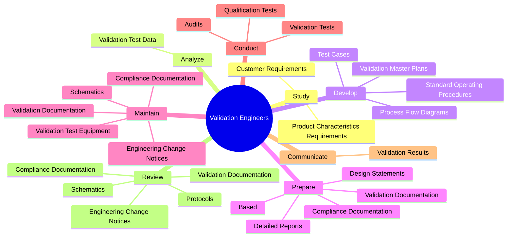
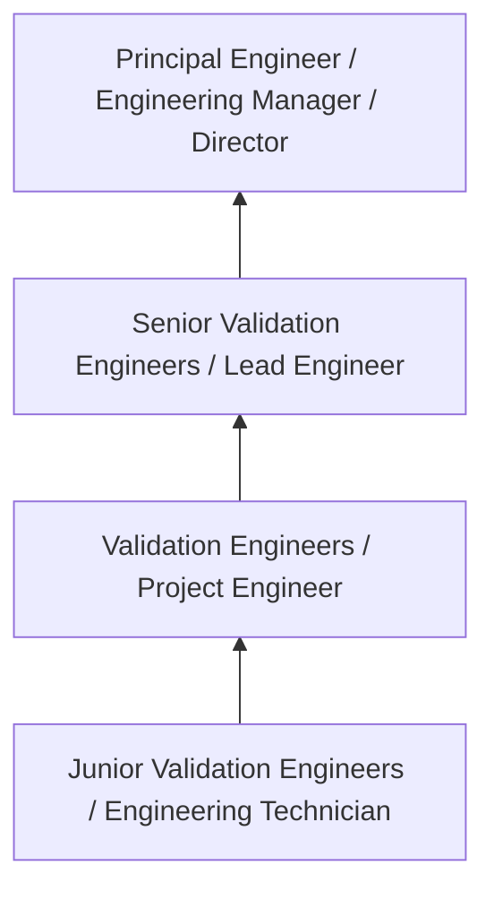
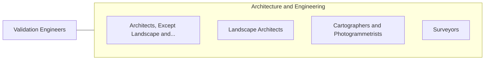

# Validation Engineers

> Design or plan protocols for equipment or processes to produce products meeting internal and external purity, safety, and quality requirements.

## Overview

Validation Engineers professionals design or plan protocols for equipment or processes to produce products meeting internal and external purity, safety, and quality requirements.. This occupation falls within the Architecture and Engineering category and requires a combination of specialized knowledge, technical skills, and practical experience.

These professionals work across diverse settings and organizational contexts, applying their expertise to meet the demands of their field. They must stay current with industry standards, emerging practices, and regulatory requirements that affect their work. The role demands both independent judgment and collaborative skills, as practitioners regularly interact with colleagues, stakeholders, and the public.

As the field continues to evolve, Validation Engineers professionals increasingly leverage technology and data-driven approaches to enhance their effectiveness. Career opportunities span the public and private sectors, with demand influenced by economic conditions, demographic shifts, and technological advancement.

## Classification Hierarchy



## Key Statistics

| Metric | Value |
|--------|-------|
| SOC Code | 17-2112.02 |
| Job Zone | N/A |
| Category | [Architecture and Engineering](/occupations/Architecture/index) |
| Core Tasks | 98+ |
| Salary Range | $55,000 - $140,000 |
| Median Salary | $85,000 |
| Growth Outlook | 4% (As fast as average) |
| Source | O*NET |

## Core Tasks



### prepare.DetailedReports

Validation Engineers prepare detailed reports as part of their core responsibilities.

**Actions:**
- `prepare.DetailedReports.on.Results.of.ValidationTestsReviewsOfProceduresProtocols` - Prepare detailed reports or design statements, based on results of validation...
- `prepare.DetailedReports.on.QualificationTestsReviews.of.ProceduresProtocols` - Prepare detailed reports or design statements, based on results of validation...
- `prepare.DesignStatements.on.Results.of.ValidationTestsReviewsOfProceduresProtocols` - Prepare detailed reports or design statements, based on results of validation...
- `prepare.DesignStatements.on.QualificationTestsReviews.of.ProceduresProtocols` - Prepare detailed reports or design statements, based on results of validation...
- `prepare.Based.on.Results.of.ValidationTestsReviewsOfProceduresProtocols` - Prepare detailed reports or design statements, based on results of validation...

### conduct.ValidationTests

Validation Engineers conduct validation tests as part of their core responsibilities.

**Actions:**
- `conduct.ValidationTests.of.NewProcesses` - Conduct validation or qualification tests of new or existing processes, equip...
- `conduct.ValidationTests.of.ExistingProcesses` - Conduct validation or qualification tests of new or existing processes, equip...
- `conduct.ValidationTests.of.Equipment` - Conduct validation or qualification tests of new or existing processes, equip...
- `conduct.ValidationTests.of.Software.in.AccordanceWithInternalProtocolsStandards` - Conduct validation or qualification tests of new or existing processes, equip...
- `conduct.ValidationTests.of.ExternalStandards` - Conduct validation or qualification tests of new or existing processes, equip...

### maintain.ValidationTestEquipment

Validation Engineers maintain validation test equipment as part of their core responsibilities.

**Actions:**
- `maintain.ValidationTestEquipment` - Maintain validation test equipment.
- `maintain.ValidationDocumentation` - Prepare, maintain, or review validation and compliance documentation, such as...
- `maintain.ComplianceDocumentation` - Prepare, maintain, or review validation and compliance documentation, such as...
- `maintain.EngineeringChangeNotices` - Prepare, maintain, or review validation and compliance documentation, such as...
- `maintain.Schematics` - Prepare, maintain, or review validation and compliance documentation, such as...

### review.ValidationDocumentation

Validation Engineers review validation documentation as part of their core responsibilities.

**Actions:**
- `review.ValidationDocumentation` - Prepare, maintain, or review validation and compliance documentation, such as...
- `review.ComplianceDocumentation` - Prepare, maintain, or review validation and compliance documentation, such as...
- `review.EngineeringChangeNotices` - Prepare, maintain, or review validation and compliance documentation, such as...
- `review.Schematics` - Prepare, maintain, or review validation and compliance documentation, such as...
- `review.Protocols` - Prepare, maintain, or review validation and compliance documentation, such as...


## Skills & Competencies

### Technical Skills
- **Technical Design** - Expert
- **Engineering Analysis** - Advanced
- **CAD/BIM Software** - Advanced
- **Project Management** - Advanced
- **Code Compliance** - Advanced
- **Quality Assurance** - Proficient

### Soft Skills
- **Analytical Thinking** - Critical
- **Problem Solving** - Critical
- **Attention to Detail** - Essential
- **Teamwork** - Essential
- **Communication** - Essential

## Education & Certifications

| Requirement | Details |
|-------------|---------|
| Typical Education | Bachelor's degree in engineering, architecture, or related field |
| Work Experience | 2-4 years professional experience |
| On-the-Job Training | Moderate - technical specialization required |
| Certifications | Professional Engineer (PE), Architect License, or field-specific certifications |

## Career Progression



## Industry Variations

### Private Sector Engineering
Design and development work for commercial clients. Validation Engineers professionals focus on product development, system design, and project delivery.

### Government and Infrastructure
Public works and infrastructure projects with emphasis on regulatory compliance and long-term sustainability.

### Construction and Field Engineering
On-site implementation and oversight of engineering designs. Strong focus on quality control and safety compliance.

### Consulting
Advisory services for diverse clients. Requires strong project management skills and ability to work across multiple simultaneous projects.

## Technology & Tools

- **Computer-Aided Design (CAD) software**
- **Building Information Modeling (BIM)**
- **Geographic Information Systems (GIS)**
- **Structural analysis software**
- **Project management tools**

## Related Occupations



## Industries

- [Engineering Services](/industries/Engineering) - High Employment
- [Construction](/industries/Construction) - High Employment
- [Manufacturing](/industries/Manufacturing) - Moderate Employment
- [Government](/industries/Government) - Moderate Employment

## Departments

This occupation typically works in:
- [Engineering](/departments/Engineering/index)
- [Design](/departments/Design)
- [Project Management](/departments/ProjectManagement)

## GraphDL Semantic Structure

```
Validation Engineers perform:
- study.ProductCharacteristicsRequirements.to.determine.ValidationObjectives
- study.ProductCharacteristicsRequirements.to.Standards
- study.CustomerRequirements.to.determine.ValidationObjectives
- study.CustomerRequirements.to.Standards
- analyze.ValidationTestData.to.determine.WhetherSystems
- analyze.ValidationTestData.to.processes.HaveMetValidationCriteriaIdentifyRootCausesOfProductionProblems
```

---

*Source: O*NET 17-2112.02 - ONETOccupation*
