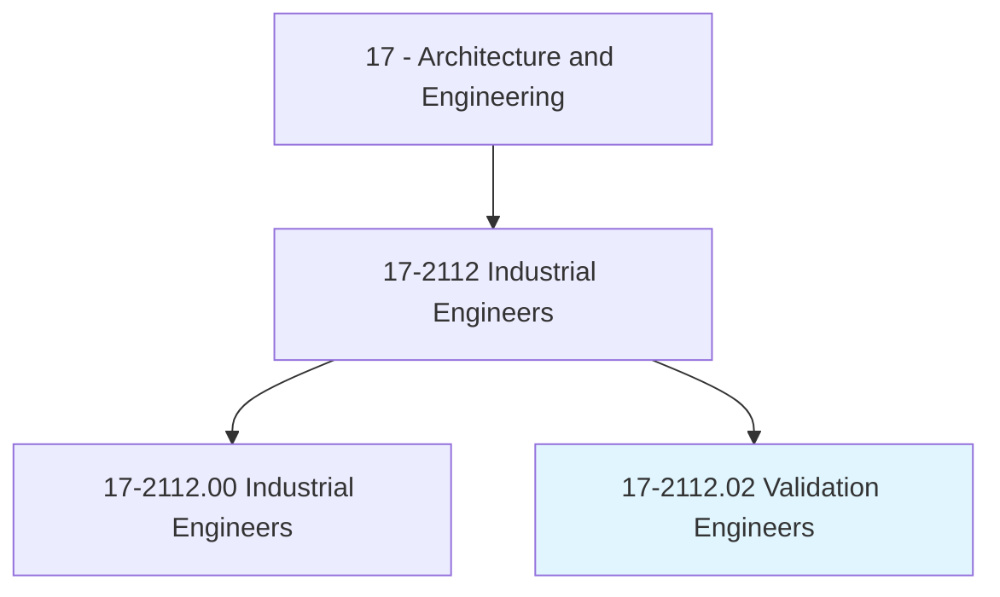
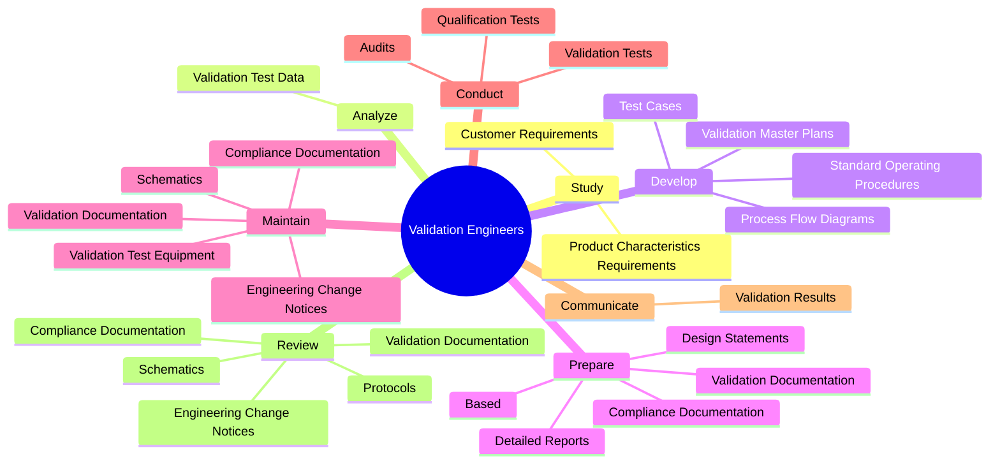
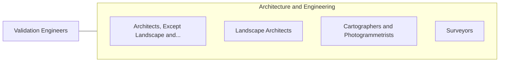

# Validation Engineers

> Design or plan protocols for equipment or processes to produce products meeting internal and external purity, safety, and quality requirements.

## Overview

Validation Engineers is classified under Architecture and Engineering (SOC 17). Design or plan protocols for equipment or processes to produce products meeting internal and external purity, safety, and quality requirements.

## Classification Hierarchy

## Key Statistics

| Metric | Value |
|--------|-------|
| SOC Code | 17-2112.02 |
| Category | [Architecture and Engineering](/occupations/Architecture) |
| Task Count | 98 |
| Source | O*NET |

## Core Tasks

### study.ProductCharacteristicsRequirements

Validation Engineers study product characteristics requirements as part of their core responsibilities.

**Actions:**
- `study.ProductCharacteristicsRequirements.to.determine.ValidationObjectives`
- `study.ProductCharacteristicsRequirements.to.Standards`
- `study.CustomerRequirements.to.determine.ValidationObjectives`
- `study.CustomerRequirements.to.Standards`

### analyze.ValidationTestData

Validation Engineers analyze validation test data as part of their core responsibilities.

**Actions:**
- `analyze.ValidationTestData.to.determine.WhetherSystems`
- `analyze.ValidationTestData.to.processes.HaveMetValidationCriteriaIdentifyRootCausesOfProductionProblems`
- `analyze.ValidationTestData.to.ToIdentifyRootCausesOfProductionProblems`

### develop.ValidationMasterPlans

Validation Engineers develop validation master plans as part of their core responsibilities.

**Actions:**
- `develop.ValidationMasterPlans`
- `develop.ProcessFlowDiagrams`
- `develop.TestCases`
- `develop.StandardOperatingProcedures`

## Skills & Competencies

### Technical Skills
- **Engineering Design** - Advanced
- **CAD/CAM** - Advanced
- **Technical Analysis** - Advanced

### Soft Skills
- **Communication** - Essential
- **Problem Solving** - Essential
- **Critical Thinking** - Important
- **Teamwork** - Important
- **Adaptability** - Important

## Related Occupations

## Industries

This occupation is found across multiple industries. See [Industries](/industries) for sector-specific employment data.

## Career Progression

---

*Source: O*NET 17-2112.02 - ONETOccupation*
