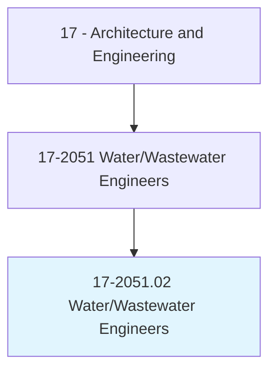
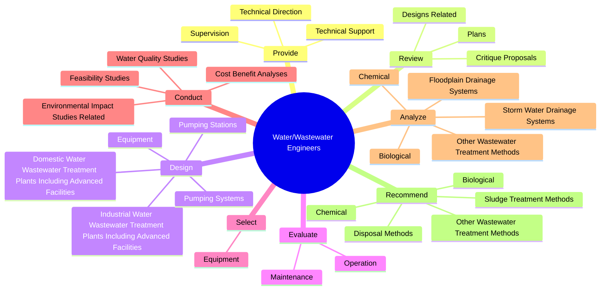
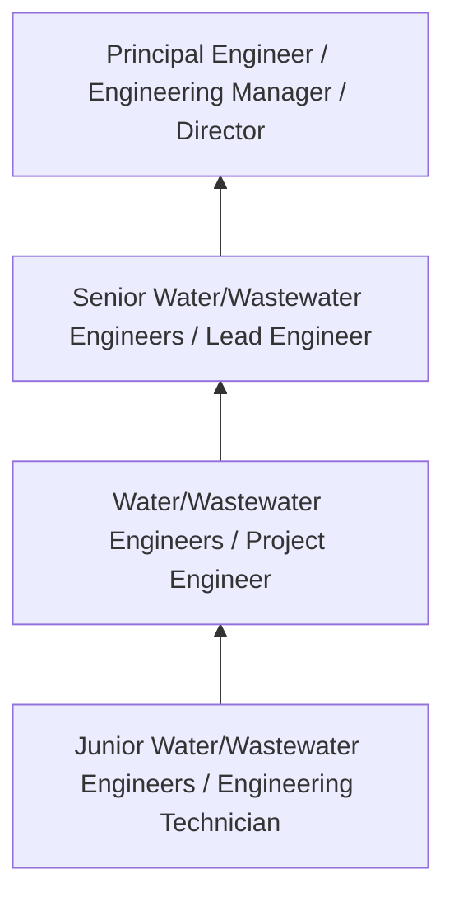
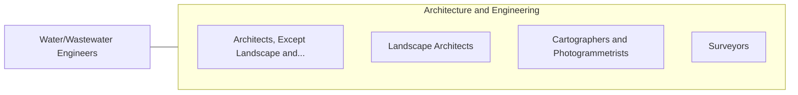

# Water/Wastewater Engineers

> Design or oversee projects involving provision of potable water, disposal of wastewater and sewage, or prevention of flood-related damage. Prepare environmental documentation for water resources, regulatory program compliance, data management and analysis, and field work. Perform hydraulic modeling and pipeline design.

## Overview

Water/Wastewater Engineers professionals design or oversee projects involving provision of potable water, disposal of wastewater and sewage, or prevention of flood-related damage. This occupation falls within the Architecture and Engineering category and requires a combination of specialized knowledge, technical skills, and practical experience.

These professionals work across diverse settings and organizational contexts, applying their expertise to meet the demands of their field. They must stay current with industry standards, emerging practices, and regulatory requirements that affect their work. The role demands both independent judgment and collaborative skills, as practitioners regularly interact with colleagues, stakeholders, and the public.

As the field continues to evolve, Water/Wastewater Engineers professionals increasingly leverage technology and data-driven approaches to enhance their effectiveness. Career opportunities span the public and private sectors, with demand influenced by economic conditions, demographic shifts, and technological advancement.

## Classification Hierarchy



## Key Statistics

| Metric | Value |
|--------|-------|
| SOC Code | 17-2051.02 |
| Job Zone | N/A |
| Category | [Architecture and Engineering](/occupations/Architecture/index) |
| Core Tasks | 131+ |
| Salary Range | $55,000 - $140,000 |
| Median Salary | $85,000 |
| Growth Outlook | 4% (As fast as average) |
| Source | O*NET |

## Core Tasks



### design.DomesticWaterWastewaterTreatmentPlantsIncludingAdvancedFacilities

Water/Wastewater Engineers design domestic water wastewater treatment plants including advanced facilities as part of their core responsibilities.

**Actions:**
- `design.DomesticWaterWastewaterTreatmentPlantsIncludingAdvancedFacilities.with.SequencingBatchReactorsSbr` - Design domestic or industrial water or wastewater treatment plants, including...
- `design.DomesticWaterWastewaterTreatmentPlantsIncludingAdvancedFacilities.with.Membranes` - Design domestic or industrial water or wastewater treatment plants, including...
- `design.DomesticWaterWastewaterTreatmentPlantsIncludingAdvancedFacilities.with.LiftStations` - Design domestic or industrial water or wastewater treatment plants, including...
- `design.DomesticWaterWastewaterTreatmentPlantsIncludingAdvancedFacilities.with.Headworks` - Design domestic or industrial water or wastewater treatment plants, including...
- `design.DomesticWaterWastewaterTreatmentPlantsIncludingAdvancedFacilities.with.SurgeOverflowBasins` - Design domestic or industrial water or wastewater treatment plants, including...

### analyze.Chemical

Water/Wastewater Engineers analyze chemical as part of their core responsibilities.

**Actions:**
- `analyze.Chemical.to.prepare.WaterForIndustrialUse` - Analyze and recommend chemical, biological, or other wastewater treatment met...
- `analyze.Chemical.to.DomesticUse` - Analyze and recommend chemical, biological, or other wastewater treatment met...
- `analyze.Biological.to.prepare.WaterForIndustrialUse` - Analyze and recommend chemical, biological, or other wastewater treatment met...
- `analyze.Biological.to.DomesticUse` - Analyze and recommend chemical, biological, or other wastewater treatment met...
- `analyze.OtherWastewaterTreatmentMethods.to.prepare.WaterForIndustrialUse` - Analyze and recommend chemical, biological, or other wastewater treatment met...

### conduct.WaterQualityStudies

Water/Wastewater Engineers conduct water quality studies as part of their core responsibilities.

**Actions:**
- `conduct.WaterQualityStudies.to.identify.WaterPollutantSources` - Conduct water quality studies to identify and characterize water pollutant so...
- `conduct.WaterQualityStudies.to.characterize.WaterPollutantSources` - Conduct water quality studies to identify and characterize water pollutant so...
- `conduct.CostBenefitAnalyses.for.Construction.of.WaterSupplySystems` - Conduct cost-benefit analyses for the construction of water supply systems, r...
- `conduct.CostBenefitAnalyses.for.RunoffCollectionNetworks` - Conduct cost-benefit analyses for the construction of water supply systems, r...
- `conduct.CostBenefitAnalyses.for.Water` - Conduct cost-benefit analyses for the construction of water supply systems, r...

### perform.HydrologicalAnalyses

Water/Wastewater Engineers perform hydrological analyses as part of their core responsibilities.

**Actions:**
- `perform.HydrologicalAnalyses.to.model.MovementOfWater` - Perform hydrological analyses, using three-dimensional simulation software, t...
- `perform.HydrologicalAnalyses.to.forecast.DispersionOfChemicalPollutantsInWaterSupply` - Perform hydrological analyses, using three-dimensional simulation software, t...
- `perform.UsingThreeDimensionalSimulationSoftware.to.model.MovementOfWater` - Perform hydrological analyses, using three-dimensional simulation software, t...
- `perform.UsingThreeDimensionalSimulationSoftware.to.forecast.DispersionOfChemicalPollutantsInWaterSupply` - Perform hydrological analyses, using three-dimensional simulation software, t...
- `perform.HydraulicAnalyses.of.WaterSupplySystems` - Perform hydraulic analyses of water supply systems or water distribution netw...


## Skills & Competencies

### Technical Skills
- **Technical Design** - Expert
- **Engineering Analysis** - Advanced
- **CAD/BIM Software** - Advanced
- **Project Management** - Advanced
- **Code Compliance** - Advanced
- **Quality Assurance** - Proficient

### Soft Skills
- **Analytical Thinking** - Critical
- **Problem Solving** - Critical
- **Attention to Detail** - Essential
- **Teamwork** - Essential
- **Communication** - Essential

## Education & Certifications

| Requirement | Details |
|-------------|---------|
| Typical Education | Bachelor's degree in engineering, architecture, or related field |
| Work Experience | 2-4 years professional experience |
| On-the-Job Training | Moderate - technical specialization required |
| Certifications | Professional Engineer (PE), Architect License, or field-specific certifications |

## Career Progression



## Industry Variations

### Private Sector Engineering
Design and development work for commercial clients. Water/Wastewater Engineers professionals focus on product development, system design, and project delivery.

### Government and Infrastructure
Public works and infrastructure projects with emphasis on regulatory compliance and long-term sustainability.

### Construction and Field Engineering
On-site implementation and oversight of engineering designs. Strong focus on quality control and safety compliance.

### Consulting
Advisory services for diverse clients. Requires strong project management skills and ability to work across multiple simultaneous projects.

## Technology & Tools

- **Computer-Aided Design (CAD) software**
- **Building Information Modeling (BIM)**
- **Geographic Information Systems (GIS)**
- **Structural analysis software**
- **Project management tools**

## Related Occupations



## Industries

- [Engineering Services](/industries/Engineering) - High Employment
- [Construction](/industries/Construction) - High Employment
- [Manufacturing](/industries/Manufacturing) - Moderate Employment
- [Government](/industries/Government) - Moderate Employment

## Departments

This occupation typically works in:
- [Engineering](/departments/Engineering/index)
- [Design](/departments/Design)
- [Project Management](/departments/ProjectManagement)

## GraphDL Semantic Structure

```
Water/Wastewater Engineers perform:
- provide.TechnicalDirection.to.JuniorEngineers
- provide.TechnicalDirection.to.Engineering
- provide.TechnicalDirection.to.ComputerAidedDesignCad
- provide.TechnicalDirection.to.OtherTechnicalPersonnel
- provide.Supervision.to.JuniorEngineers
- provide.Supervision.to.Engineering
```

---

*Source: O*NET 17-2051.02 - ONETOccupation*
