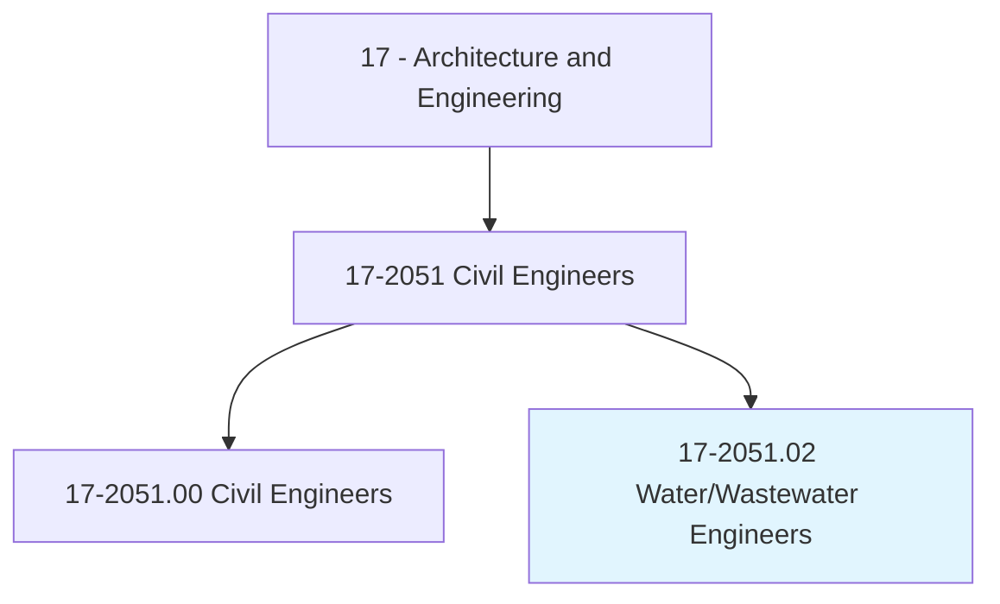
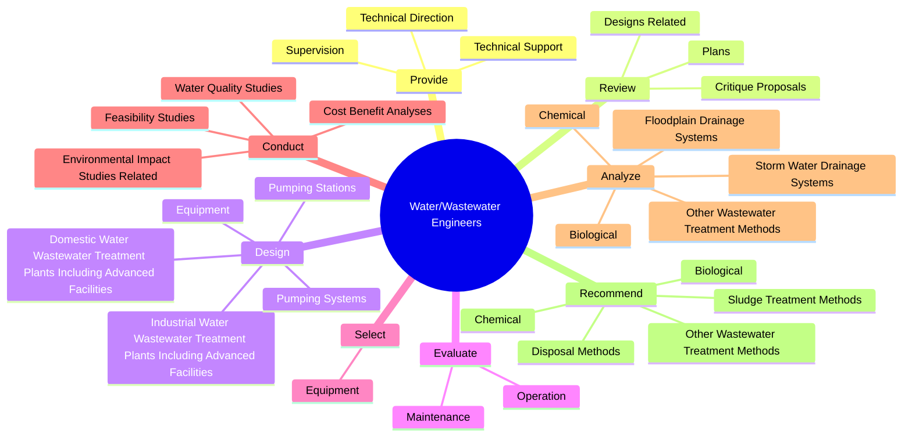
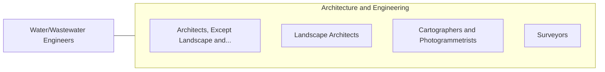

# Water/Wastewater Engineers

> Design or oversee projects involving provision of potable water, disposal of wastewater and sewage, or prevention of flood-related damage. Prepare environmental documentation for water resources, regulatory program compliance, data management and analysis, and field work. Perform hydraulic modeling and pipeline design.

## Overview

Water/Wastewater Engineers is a specialized variant within the Architecture and Engineering category. Design or oversee projects involving provision of potable water, disposal of wastewater and sewage, or prevention of flood-related damage. Prepare environmental documentation for water resources, regulatory program compliance, data management and analysis, and field work.

## Classification Hierarchy

## Key Statistics

| Metric | Value |
|--------|-------|
| SOC Code | 17-2051.02 |
| Category | [Architecture and Engineering](/occupations/Architecture) |
| Task Count | 131 |
| Source | O*NET |

## Core Tasks

### provide.TechnicalDirection

Water/Wastewater Engineers provide technical direction as part of their core responsibilities.

**Actions:**
- `provide.TechnicalDirection.to.JuniorEngineers`
- `provide.TechnicalDirection.to.Engineering`
- `provide.TechnicalDirection.to.ComputerAidedDesignCad`
- `provide.TechnicalDirection.to.OtherTechnicalPersonnel`

### review.CritiqueProposals

Water/Wastewater Engineers review critique proposals as part of their core responsibilities.

**Actions:**
- `review.CritiqueProposals.to.water.TreatmentSystems`
- `review.CritiqueProposals.to.WastewaterTreatmentSystems`
- `review.Plans.to.water.TreatmentSystems`
- `review.Plans.to.WastewaterTreatmentSystems`

### design.DomesticWaterWastewaterTreatmentPlantsIncludingAdvancedFacilities

Water/Wastewater Engineers design domestic water wastewater treatment plants including advanced facilities as part of their core responsibilities.

**Actions:**
- `design.DomesticWaterWastewaterTreatmentPlantsIncludingAdvancedFacilities.with.SequencingBatchReactorsSbr`
- `design.DomesticWaterWastewaterTreatmentPlantsIncludingAdvancedFacilities.with.Membranes`
- `design.DomesticWaterWastewaterTreatmentPlantsIncludingAdvancedFacilities.with.LiftStations`
- `design.DomesticWaterWastewaterTreatmentPlantsIncludingAdvancedFacilities.with.Headworks`

## Skills & Competencies

### Technical Skills
- **Engineering Design** - Advanced
- **CAD/CAM** - Advanced
- **Technical Analysis** - Advanced

### Soft Skills
- **Communication** - Essential
- **Problem Solving** - Essential
- **Critical Thinking** - Important
- **Teamwork** - Important
- **Adaptability** - Important

## Related Occupations

## Industries

This occupation is found across multiple industries. See [Industries](/industries) for sector-specific employment data.

## Career Progression

---

*Source: O*NET 17-2051.02 - ONETOccupation*
