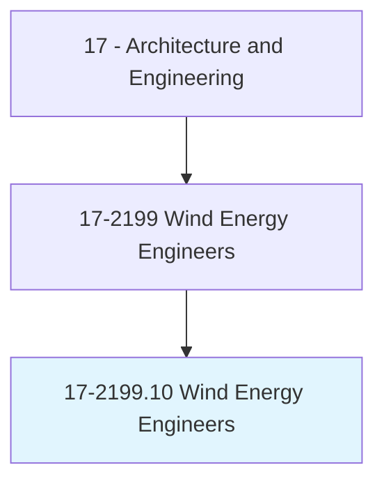
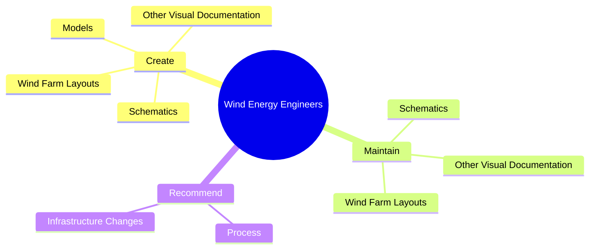
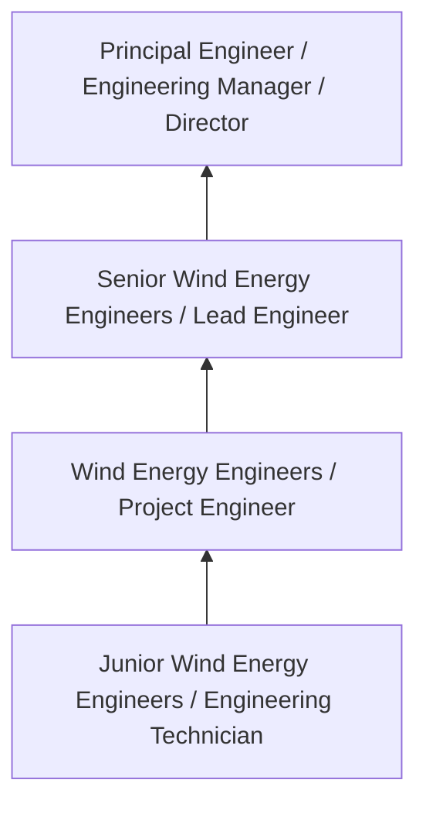
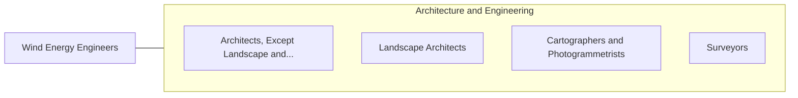

# Wind Energy Engineers

> Design underground or overhead wind farm collector systems and prepare and develop site specifications.

## Overview

Wind Energy Engineers professionals design underground or overhead wind farm collector systems and prepare and develop site specifications.. This occupation falls within the Architecture and Engineering category and requires a combination of specialized knowledge, technical skills, and practical experience.

These professionals work across diverse settings and organizational contexts, applying their expertise to meet the demands of their field. They must stay current with industry standards, emerging practices, and regulatory requirements that affect their work. The role demands both independent judgment and collaborative skills, as practitioners regularly interact with colleagues, stakeholders, and the public.

As the field continues to evolve, Wind Energy Engineers professionals increasingly leverage technology and data-driven approaches to enhance their effectiveness. Career opportunities span the public and private sectors, with demand influenced by economic conditions, demographic shifts, and technological advancement.

## Classification Hierarchy



## Key Statistics

| Metric | Value |
|--------|-------|
| SOC Code | 17-2199.10 |
| Job Zone | N/A |
| Category | [Architecture and Engineering](/occupations/Architecture/index) |
| Core Tasks | 65+ |
| Salary Range | $55,000 - $140,000 |
| Median Salary | $85,000 |
| Growth Outlook | 4% (As fast as average) |
| Source | O*NET |

## Core Tasks



### develop.ActiveControlAlgorithms

Wind Energy Engineers develop active control algorithms as part of their core responsibilities.

**Actions:**
- `develop.ActiveControlAlgorithms.for.WindTurbines` - Develop active control algorithms, electronics, software, electromechanical, ...
- `develop.Electronics.for.WindTurbines` - Develop active control algorithms, electronics, software, electromechanical, ...
- `develop.Software.for.WindTurbines` - Develop active control algorithms, electronics, software, electromechanical, ...
- `develop.Electromechanical.for.WindTurbines` - Develop active control algorithms, electronics, software, electromechanical, ...
- `develop.ElectrohydraulicSystems.for.WindTurbines` - Develop active control algorithms, electronics, software, electromechanical, ...

### create.WindFarmLayouts

Wind Energy Engineers create wind farm layouts as part of their core responsibilities.

**Actions:**
- `create.WindFarmLayouts.for.WindFarms` - Create or maintain wind farm layouts, schematics, or other visual documentati...
- `create.Schematics.for.WindFarms` - Create or maintain wind farm layouts, schematics, or other visual documentati...
- `create.OtherVisualDocumentation.for.WindFarms` - Create or maintain wind farm layouts, schematics, or other visual documentati...
- `create.Models.to.optimize.LayoutOfWindFarmAccessRoads` - Create models to optimize the layout of wind farm access roads, crane pads, c...
- `create.Models.to.CranePads` - Create models to optimize the layout of wind farm access roads, crane pads, c...

### investigate.ExperimentalWindTurbines

Wind Energy Engineers investigate experimental wind turbines as part of their core responsibilities.

**Actions:**
- `investigate.ExperimentalWindTurbines.for.Properties` - Investigate experimental wind turbines or wind turbine technologies for prope...
- `investigate.ExperimentalWindTurbines.for.Aerodynamics` - Investigate experimental wind turbines or wind turbine technologies for prope...
- `investigate.ExperimentalWindTurbines.for.Production` - Investigate experimental wind turbines or wind turbine technologies for prope...
- `investigate.ExperimentalWindTurbines.for.Noise` - Investigate experimental wind turbines or wind turbine technologies for prope...
- `investigate.ExperimentalWindTurbines.for.Load` - Investigate experimental wind turbines or wind turbine technologies for prope...

### direct.Balance

Wind Energy Engineers direct balance as part of their core responsibilities.

**Actions:**
- `direct.Balance.of.PlantBop` - Direct balance of plant (BOP) construction, generator installation, testing, ...
- `direct.Balance.of.Generat` - Direct balance of plant (BOP) construction, generator installation, testing, ...
- `direct.Balance.of.Installation` - Direct balance of plant (BOP) construction, generator installation, testing, ...
- `direct.Balance.of.Testing` - Direct balance of plant (BOP) construction, generator installation, testing, ...
- `direct.Balance.of.Commissioning` - Direct balance of plant (BOP) construction, generator installation, testing, ...


## Skills & Competencies

### Technical Skills
- **Technical Design** - Expert
- **Engineering Analysis** - Advanced
- **CAD/BIM Software** - Advanced
- **Project Management** - Advanced
- **Code Compliance** - Advanced
- **Quality Assurance** - Proficient

### Soft Skills
- **Analytical Thinking** - Critical
- **Problem Solving** - Critical
- **Attention to Detail** - Essential
- **Teamwork** - Essential
- **Communication** - Essential

## Education & Certifications

| Requirement | Details |
|-------------|---------|
| Typical Education | Bachelor's degree in engineering, architecture, or related field |
| Work Experience | 2-4 years professional experience |
| On-the-Job Training | Moderate - technical specialization required |
| Certifications | Professional Engineer (PE), Architect License, or field-specific certifications |

## Career Progression



## Industry Variations

### Private Sector Engineering
Design and development work for commercial clients. Wind Energy Engineers professionals focus on product development, system design, and project delivery.

### Government and Infrastructure
Public works and infrastructure projects with emphasis on regulatory compliance and long-term sustainability.

### Construction and Field Engineering
On-site implementation and oversight of engineering designs. Strong focus on quality control and safety compliance.

### Consulting
Advisory services for diverse clients. Requires strong project management skills and ability to work across multiple simultaneous projects.

## Technology & Tools

- **Computer-Aided Design (CAD) software**
- **Building Information Modeling (BIM)**
- **Geographic Information Systems (GIS)**
- **Structural analysis software**
- **Project management tools**

## Related Occupations



## Industries

- [Engineering Services](/industries/Engineering) - High Employment
- [Construction](/industries/Construction) - High Employment
- [Manufacturing](/industries/Manufacturing) - Moderate Employment
- [Government](/industries/Government) - Moderate Employment

## Departments

This occupation typically works in:
- [Engineering](/departments/Engineering/index)
- [Design](/departments/Design)
- [Project Management](/departments/ProjectManagement)

## GraphDL Semantic Structure

```
Wind Energy Engineers perform:
- create.WindFarmLayouts.for.WindFarms
- create.Schematics.for.WindFarms
- create.OtherVisualDocumentation.for.WindFarms
- maintain.WindFarmLayouts.for.WindFarms
- maintain.Schematics.for.WindFarms
- maintain.OtherVisualDocumentation.for.WindFarms
```

---

*Source: O*NET 17-2199.10 - ONETOccupation*
