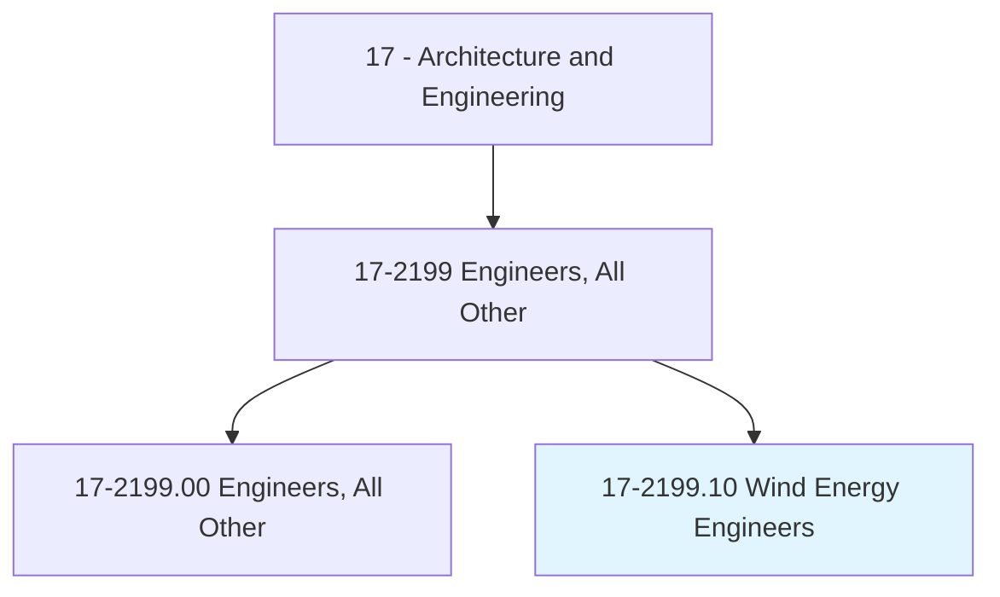
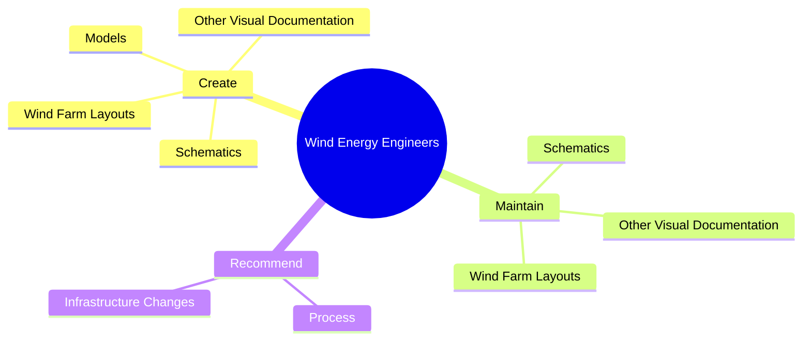
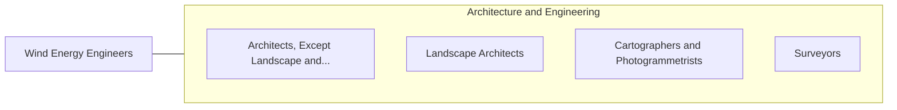

# Wind Energy Engineers

> Design underground or overhead wind farm collector systems and prepare and develop site specifications.

## Overview

Wind Energy Engineers is classified under Architecture and Engineering (SOC 17). Design underground or overhead wind farm collector systems and prepare and develop site specifications.

## Classification Hierarchy

## Key Statistics

| Metric | Value |
|--------|-------|
| SOC Code | 17-2199.10 |
| Category | [Architecture and Engineering](/occupations/Architecture) |
| Task Count | 65 |
| Source | O*NET |

## Core Tasks

### create.WindFarmLayouts

Wind Energy Engineers create wind farm layouts as part of their core responsibilities.

**Actions:**
- `create.WindFarmLayouts.for.WindFarms`
- `create.Schematics.for.WindFarms`
- `create.OtherVisualDocumentation.for.WindFarms`
- `create.Models.to.optimize.LayoutOfWindFarmAccessRoads`

### maintain.WindFarmLayouts

Wind Energy Engineers maintain wind farm layouts as part of their core responsibilities.

**Actions:**
- `maintain.WindFarmLayouts.for.WindFarms`
- `maintain.Schematics.for.WindFarms`
- `maintain.OtherVisualDocumentation.for.WindFarms`

### recommend.Process

Wind Energy Engineers recommend process as part of their core responsibilities.

**Actions:**
- `recommend.Process.to.improve.WindTurbinePerformance`
- `recommend.Process.to.reduce.OperationalCosts`
- `recommend.Process.to.comply.WithRegulations`
- `recommend.InfrastructureChanges.to.improve.WindTurbinePerformance`

## Skills & Competencies

### Technical Skills
- **Engineering Design** - Advanced
- **CAD/CAM** - Advanced
- **Technical Analysis** - Advanced

### Soft Skills
- **Communication** - Essential
- **Problem Solving** - Essential
- **Critical Thinking** - Important
- **Teamwork** - Important
- **Adaptability** - Important

## Related Occupations

## Industries

This occupation is found across multiple industries. See [Industries](/industries) for sector-specific employment data.

## Career Progression

---

*Source: O*NET 17-2199.10 - ONETOccupation*
