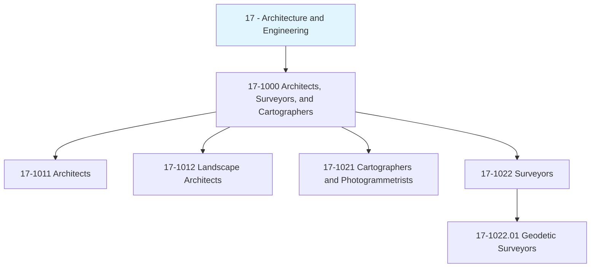
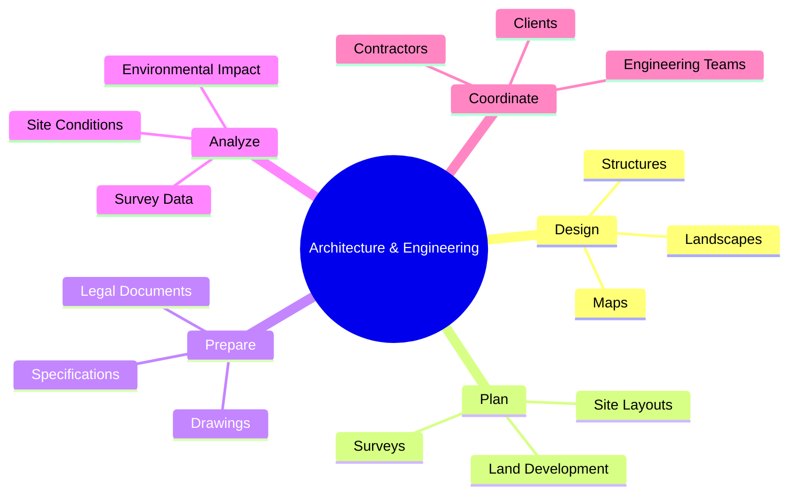
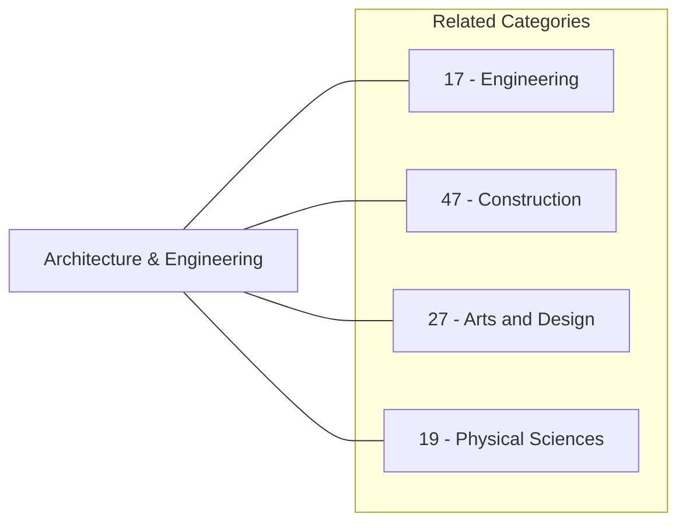
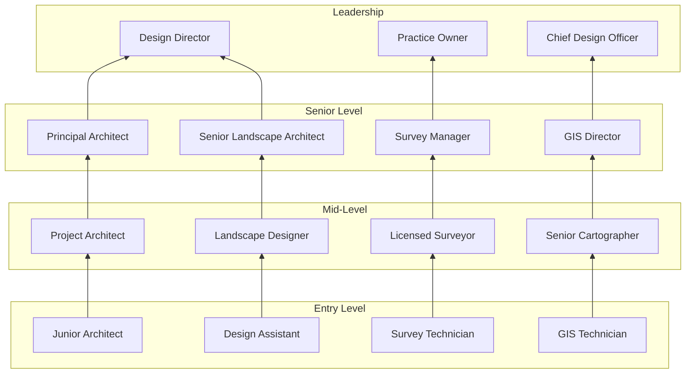

# Architecture and Engineering

> Design and plan the built environment, from structures and landscapes to geographic mapping and land boundaries.

## Overview

Architecture and Engineering occupations (SOC Category 17) encompass professionals who design, plan, and oversee the creation of structures, landscapes, and spatial documentation. This category includes architects who envision buildings and spaces, landscape architects who design outdoor environments, surveyors who establish property boundaries and topographical data, cartographers who create maps and spatial representations, and geodetic surveyors who measure large-scale Earth surface features. These professionals combine creative vision with technical precision, ensuring that built environments are functional, aesthetically pleasing, and compliant with regulations.

## Classification Hierarchy

## Occupations in this Category

### Architects
- [Architects, Except Landscape and Naval](./Architects.mdx) - 17-1011.00

### Landscape Architects
- [Landscape Architects](./LandscapeArchitects.mdx) - 17-1012.00

### Cartographers and Photogrammetrists
- [Cartographers and Photogrammetrists](./Cartographers.mdx) - 17-1021.00

### Surveyors
- [Surveyors](./Surveyors.mdx) - 17-1022.00
- [Geodetic Surveyors](./GeodeticSurveyors.mdx) - 17-1022.01

## Core Task Categories

## Skills Overview

### Technical Skills
- **Computer-Aided Design (CAD)** - Essential across all occupations
- **Geographic Information Systems (GIS)** - Cartographers and Surveyors
- **Building Information Modeling (BIM)** - Architects
- **Surveying Equipment** - Surveyors and Geodetic Surveyors
- **Environmental Analysis** - Landscape Architects

### Soft Skills
- **Spatial Reasoning** - Critical
- **Attention to Detail** - Critical
- **Communication** - Essential
- **Project Management** - Essential
- **Problem Solving** - Essential

## Related Categories

## Industries

- [Construction](/industries/Construction/index) - High Employment
- [Professional, Scientific, and Technical Services](/industries/Scientific) - High Employment
- [Government](/industries/PublicAdministration) - Moderate Employment
- [Real Estate](/industries/RealEstate/index) - Moderate Employment
- [Mining, Quarrying, and Oil and Gas Extraction](/industries/Mining/index) - Surveyors

## Career Pathways

## Education Requirements

| Occupation | Typical Education | Licensure |
|------------|------------------|-----------|
| Architects | Bachelor's or Master's in Architecture | Required in all states |
| Landscape Architects | Bachelor's in Landscape Architecture | Required in most states |
| Cartographers | Bachelor's in Cartography, Geography, or GIS | None required |
| Surveyors | Bachelor's in Surveying or Civil Engineering | Required in all states |
| Geodetic Surveyors | Bachelor's + Advanced Training | Required in all states |

## Departments

This category typically works in:
- Design
- Architecture
- [Engineering](/departments/Technology)
- Land Development
- Planning

---

*Source: O*NET Category 17 - Architecture and Engineering Occupations*
