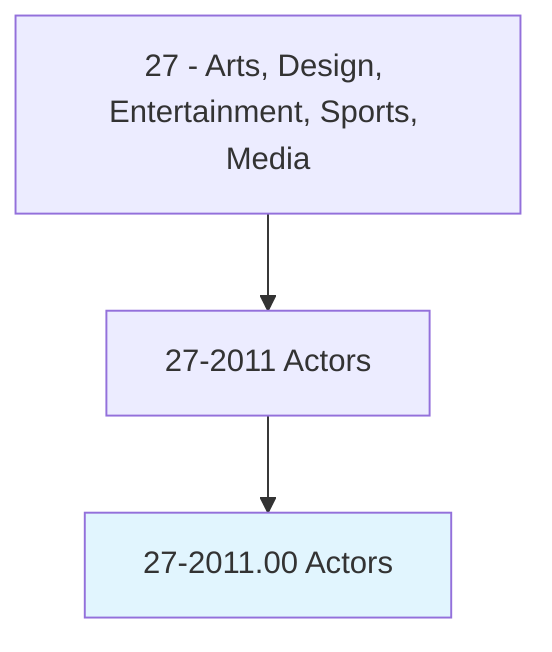
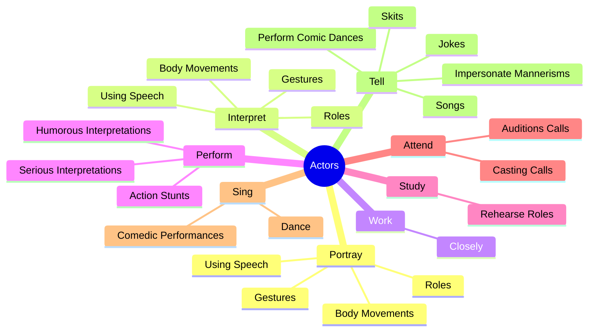
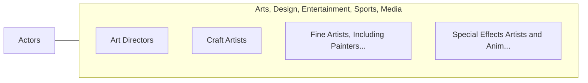

# Actors

> Play parts in stage, television, radio, video, or film productions, or other settings for entertainment, information, or instruction. Interpret serious or comic role by speech, gesture, and body movement to entertain or inform audience. May dance and sing.

## Overview

Actors is an occupation within the Arts, Design, Entertainment, Sports, Media category. Play parts in stage, television, radio, video, or film productions, or other settings for entertainment, information, or instruction. Interpret serious or comic role by speech, gesture, and body movement to entertain or inform audience.

## Classification Hierarchy

## Key Statistics

| Metric | Value |
|--------|-------|
| SOC Code | 27-2011.00 |
| Category | [Arts, Design, Entertainment, Sports, Media](/occupations/ArtsMedia) |
| Task Count | 129 |
| Source | O*NET |

## Core Tasks

### portray.Roles

Actors portray roles as part of their core responsibilities.

**Actions:**
- `portray.Roles.to.entertain`
- `portray.Roles.to.inform`
- `portray.Roles.to.instruct.Radio`
- `portray.Roles.to.Film`

### interpret.Roles

Actors interpret roles as part of their core responsibilities.

**Actions:**
- `interpret.Roles.to.entertain`
- `interpret.Roles.to.inform`
- `interpret.Roles.to.instruct.Radio`
- `interpret.Roles.to.Film`

### work.Closely

Actors work closely as part of their core responsibilities.

**Actions:**
- `work.Closely.with.Directors`
- `work.Closely.with.OtherActors`
- `work.Closely.with.Playwrights.to.find.InterpretationSuitedToRole`

## Skills & Competencies

### Technical Skills
- **Creative Design** - Advanced
- **Digital Media** - Advanced
- **Content Creation** - Advanced

### Soft Skills
- **Communication** - Essential
- **Problem Solving** - Essential
- **Critical Thinking** - Important
- **Teamwork** - Important
- **Adaptability** - Important

## Related Occupations

## Industries

This occupation is found across multiple industries. See [Industries](/industries) for sector-specific employment data.

## Career Progression

---

*Source: O*NET 27-2011.00 - ONETOccupation*
