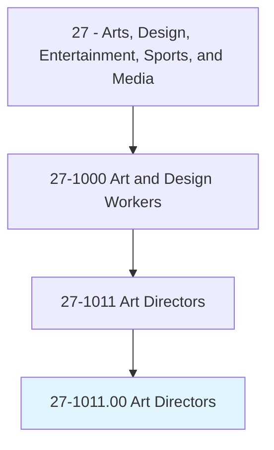
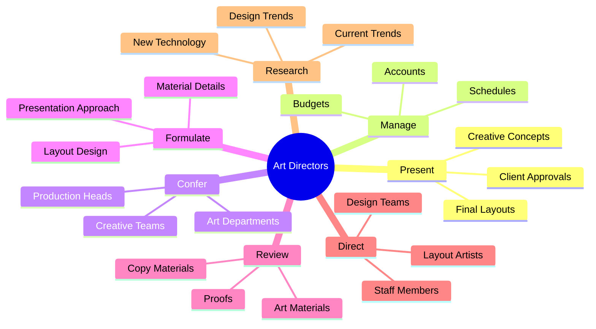
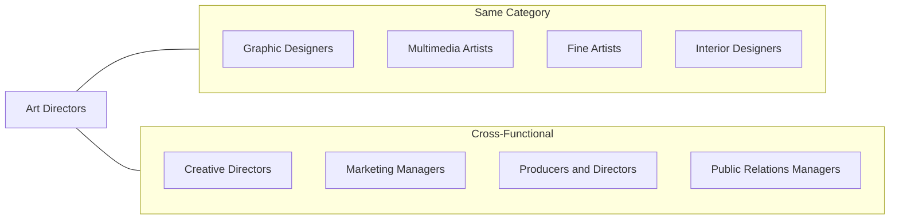
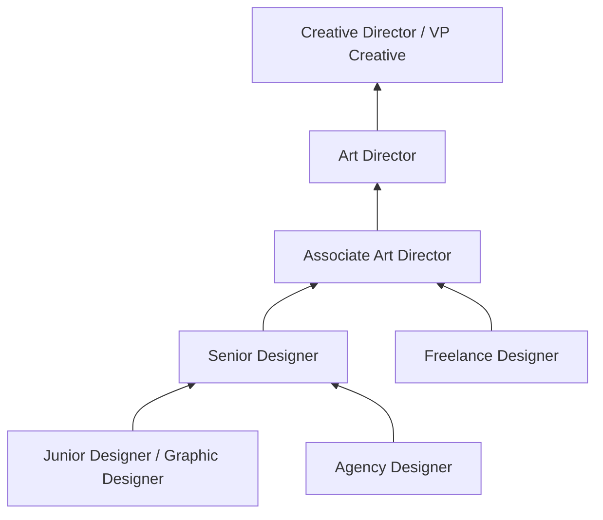

# Art Directors

> Formulate design concepts and presentation approaches for visual productions and media, such as print, broadcasting, video, and film. Direct workers engaged in artwork or layout design.

## Overview

Art Directors are creative leaders who shape the visual style and imagery of magazines, newspapers, product packaging, movies, and television productions. They work with creative teams to establish the artistic vision for projects, coordinate the work of designers and artists, and ensure the final visual products align with client objectives and brand guidelines. This role bridges creative artistry with business requirements, requiring both exceptional aesthetic judgment and strong leadership skills.

## Classification Hierarchy

## Key Statistics

| Metric | Value |
|--------|-------|
| SOC Code | 27-1011.00 |
| Job Zone | 4 (Considerable Preparation) |
| Category | [Arts, Design, Entertainment, Sports, and Media](/occupations/ArtsMedia/index) |
| Core Tasks | 15+ |
| Source | O*NET |

## Core Tasks

### present.FinalLayouts

Art Directors present completed design work to clients and stakeholders for review and approval.

**Actions:**
- `present.FinalLayouts.to.ClientsForApproval` - Submit completed layouts for client review and sign-off
- `present.DesignConcepts.to.Stakeholders` - Communicate creative vision to decision-makers
- `present.CreativeOptions.to.Teams` - Share design alternatives with production teams

### confer.CreativeTeams

Art Directors collaborate with creative, art, copywriting, and production departments to align on requirements and coordinate activities.

**Actions:**
- `confer.Art.to.discuss.ClientRequirementsConceptsToCoordinateCreativeActivities` - Discuss project requirements with art teams
- `confer.Copywriting.to.discuss.ClientRequirementsConceptsToCoordinateCreativeActivities` - Coordinate with copywriters on messaging and visuals
- `confer.ProductionDepartmentHeads.to.PresentationConceptsToCoordinateCreativeActivities` - Align production teams on creative direction

### formulate.LayoutDesign

Art Directors develop the foundational design approach and specify detailed material requirements.

**Actions:**
- `formulate.BasicLayoutDesignApproachSpecifyMaterialDetails.of.Type` - Establish typography specifications
- `formulate.BasicLayoutDesignApproachSpecifyMaterialDetails.of.Photographs` - Define photographic style and requirements
- `formulate.BasicLayoutDesignApproachSpecifyMaterialDetails.of.Graphics` - Specify graphic elements and treatments
- `formulate.BasicLayoutDesignApproachSpecifyMaterialDetails.of.Animation` - Set animation style and parameters
- `formulate.Style.of.Video` - Determine video aesthetic direction

### review.ArtMaterials

Art Directors evaluate and approve creative materials produced by team members.

**Actions:**
- `review.ArtMaterials.of.PrintedCopyDeveloped.by.StaffMembers` - Assess artwork quality and brand alignment
- `review.CopyMaterials.of.PrintedCopyDeveloped.by.StaffMembers` - Review written content integration
- `review.Proofs.of.PrintedCopyDeveloped.by.StaffMembers` - Check final proofs before production
- `approve.ArtMaterials.of.PrintedCopyDeveloped.by.StaffMembers` - Give final approval for production

### direct.StaffMembers

Art Directors lead, train, and manage creative team members who execute design work.

**Actions:**
- `hire.StaffMembersWhoDevelopDesignConcepts.into.ArtLayoutsPrepareLayouts.for.Printing` - Recruit design talent
- `train.StaffMembersWhoDevelopDesignConcepts.into.ArtLayoutsPrepareLayouts.for.Printing` - Develop team skills and capabilities
- `direct.StaffMembersWhoDevelopDesignConcepts.into.ArtLayoutsPrepareLayouts.for.Printing` - Guide daily creative work

### research.CurrentTrends

Art Directors stay current on industry developments to maintain competitive creative output.

**Actions:**
- `research.CurrentTrendsTechnology` - Track emerging design trends
- `research.PrintingProductionTechniques` - Learn new production methods
- `research.ComputerSoftware` - Evaluate new design tools
- `research.DesignTrends` - Monitor visual style evolution

## Skills & Competencies

### Technical Skills
- **Visual Design** - Expert
- **Typography** - Expert
- **Brand Development** - Advanced
- **Adobe Creative Suite** - Advanced
- **Photography Direction** - Advanced
- **Video Production** - Intermediate
- **Motion Graphics** - Intermediate

### Soft Skills
- **Leadership** - Critical
- **Creative Vision** - Critical
- **Communication** - Critical
- **Client Management** - Essential
- **Team Collaboration** - Essential
- **Problem Solving** - Essential

## Related Occupations

## Industries

- [Advertising and Public Relations](/industries/Advertising) - High Employment
- [Publishing Industries](/industries/Publishing) - High Employment
- [Motion Picture and Video Industries](/industries/MotionPictures) - Moderate Employment
- [Design Services](/industries/DesignServices) - High Employment
- [Software Publishers](/industries/Information/PublishingIndustries/SoftwarePublishers) - Growing Employment

## Industry Variations

### Advertising Art Director
Focuses on campaign concepts, brand messaging, and commercial visual communication. Works closely with copywriters and account managers to develop compelling advertising across media.

### Publishing Art Director
Oversees visual design for magazines, books, and digital publications. Manages layout, typography, and image selection to create cohesive reading experiences.

### Film/Television Art Director
Designs visual elements for film and TV productions including sets, graphics, and title sequences. Collaborates with directors and production designers.

### Digital/Interactive Art Director
Specializes in user experience design for websites, apps, and interactive media. Combines traditional design skills with UX principles and digital production knowledge.

## Career Progression

## Education & Training

| Requirement | Details |
|-------------|---------|
| Typical Education | Bachelor's degree in Graphic Design, Fine Arts, or related field |
| Work Experience | 5+ years in design roles with increasing responsibility |
| On-the-Job Training | Moderate - portfolio development and industry-specific knowledge |
| Common Certifications | Adobe Certified Expert, Brand Management certifications |

## Departments

This occupation typically works in:
- [Creative Department](/departments/Creative)
- [Marketing Department](/departments/Marketing/index)
- [Brand Management](/departments/Brand)
- [Production Department](/departments/Production)

## Tools & Technologies

### Design Software
- Adobe Photoshop
- Adobe Illustrator
- Adobe InDesign
- Sketch / Figma
- After Effects

### Collaboration Tools
- Project management platforms (Asana, Monday)
- Digital asset management systems
- Review and proofing tools
- Video conferencing platforms

---

*Source: O*NET 27-1011.00 - ONETOccupation*
