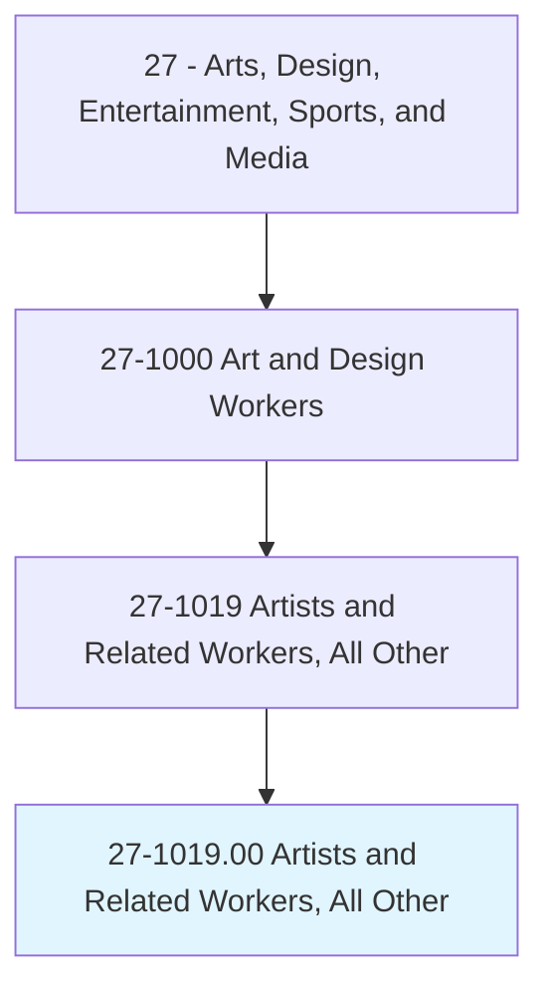
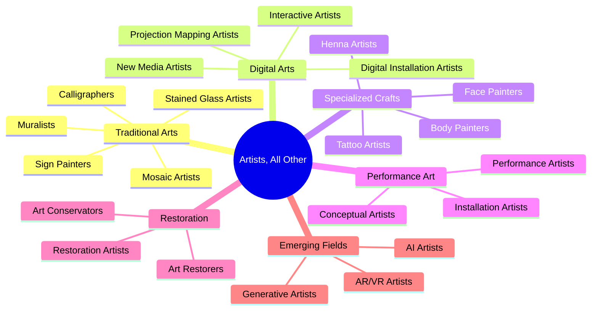
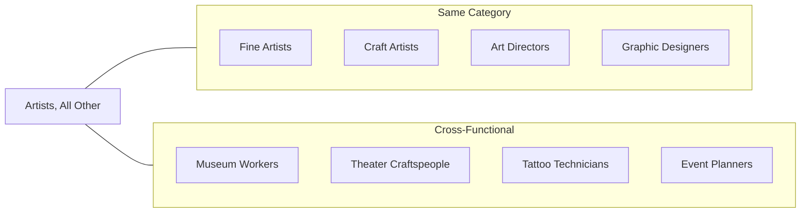
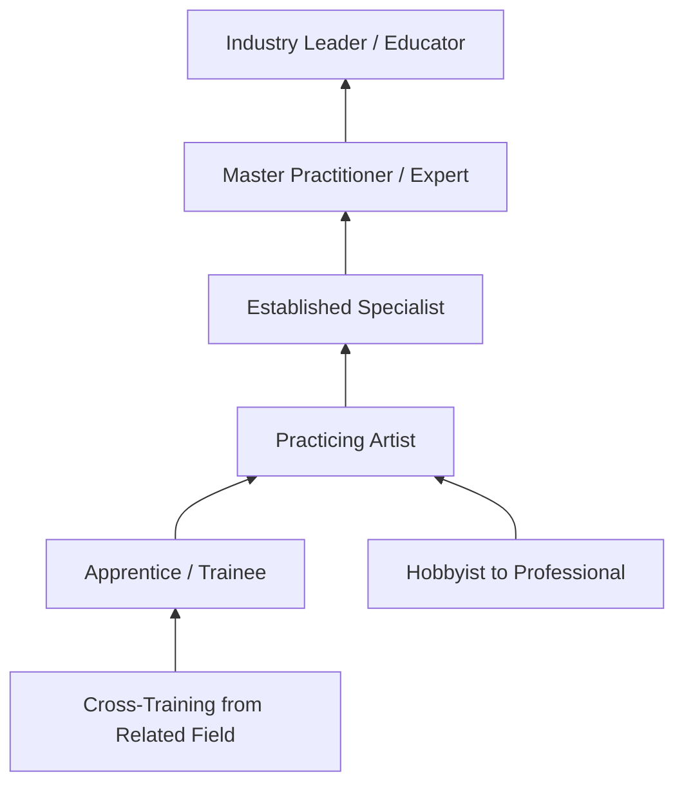

# Artists and Related Workers, All Other

> All artists and related workers not listed separately.

## Overview

Artists and Related Workers, All Other is a residual classification that encompasses creative professionals whose work does not fit neatly into other specific artist categories. This includes emerging artistic disciplines, hybrid roles that combine multiple art forms, specialized niche artists, and traditional artistic roles that are less common in the modern workforce. Despite the "all other" designation, these artists often possess highly specialized skills and contribute meaningfully to diverse creative industries.

## Classification Hierarchy

## Key Statistics

| Metric | Value |
|--------|-------|
| SOC Code | 27-1019.00 |
| Job Zone | 3-4 (Medium to Considerable Preparation) |
| Category | [Arts, Design, Entertainment, Sports, and Media](/occupations/ArtsMedia/index) |
| Classification Type | Residual Category |
| Source | O*NET |

## Included Occupations

This category encompasses various artistic roles including but not limited to:

## Example Occupations

### Calligraphers
Artists who specialize in decorative handwriting and lettering, creating work for invitations, certificates, artwork, and branding.

### Muralists
Artists who create large-scale paintings on walls and other surfaces, often for public spaces, businesses, or private commissions.

### Tattoo Artists
Create permanent body art through the application of ink under the skin, combining artistic skill with technical precision and client consultation.

### Art Conservators
Preserve and restore artworks and cultural artifacts, combining artistic skills with scientific knowledge of materials and conservation techniques.

### Stained Glass Artists
Design and create artistic works in colored glass for windows, panels, and decorative objects using traditional and modern techniques.

### New Media Artists
Create work using emerging technologies including digital installations, interactive media, and experimental art forms.

### Body Painters
Apply artistic designs directly to the human body for performance, photography, entertainment, or ceremonial purposes.

### Sign Painters
Create hand-lettered signs and typography, blending traditional craftsmanship with commercial applications.

## Common Tasks

### Creative Development
- Conceptualize and design original artwork
- Research techniques, materials, and subject matter
- Develop personal artistic style and vision
- Create sketches and preliminary designs

### Production
- Execute artwork using specialized techniques
- Prepare materials and workspaces
- Apply finishing processes appropriate to medium
- Maintain quality standards

### Client Relations
- Consult with clients on project requirements
- Present design concepts and options
- Manage revisions and feedback
- Deliver completed work

### Business Operations
- Market services to potential clients
- Manage pricing and contracts
- Maintain portfolio of work
- Handle administrative tasks

## Skills & Competencies

### Technical Skills
- **Medium-Specific Expertise** - Expert (varies by specialization)
- **Drawing and Design** - Advanced
- **Color Theory** - Advanced
- **Materials Knowledge** - Advanced
- **Tool Proficiency** - Expert in chosen specialty
- **Quality Control** - Advanced

### Soft Skills
- **Creativity** - Critical
- **Attention to Detail** - Critical
- **Client Communication** - Essential
- **Self-Management** - Essential
- **Adaptability** - Important
- **Problem Solving** - Important

## Related Occupations

## Industries

- [Self-Employed / Independent Artists](/industries/SelfEmployed) - Highest Employment
- [Personal Care Services](/industries/OtherServices/LaundryServices/PersonalServices/index) - Tattoo artists, body painters
- [Museums and Historical Sites](/industries/Museums) - Conservation, restoration
- [Religious Organizations](/industries/Religious) - Liturgical arts
- [Specialized Design Services](/industries/DesignServices) - Various specializations
- [Performing Arts](/industries/PerformingArts) - Performance and installation art

## Industry Contexts

### Commercial Applications
Creating custom artwork for businesses, events, and marketing purposes. Includes murals, signage, and branded artistic content.

### Personal Services
Providing artistic services directly to individuals, including tattoos, body art, custom calligraphy, and portrait work.

### Cultural and Religious
Creating art for religious institutions, cultural celebrations, and ceremonial purposes, often following traditional techniques.

### Conservation and Restoration
Working to preserve and restore existing artworks and cultural artifacts in museums, galleries, and private collections.

### Emerging Technologies
Exploring new artistic frontiers using digital tools, immersive technologies, and experimental media.

## Career Progression

## Education & Training

| Requirement | Details |
|-------------|---------|
| Typical Education | Varies widely: self-taught, apprenticeship, certificate programs, or degrees |
| Work Experience | Extensive practice in chosen specialty |
| On-the-Job Training | Often through apprenticeship or mentorship |
| Licensing/Certification | Required for some specialties (e.g., tattoo artists require health department licensing) |

## Licensing Considerations

### Regulated Specialties
- **Tattoo Artists**: Health department permits, bloodborne pathogen training
- **Art Conservators**: Professional certifications available (AIC membership)
- **Sign Painters**: Local business licensing, sometimes contractor licensing

### Self-Regulated Specialties
- Many artistic disciplines are self-regulated through professional associations
- Portfolio and reputation serve as primary credentials
- Apprenticeship traditions in traditional crafts

## Work Environments

### Studio-Based
- Personal or shared studio spaces
- Workshops with specialized equipment
- Home-based studios

### On-Location
- Client premises
- Public spaces for murals and installations
- Event venues

### Institutional
- Museums and cultural institutions
- Religious organizations
- Educational settings

## Tools & Equipment

### Traditional Tools
- Brushes, pens, specialized applicators
- Paints, inks, pigments
- Surfaces and substrates
- Hand tools specific to specialty

### Specialized Equipment
- Tattoo machines and supplies
- Glass-cutting and soldering equipment
- Restoration chemicals and tools
- Scaffolding and large-scale equipment for murals

### Digital Tools
- Design software for planning
- Documentation equipment
- Digital presentation tools
- E-commerce platforms

## Professional Organizations

- American Institute for Conservation (AIC)
- Alliance of Professional Tattooists
- Calligraphy guilds and societies
- Mural arts organizations
- Sign painters associations

## Departments

This occupation typically works in:
- [Self-Employed / Independent Practice](/departments/Studio)
- [Conservation Department](/departments/Conservation)
- [Studio/Parlor](/departments/Studio) (tattoo, body art)
- [Facilities/Operations](/departments/Facilities) (murals, signage)

---

*Source: O*NET 27-1019.00 - ONETOccupation*
