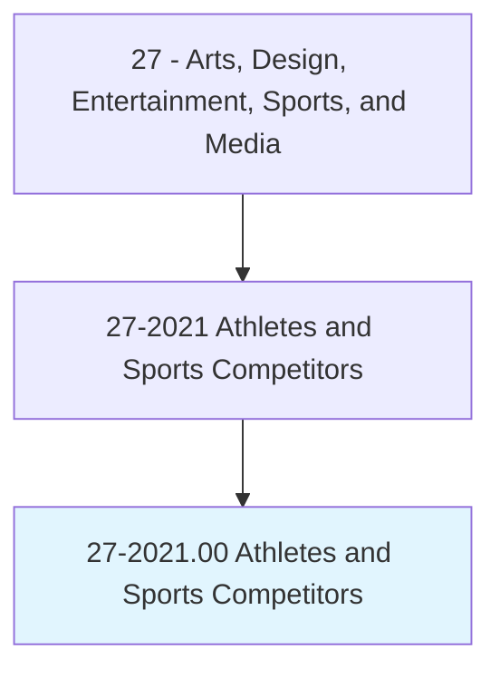
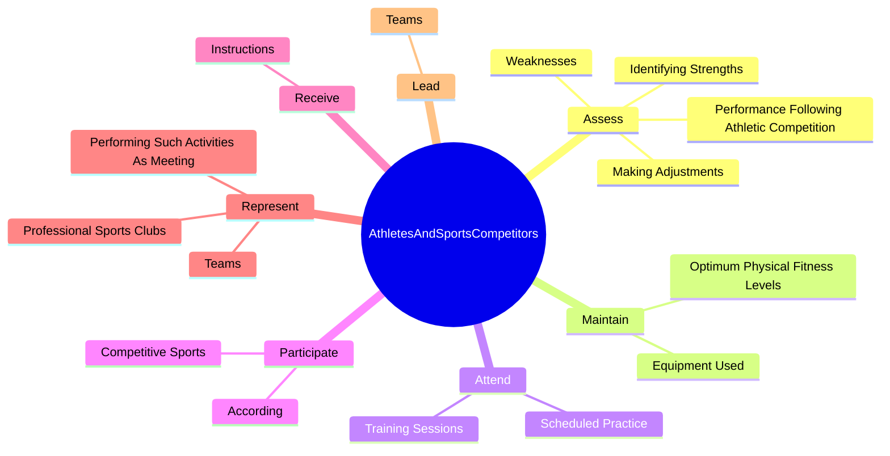
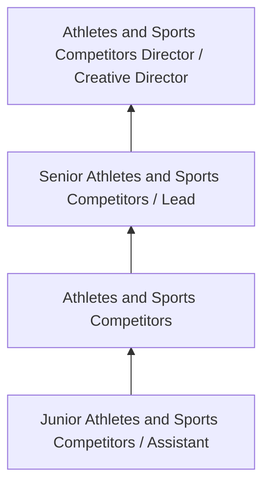
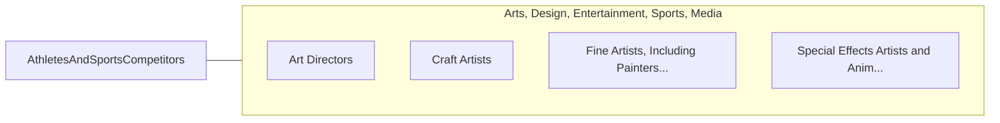

# Athletes and Sports Competitors

> Compete in athletic events.

## Overview

Athletes and Sports Competitors professionals serve a vital function within the Arts, Design, Entertainment, Sports, and Media field. They bring specialized skills and knowledge to their roles, contributing to organizational objectives and societal needs.

These practitioners work in varied environments, adapting their expertise to meet specific requirements of their industry and employer. The role requires ongoing professional development to maintain competency and respond to changing demands.

Career paths in this field offer opportunities for advancement through experience, additional education, and specialized certifications. Employment prospects are influenced by industry trends, technological change, and workforce demographics.

## Classification Hierarchy



## Key Statistics

| Metric | Value |
|--------|-------|
| SOC Code | 27-2021.00 |
| Job Zone | N/A |
| Category | [Arts, Design, Entertainment, Sports, and Media](/occupations/ArtsMedia/index) |
| Core Tasks | N/A+ |
| Salary Range | $35,000 - $100,000 |
| Median Salary | $55,000 |
| Growth Outlook | 3% (Slower than average) |
| Source | O*NET |

## Core Tasks



### assess.PerformanceFollowingAthleticCompetition

Athletes and Sports Competitors assess performance following athletic competition as part of their core responsibilities.

**Actions:**
- `assess.PerformanceFollowingAthleticCompetition.to.improve.FuturePerformance`
- `assess.IdentifyingStrengths.to.improve.FuturePerformance`
- `assess.Weaknesses.to.improve.FuturePerformance`
- `assess.MakingAdjustments.to.improve.FuturePerformance`

### maintain.EquipmentUsed

Athletes and Sports Competitors maintain equipment used as part of their core responsibilities.

**Actions:**
- `maintain.EquipmentUsed.in.ParticularSport`
- `maintain.OptimumPhysicalFitnessLevels.by.TrainingRegularly`
- `maintain.OptimumPhysicalFitnessLevels.by.FollowingNutritionPlans`
- `maintain.OptimumPhysicalFitnessLevels.by.Consulting.with.HealthProfessionals`

### attend.ScheduledPractice

Athletes and Sports Competitors attend scheduled practice as part of their core responsibilities.

**Actions:**
- `attend.ScheduledPractice`
- `attend.TrainingSessions`

### Technical Skills
- **Creative Design** - Advanced
- **Digital Media** - Advanced
- **Content Creation** - Advanced

### Soft Skills
- **Communication** - Essential
- **Problem Solving** - Essential
- **Critical Thinking** - Important
- **Teamwork** - Important
- **Adaptability** - Important


## Skills & Competencies

### Technical Skills
- **Creative Design** - Expert
- **Digital Media Tools** - Advanced
- **Content Creation** - Advanced
- **Visual Communication** - Advanced
- **Production Techniques** - Proficient
- **Project Coordination** - Proficient

### Soft Skills
- **Creativity** - Critical
- **Communication** - Critical
- **Collaboration** - Essential
- **Adaptability** - Essential
- **Time Management** - Essential

## Education & Certifications

| Requirement | Details |
|-------------|---------|
| Typical Education | Bachelor's degree in arts, design, communications, or related field |
| Work Experience | 1-3 years portfolio-based experience |
| On-the-Job Training | Moderate - ongoing skill development in creative tools |
| Certifications | Industry-specific certifications (Adobe, etc.) |

## Career Progression



## Industry Variations

### Entertainment and Media
Creative production for film, television, music, or digital media. Athletes and Sports Competitors professionals focus on audience engagement and storytelling.

### Advertising and Marketing
Brand communication and commercial creative work. Emphasis on client relationships and measurable campaign outcomes.

### Corporate Communications
Internal and external communications for organizations. Focus on brand consistency and strategic messaging.

### Freelance and Independent
Self-directed creative work with diverse clients. Requires strong business skills alongside creative talent.

## Technology & Tools

- **Adobe Creative Suite (Photoshop, Illustrator, Premiere)**
- **Digital audio workstations**
- **Content management systems**
- **3D modeling software**
- **Social media and analytics platforms**

## Related Occupations



## Industries

- [Media and Entertainment](/industries/Media) - High Employment
- [Advertising and Marketing](/industries/Advertising) - High Employment
- [Publishing](/industries/Publishing) - Moderate Employment
- [Technology](/industries/Technology) - Growing Employment

## Departments

This occupation typically works in:
- [Creative Services](/departments/Creative)
- [Marketing](/departments/Marketing/index)
- [Communications](/departments/Communications)

## GraphDL Semantic Structure

```
Athletes and Sports Competitors perform:
- create.Content.for.AthletesandSportsCompetitorsProjects
- develop.Concepts.for.CreativeWork
- present.Work.to.ClientsAndStakeholders
- collaborate.WithTeam.on.CreativeProjects
- review.Materials.for.QualityStandards
```

---

*Source: O*NET 27-2021.00 - ONETOccupation*
