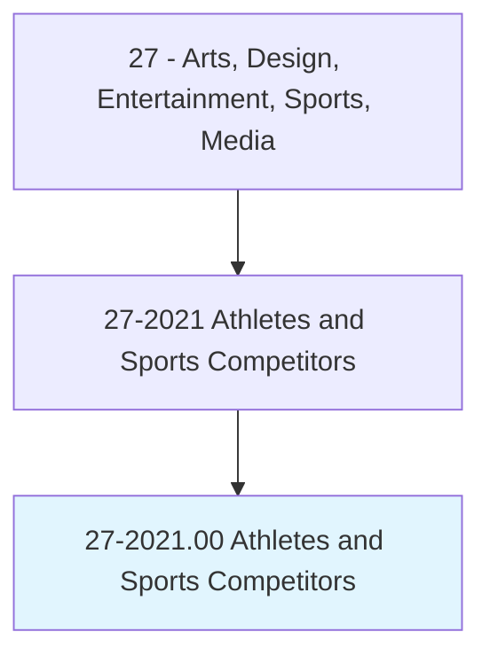
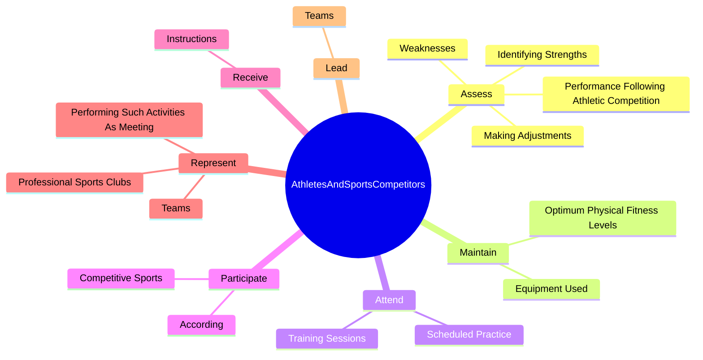

# Athletes and Sports Competitors

> Compete in athletic events.

## Overview

Athletes and Sports Competitors is classified under Arts, Design, Entertainment, Sports, Media (SOC 27). Compete in athletic events.

## Classification Hierarchy

## Key Statistics

| Metric | Value |
|--------|-------|
| SOC Code | 27-2021.00 |
| Category | [Arts, Design, Entertainment, Sports, Media](/occupations/ArtsMedia) |
| Task Count | 26 |
| Source | O*NET |

## Core Tasks

### assess.PerformanceFollowingAthleticCompetition

Athletes and Sports Competitors assess performance following athletic competition as part of their core responsibilities.

**Actions:**
- `assess.PerformanceFollowingAthleticCompetition.to.improve.FuturePerformance`
- `assess.IdentifyingStrengths.to.improve.FuturePerformance`
- `assess.Weaknesses.to.improve.FuturePerformance`
- `assess.MakingAdjustments.to.improve.FuturePerformance`

### maintain.EquipmentUsed

Athletes and Sports Competitors maintain equipment used as part of their core responsibilities.

**Actions:**
- `maintain.EquipmentUsed.in.ParticularSport`
- `maintain.OptimumPhysicalFitnessLevels.by.TrainingRegularly`
- `maintain.OptimumPhysicalFitnessLevels.by.FollowingNutritionPlans`
- `maintain.OptimumPhysicalFitnessLevels.by.Consulting.with.HealthProfessionals`

### attend.ScheduledPractice

Athletes and Sports Competitors attend scheduled practice as part of their core responsibilities.

**Actions:**
- `attend.ScheduledPractice`
- `attend.TrainingSessions`

## Skills & Competencies

### Technical Skills
- **Creative Design** - Advanced
- **Digital Media** - Advanced
- **Content Creation** - Advanced

### Soft Skills
- **Communication** - Essential
- **Problem Solving** - Essential
- **Critical Thinking** - Important
- **Teamwork** - Important
- **Adaptability** - Important

## Related Occupations

## Industries

This occupation is found across multiple industries. See [Industries](/industries) for sector-specific employment data.

## Career Progression

---

*Source: O*NET 27-2021.00 - ONETOccupation*
